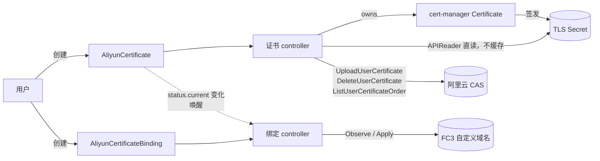

# le-to-alicloud

把 cert-manager 签发的 TLS 证书上传到阿里云数字证书管理服务（CAS），并绑定到函数计算 FC3 的自定义域名。

- API Group：`certs.bestheme.ac.cn/v1alpha1`
- 两个 CRD：`AliyunCertificate`（证书本身）、`AliyunCertificateBinding`（证书 ↔ 目标的关联）

> **命令写法约定**：本文涉及集群的命令同时给出 `oc`（OpenShift）与 `kubectl`（其他 Kubernetes 发行版）两种写法。两者参数逐字相同，任选一种复制执行即可。

## 概述

这个 operator 让「阿里云上的一张 TLS 证书」成为集群里的声明式资源。你创建一个 `AliyunCertificate`，operator 负责把它变成 cert-manager 的 `Certificate`、盯着签发结果、把签发出来的证书上传到阿里云 CAS、在续期时上传新代次并按保留策略回收旧代次。整条链路的幂等基准是叶子证书的 SHA-256(DER) 指纹，不是时间戳也不是 generation。

证书由 cert-manager 签发，operator 只依赖 cert-manager 的 `Issuer` 抽象。它**不创建也不管理** `Issuer` / `ClusterIssuer`，不碰 ACME 账号，不配置 DNS-01 solver——这些是你自己的事，换任何签发后端都不需要改 operator。第一版的验证环境用 Let's Encrypt，但设计上没有任何一处依赖 ACME。

部署目标方面，第一版只支持 **FC3（函数计算 3.0）自定义域名**：证书归属于域名，与函数无关。provider 层是接口 + registry 的形状（`pkg/provider`），为 CDN / CLB / ALB 预留了扩展点，但这一版只有 `pkg/provider/fc3` 一个实现。

**当前状态**：证书 controller 与绑定 controller 都已交付可用。装上 CRD 与 operator 之后，`AliyunCertificate` 与 `AliyunCertificateBinding` 两条路径都能直接使用，包括绑定目标的周期性 Observe 与漂移纠正。

## 架构



三个贯穿全局的设计要点：

- **SHA-256(DER) 指纹是全系统的幂等基准**：证书侧用它命名 CAS 上的证书、判定是否需要上传；绑定侧用它判定目标上那张是不是最新的。
- **上传 CAS 与绑定 FC3 是并行副作用，不是串行依赖**：两者都只依赖同一个 Secret。对 FC3 来说，CAS 上传是归档与控制台可见性，不是功能必需（所以 `aliyun.uploadToCAS: false` 是个合法配置）。
- **宁可停在旧证书，也不把坏证书推到线上**：任何校验不通过都拒绝上传 / 拒绝应用，而不是带着可疑材料继续往前走。

## 前置条件

| 依赖 | 要求 | 检查 |
|---|---|---|
| Kubernetes | ≥ 1.25（CRD 用了 CEL `x-kubernetes-validations`）；OpenShift ≥ 4.12 | `kubectl version -o json \| jq -r .serverVersion.minor` |
| cert-manager | 已安装并可用。编译期钉在 v1.21.1，运行期建议同版本；更低版本未验证 | `kubectl get pods -n cert-manager` |
| `Issuer` / `ClusterIssuer` | 由你自己创建，operator 不管它 | `kubectl get clusterissuers` |
| Prometheus Operator | **使用 openshift overlay 时必需**：该 overlay 含 `ServiceMonitor` 与 `PrometheusRule`。OpenShift 自带 `monitoring.coreos.com` CRD，所以 apply 不会失败，但需要启用 user workload monitoring 才会真的被抓取；其他集群必须先安装 Prometheus Operator，否则 Argo sync 会因为缺 CRD 而失败 | `kubectl get crd prometheusrules.monitoring.coreos.com servicemonitors.monitoring.coreos.com` |

OpenShift 上的等价检查：

```bash
oc version -o json | jq -r .serverVersion.minor
oc get pods -n cert-manager
oc get clusterissuers
oc get crd prometheusrules.monitoring.coreos.com servicemonitors.monitoring.coreos.com
```

### external-dns 会删掉 ACME 的挑战记录

如果集群里跑着 external-dns 并托管同一个 zone，它会把 cert-manager 创建的 `_acme-challenge.*` TXT 记录当成无主记录清理掉，DNS-01 挑战于是永远超时，证书永远签不出来。三种修法任选其一：

- 给 external-dns 加 `--policy=upsert-only`（它就只增改、不删除）；
- 用 `--exclude-domains` 把 `_acme-challenge` 排除掉；
- 把挑战记录放进一个独立的、external-dns 不管的 zone。

### 先用 Let's Encrypt staging 验证

生产 Let's Encrypt 的速率限制是每个注册域每周 50 张证书、每周 5 张重复证书。`dnsNames` 配错一次就可能把一周的配额烧掉，而配额是按注册域计的——烧的是整个域名下所有服务的额度。请先用 staging issuer 把全流程（签发 → 上传 CAS → 绑定 FC3）跑通，再切生产 issuer。

### Argo CD 的 namespace 与 AppProject

`deploy/argocd/` 下四个文件都硬编码了 `namespace: argocd`。OpenShift GitOps 的默认实例装在 `openshift-gitops`，社区版 Argo CD 常见于 `argocd`——请按你自己的安装位置调整这四个文件里的 `metadata.namespace`（root application 还有 `spec.destination.namespace`）。另外 `root-application.yaml` 里的 `project: default` 只适合试装：生产环境应换成一个限定了 source repo、destination namespace 与允许资源类型的受限 `AppProject`。

## 安装

### Argo CD（推荐）

`deploy/argocd/` 下是一个 app-of-apps：一个根 Application 管理三个子 Application，三者的资源集合互不相交（Argo 因此不会报 shared resource）。

| 文件 | 同步内容 | wave | prune |
|---|---|---|---|
| `deploy/argocd/root-application.yaml` | `deploy/argocd` 目录本身（app-of-apps 根） | — | 关 |
| `deploy/argocd/application-crds.yaml` | `config/crd` | -2 | 关（prune CRD 会级联删除所有 CR） |
| `deploy/argocd/application-credentials.yaml.example` | 你自己的密钥仓库 | -1 | 关 |
| `deploy/argocd/application-operator.yaml` | `config/overlays/openshift` | 0 | 开 |

**为什么必须从 `root-application.yaml` 装。** sync wave 排序的是**单次 sync 操作内部**的资源。写在 Application 对象**自身**上的 `argocd.argoproj.io/sync-wave` 注解，只有当这些 Application 本身是某个父 Application 的资源、由父应用在一次 sync 里一起下发时才会被读取。如果直接 `oc apply -f deploy/argocd/`，三个 Application 会各自独立 automated sync、并发执行，`-2` / `-1` / `0` 全是死字符串——operator 的 Deployment 可能先于 CRD 起来，controller-runtime 在 `SetupWithManager` 阶段 RESTMapper 找不到 `certs.bestheme.ac.cn/v1alpha1`，进程直接退出并 CrashLoopBackOff，直到 CRD 落地才自愈。

```bash
# 1. 改镜像地址
$EDITOR deploy/argocd/application-operator.yaml   # kustomize.images

# 2. 改三个子 Application 与根 Application 的 repoURL / targetRevision，指向你自己的仓库

# 3. 凭证 Application：复制模板并指向你的密钥仓库，别提交明文 Secret
cp deploy/argocd/application-credentials.yaml.example deploy/argocd/application-credentials.yaml
$EDITOR deploy/argocd/application-credentials.yaml   # 填掉 REPLACE_ME

# 4. 把以上改动提交并推到 root-application.yaml 的 repoURL 指向的那个仓库
```

改完并推送之后，只 apply 根应用这一个文件，其余三个由它拉起：

```bash
# oc
oc apply -f deploy/argocd/root-application.yaml
oc -n argocd get applications
```

```bash
# kubectl
kubectl apply -f deploy/argocd/root-application.yaml
kubectl -n argocd get applications
```

> 根应用的 `source.path` 指向 `deploy/argocd` 目录本身，Argo 只会捡其中的 `.yaml` / `.yml` / `.json`。`application-credentials.yaml.example` 因为后缀是 `.example` 天然被排除在外——所以第 3 步要把它复制成 `application-credentials.yaml` 再提交，否则凭证 Application 不会被下发。

**不走 app-of-apps 时**（比如你有别的方式管理 Application 对象），wave 全部失效，顺序必须人工保证：

```bash
# oc
oc apply -f deploy/argocd/application-crds.yaml
oc wait --for=condition=Established --timeout=120s \
  crd/aliyuncertificates.certs.bestheme.ac.cn \
  crd/aliyuncertificatebindings.certs.bestheme.ac.cn
oc apply -f deploy/argocd/application-credentials.yaml
oc apply -f deploy/argocd/application-operator.yaml
```

```bash
# kubectl
kubectl apply -f deploy/argocd/application-crds.yaml
kubectl wait --for=condition=Established --timeout=120s \
  crd/aliyuncertificates.certs.bestheme.ac.cn \
  crd/aliyuncertificatebindings.certs.bestheme.ac.cn
kubectl apply -f deploy/argocd/application-credentials.yaml
kubectl apply -f deploy/argocd/application-operator.yaml
```

注意 `oc wait` 等的是 CRD 变成 `Established`，而不是 Application 变成 Synced——CRD Application 的 sync 是异步的，第一次执行可能需要重试几次直到 CRD 真的出现。

#### 三条硬约束

写在这里是因为踩中任何一条都会丢证书。

- **`ServerSideApply=true` 必开**。SSA 让 Argo 与 apiserver 共享字段所有权，避免 `last-applied-configuration` 与 CRD 默认值互相打架；CRD 将来增长也不会撞上 262144 字节的注解上限。（本仓库两个 CRD 目前合计约 32 KB，离上限还很远——开 SSA 是为了避免所有权打架，不是因为现在就会失败。）
- **绝不给 CRD 用 `Replace=true`**。Replace 是 delete + create，会连带删除全部 `AliyunCertificate` 与 `AliyunCertificateBinding`，它们的 finalizer 随即去删云上的证书、解绑 FC3 域名。
- **凭证 Secret 必须与 CR 分属不同 Application**。同一个 Application 里 prune 的顺序不确定；凭证先消失时 finalizer 拿不到凭证，云上会留下孤儿证书。这也是 `application-credentials.yaml.example` 单独存在的理由。

#### 删除 CRD Application 时必须 `--cascade=false`

`argocd app delete` 与 Argo UI 删除对话框的 `--cascade` **默认为 true**：CLI 会在删除前主动把 `resources-finalizer.argocd.argoproj.io` **patch 进 Application 对象**，git 里写 `finalizers: []` 拦不住这条路。一旦级联生效：CRD 被删 → apiserver 连锁删光所有 `AliyunCertificate` 与 `AliyunCertificateBinding` → 这些 CR 带 finalizer，而 operator 属于**另一个** Application、此刻仍然活着 → **operator 会真的去删阿里云 CAS 上的证书、解绑 FC3 自定义域名**。

所以删除这个 Application 时必须显式关掉级联：

```bash
argocd app delete le-to-alicloud-crds --cascade=false
```

第二道防线由 CRD 资源自身承载：`config/crd` 给两个 CRD 打了 `argocd.argoproj.io/sync-options: Delete=false`，Argo 级联删除时会跳过带此注解的资源。部署前可以离线核对它在位（应输出 `2`）：

```bash
./bin/kustomize build config/crd | grep -c "argocd.argoproj.io/sync-options"
```

代价是将来真要删 CRD 时必须先手工摘掉这个注解——这道摩擦是有意的。

### kubectl / oc（开发与验证）

不走 Argo CD 的直装路径。`make deploy` 用的是 `config/default`，它把 CRD 与 operator 聚合在一起（与 Argo CD 下两个 Application 分治的布局不同）。

```bash
make docker-build docker-push IMG=registry.example.com/le-to-alicloud:v0.1.0
make install                                   # 只装 CRD
make deploy IMG=registry.example.com/le-to-alicloud:v0.1.0
```

确认 operator 起来了：

```bash
# oc
oc -n le-to-alicloud-system get deploy le-to-alicloud-controller-manager
```

```bash
# kubectl
kubectl -n le-to-alicloud-system get deploy le-to-alicloud-controller-manager
```

卸载（**会删掉全部 CR，从而触发云侧清理**——`AliyunCertificate` 的 finalizer 会去删 CAS 上的证书，`deletionPolicy: Unbind` 的 Binding 会去解绑 FC3 域名）：

```bash
make undeploy
make uninstall
```

## CRD 参考

### AliyunCertificate

`spec.certificateTemplate` 与 `spec.aliyun` 是必填对象，`spec.retention` 可省略（整体默认 `{}`）。

| 字段 | 类型 | 必填 | 默认 | 说明 |
|---|---|---|---|---|
| `secretName` | string | 否 | `<metadata.name>-tls` | cert-manager 写入证书的 Secret 名 |
| `certificateTemplate.issuerRef` | object | 否 | 回退到 `--default-issuer-*` | 一旦解析成功就固化进 `status.effectiveIssuerRef`，之后改 flag 不会触发重签 |
| `certificateTemplate.dnsNames` | []string | 与 `commonName` 至少一个 | — | 证书的 SAN；CEL 校验 `dnsNames` 非空或 `commonName` 非空 |
| `certificateTemplate.commonName` | string | 同上 | — | |
| `certificateTemplate.ipAddresses` | []string | 否 | — | |
| `certificateTemplate.duration` | duration | 否 | cert-manager 默认 | Go duration 字符串，如 `2160h` |
| `certificateTemplate.renewBefore` | duration | 否 | cert-manager 默认 | |
| `certificateTemplate.subject` | object | 否 | — | cert-manager 的 `X509Subject` |
| `certificateTemplate.usages` | []string | 否 | cert-manager 默认 | |
| `certificateTemplate.privateKey` | object | 否 | `encoding: PKCS1` | 不指定 `encoding` 时 operator 补上 PKCS#1；这是 CAS 与 FC3 的原生期望格式 |
| `certificateTemplate.secretTemplate` | object | 否 | — | operator 会往 `labels` 注入 `certs.bestheme.ac.cn/managed=true` |
| `aliyun.credentialsRef.name` | string | **是** | — | 同 namespace 的凭证 Secret；**没有 namespace 字段，跨 namespace 引用被类型系统禁止** |
| `aliyun.region` | string | **是** | — | |
| `aliyun.casRegion` | string | 否 | 同 `region` | CAS 部分 region 化，见「已知限制」 |
| `aliyun.endpointOverride` | string | 否 | — | 覆盖 SDK 选出的 endpoint（VPC 内网 / 专有云） |
| `aliyun.resourceGroupId` | string | 否 | — | |
| `aliyun.uploadToCAS` | bool | 否 | `true` | 为 `false` 时完全不碰 CAS（不上传 / 不回收 / 不探测），也就不需要 `yundun-cert:*` 权限，`Uploaded` 不参与 `Ready` 聚合 |
| `retention.keepLast` | int32 | 否 | `2` | `current` + `history` 的总代数，最小 1 |
| `retention.minAge` | duration | 否 | `24h` | 代次自上传起未满 `minAge` 不回收 |

`status` 的关键字段：

| 字段 | 说明 |
|---|---|
| `observedGeneration` | |
| `effectiveIssuerRef` | 实际生效并被固化（Pin）的 issuer |
| `secretName` / `certManagerCertificateName` | operator 实际使用的 Secret 名与它创建的 cert-manager `Certificate` 名 |
| `issuance` | 镜像 cert-manager 的 `revision` / `renewalTime` / `failedIssuanceAttempts` / `lastFailureTime` |
| `current` | 当前代次：`fingerprint` / `certId` / `casName` / `notBefore` / `notAfter` / `uploadedAt` |
| `history` | 旧代次，最多 `keepLast-1` 条，结构同 `current` |
| `pendingUpload` | CAS 上传的 write-ahead 记录（`fingerprint` / `casName` / `clientToken` / `startedAt` / `domainHint`），上传成功即清空 |
| `casProbedAt` | 上次核对「`current` 在 CAS 上仍然存在」的时间 |
| `cleanupStartedAt` | 首次进入删除分支的时间，用于 `--cleanup-grace-period` 计时 |
| `conditions` | `Ready` / `Issued` / `Uploaded` 等 |

示例（`config/samples/certs_v1alpha1_aliyuncertificate.yaml`）：

```yaml
apiVersion: certs.bestheme.ac.cn/v1alpha1
kind: AliyunCertificate
metadata:
  name: timehorse-api
spec:
  certificateTemplate:
    dnsNames: [api.timehorse.bestheme.ac.cn]
  aliyun:
    credentialsRef: { name: aliyun-cas-credentials }
    region: cn-hangzhou
  retention:
    keepLast: 2
```

### AliyunCertificateBinding

| 字段 | 类型 | 必填 | 默认 | 说明 |
|---|---|---|---|---|
| `certificateRef.name` | string | **是** | — | 同 namespace 的 `AliyunCertificate` |
| `target.type` | string | **是** | — | 目前只有 `FC3CustomDomain`；**整个 `target` 不可变**（CEL `self == oldSelf`），改目标请新建 Binding |
| `target.fc3CustomDomain.region` | string | **是** | — | `type=FC3CustomDomain` 时必须且只能设置这个块 |
| `target.fc3CustomDomain.domainName` | string | **是** | — | 证书归属于域名，与函数无关 |
| `target.fc3CustomDomain.ensureHTTPSProtocol` | bool | 否 | `false` | 只有为 `true` 且域名当前 protocol 不含 HTTPS 时，才把 protocol 改为 `HTTP,HTTPS`；默认不动 |
| `credentialsRef.name` | string | 否 | 继承 `certificateRef` 所指证书的 `aliyun.credentialsRef` | 同 namespace |
| `deletionPolicy` | enum（`Orphan` / `Unbind`） | 否 | `Orphan` | `Orphan`：删 Binding 不动云侧；`Unbind`：先 Observe 确认目标上那张确实是自己写的，才清空 `certConfig`（纯 HTTPS 域名同时降为 HTTP） |

`status` 的关键字段：

| 字段 | 说明 |
|---|---|
| `observedGeneration` | |
| `appliedFingerprint` | 目标上实际生效的证书指纹 |
| `driftedFingerprint` | 上一轮观测到的「漂移证书」指纹：既不是我们上次写的、也不是当前该写的那一张。它的作用是让 `DriftCorrected` 事件与 drift 计数器只在跃迁时发一次，而不是每轮重发 |
| `lastAppliedTime` / `lastObservedTime` | 上次成功 Apply / 上次 Observe 的时间 |
| `boundAccountId` | 首次成功 Apply 时固化，用于账号 fencing |
| `cleanupStartedAt` | 首次进入删除分支的时间，用于 `--cleanup-grace-period` 计时 |
| `conditions` | `Ready` / `Applied` / `Conflict` 等 |

示例（`config/samples/certs_v1alpha1_aliyuncertificatebinding.yaml`）：

```yaml
apiVersion: certs.bestheme.ac.cn/v1alpha1
kind: AliyunCertificateBinding
metadata:
  name: timehorse-api-fc3
spec:
  certificateRef:
    name: timehorse-api
  target:
    type: FC3CustomDomain
    fc3CustomDomain:
      region: cn-hangzhou
      domainName: api.timehorse.bestheme.ac.cn
```

### 上手

`config/samples/` 里的三个样本可以直接用。凭证 Secret 的两个 `REPLACE_ME` 必须先改掉——**改完的文件不要提交进任何仓库**，生产环境请用 SealedSecret / ExternalSecret 生成它。

```bash
# oc
$EDITOR config/samples/aliyun-credentials-secret.yaml   # 填掉两个 REPLACE_ME
oc apply -f config/samples/aliyun-credentials-secret.yaml
oc apply -f config/samples/certs_v1alpha1_aliyuncertificate.yaml
oc apply -f config/samples/certs_v1alpha1_aliyuncertificatebinding.yaml
oc get aliyuncertificate,aliyuncertificatebinding -o wide
```

```bash
# kubectl
$EDITOR config/samples/aliyun-credentials-secret.yaml   # 填掉两个 REPLACE_ME
kubectl apply -f config/samples/aliyun-credentials-secret.yaml
kubectl apply -f config/samples/certs_v1alpha1_aliyuncertificate.yaml
kubectl apply -f config/samples/certs_v1alpha1_aliyuncertificatebinding.yaml
kubectl get aliyuncertificate,aliyuncertificatebinding -o wide
```

样本里的 `AliyunCertificate` 没写 `certificateTemplate.issuerRef`，所以它依赖 operator 的 `--default-issuer-name` 已经配好；否则请在 CR 里显式写上 `issuerRef`。

## Flags

## 指标与告警

## RAM 权限

## 威胁模型

## 已知限制

## 故障排查

## 开发
