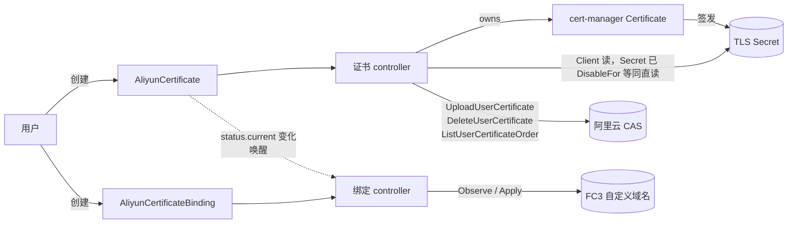

# le-to-alicloud

把 cert-manager 签发的 TLS 证书上传到阿里云数字证书管理服务（CAS），并绑定到函数计算 FC3 的自定义域名。

- API Group：`certs.bestheme.ac.cn/v1alpha1`
- 两个 CRD：`AliyunCertificate`（证书本身）、`AliyunCertificateBinding`（证书 ↔ 目标的关联）

> **命令写法约定**：本文涉及集群的命令同时给出 `oc`（OpenShift）与 `kubectl`（其他 Kubernetes 发行版）两种写法。两者参数逐字相同，任选一种复制执行即可。

## 概述

这个 operator 让「阿里云上的一张 TLS 证书」成为集群里的声明式资源。你创建一个 `AliyunCertificate`，operator 负责把它变成 cert-manager 的 `Certificate`、盯着签发结果、把签发出来的证书上传到阿里云 CAS、在续期时上传新代次并按保留策略回收旧代次。整条链路的幂等基准是叶子证书的 SHA-256(DER) 指纹，不是时间戳也不是 generation。

证书由 cert-manager 签发，operator 只依赖 cert-manager 的 `Issuer` 抽象。它**不创建也不管理** `Issuer` / `ClusterIssuer`，不碰 ACME 账号，不配置 DNS-01 solver——这些是你自己的事，换任何签发后端都不需要改 operator。第一版的验证环境用 Let's Encrypt，但设计上没有任何一处依赖 ACME。

部署目标方面，第一版只支持 **FC3（函数计算 3.0）自定义域名**：证书归属于域名，与函数无关。provider 层是接口 + registry 的形状（`pkg/provider`），为 CDN / CLB / ALB 预留了扩展点，但这一版只有 `pkg/provider/fc3` 一个实现。

**当前状态**：证书 controller 与绑定 controller 都已交付可用。装上 CRD 与 operator 之后，`AliyunCertificate` 与 `AliyunCertificateBinding` 两条路径都能直接使用，包括绑定目标的周期性 Observe 与漂移纠正。

## 架构



绑定 controller 的唤醒条件是这几种：Binding 自己的 spec / annotation / label 变了、同目标的 peer Binding 变了（仲裁）、它引用的 `AliyunCertificate` 变了（那条 watch 没有谓词，任何变化都算，续期信号就在里面）、`--drift-check-interval` 到点，以及失败路径自己排的重试（凭证问题 5 分钟、域名还不存在 5 分钟、retryable 走指数退避）。**Binding 的 status 写入不唤醒任何 controller**，它自己也不例外——每一轮成功观测都会写 `status.lastObservedTime`，让那次 patch 唤醒下一轮就是一个只受云调用耗时约束的自循环。

三个贯穿全局的设计要点：

- **SHA-256(DER) 指纹是全系统的幂等基准**：证书侧用它命名 CAS 上的证书、判定是否需要上传；绑定侧用它判定目标上那张是不是最新的。
- **上传 CAS 与绑定 FC3 是并行副作用，不是串行依赖**：两者都只依赖同一个 Secret。对 FC3 来说，CAS 上传是归档与控制台可见性，不是功能必需（所以 `aliyun.uploadToCAS: false` 是个合法配置）。
- **宁可停在旧证书，也不把坏证书推到线上**：任何校验不通过都拒绝上传 / 拒绝应用，而不是带着可疑材料继续往前走。

## 前置条件

| 依赖 | 要求 | 检查 |
|---|---|---|
| Kubernetes | ≥ 1.25（CRD 用了 CEL `x-kubernetes-validations`）；OpenShift ≥ 4.12 | `kubectl version -o json \| jq -r .serverVersion.minor` |
| cert-manager | 已安装并可用。编译期钉在 v1.21.1，运行期建议同版本；更低版本未验证 | `kubectl get pods -n cert-manager` |
| `Issuer` / `ClusterIssuer` | 由你自己创建，operator 不管它 | `kubectl get clusterissuers` |
| Go 工具链 | **只有在本机跑 `make` 时才需要**（`go.mod` 要求 ≥ 1.26）：`make kustomize` / `manifests` / `generate` / `build` / `lint` / `test` 都经 `go-install-tool` 按需 `go install` 缺失的工具到 `bin/`，没有 Go 就会失败。纯 Argo CD 或 `kubectl apply -k` 的安装路径不需要它 | `go version` |
| Prometheus Operator | **使用 openshift overlay 时必需**：该 overlay 含 `ServiceMonitor` 与 `PrometheusRule`。OpenShift 自带 `monitoring.coreos.com` CRD，所以 apply 不会失败，但需要启用 user workload monitoring 才会真的被抓取；其他集群必须先安装 Prometheus Operator，否则 Argo sync 会因为缺 CRD 而失败 | `kubectl get crd prometheusrules.monitoring.coreos.com servicemonitors.monitoring.coreos.com` |

OpenShift 上的等价检查：

```bash
oc version -o json | jq -r .serverVersion.minor
oc get pods -n cert-manager
oc get clusterissuers
oc get crd prometheusrules.monitoring.coreos.com servicemonitors.monitoring.coreos.com
```

### external-dns 会删掉 ACME 的挑战记录

如果集群里跑着 external-dns 并托管同一个 zone，它会把 cert-manager 创建的 `_acme-challenge.*` TXT 记录当成无主记录清理掉，DNS-01 挑战于是永远超时，证书永远签不出来。三种修法任选其一：

- 给 external-dns 加 `--policy=upsert-only`（它就只增改、不删除）；
- 用 `--exclude-domains` 把 `_acme-challenge` 排除掉；
- 把挑战记录放进一个独立的、external-dns 不管的 zone。

### 先用 Let's Encrypt staging 验证

生产 Let's Encrypt 的速率限制是每个注册域每周 50 张证书、每周 5 张重复证书。`dnsNames` 配错一次就可能把一周的配额烧掉，而配额是按注册域计的——烧的是整个域名下所有服务的额度。请先用 staging issuer 把全流程（签发 → 上传 CAS → 绑定 FC3）跑通，再切生产 issuer。

### Argo CD 的 namespace 与 AppProject

`deploy/argocd/` 下四个文件都硬编码了 `namespace: argocd`。OpenShift GitOps 的默认实例装在 `openshift-gitops`，社区版 Argo CD 常见于 `argocd`——请按你自己的安装位置调整这四个文件里的 `metadata.namespace`（root application 还有 `spec.destination.namespace`）。另外 `root-application.yaml` 里的 `project: default` 只适合试装：生产环境应换成一个限定了 source repo、destination namespace 与允许资源类型的受限 `AppProject`。

## 安装

### Argo CD（推荐）

`deploy/argocd/` 下是一个 app-of-apps：一个根 Application 管理三个子 Application，三者的资源集合互不相交（Argo 因此不会报 shared resource）。

| 文件 | 同步内容 | wave | prune |
|---|---|---|---|
| `deploy/argocd/root-application.yaml` | `deploy/argocd` 目录本身（app-of-apps 根） | — | 关 |
| `deploy/argocd/application-crds.yaml` | `config/crd` | -2 | 关（prune CRD 会级联删除所有 CR） |
| `application-credentials.yaml`（由 `…yaml.example` 复制而来，见下文第 3 步；带 `.example` 后缀的模板本身不会被 Argo 同步） | 你自己的密钥仓库 | -1 | 关 |
| `deploy/argocd/application-operator.yaml` | `config/overlays/openshift` | 0 | 开 |

**为什么必须从 `root-application.yaml` 装。** sync wave 排序的是**单次 sync 操作内部**的资源。写在 Application 对象**自身**上的 `argocd.argoproj.io/sync-wave` 注解，只有当这些 Application 本身是某个父 Application 的资源、由父应用在一次 sync 里一起下发时才会被读取。如果直接 `oc apply -f deploy/argocd/`，三个 Application 会各自独立 automated sync、并发执行，`-2` / `-1` / `0` 全是死字符串——operator 的 Deployment 可能先于 CRD 起来，controller-runtime 在 `SetupWithManager` 阶段 RESTMapper 找不到 `certs.bestheme.ac.cn/v1alpha1`，进程直接退出并 CrashLoopBackOff，直到 CRD 落地才自愈。

```bash
# 1. 改镜像地址
$EDITOR deploy/argocd/application-operator.yaml   # kustomize.images

# 2. 改三个子 Application 与根 Application 的 repoURL / targetRevision，指向你自己的仓库

# 3. 凭证 Application：复制模板并指向你的密钥仓库，别提交明文 Secret
cp deploy/argocd/application-credentials.yaml.example deploy/argocd/application-credentials.yaml
$EDITOR deploy/argocd/application-credentials.yaml   # 填掉 REPLACE_ME

# 4. 把以上改动提交并推到 root-application.yaml 的 repoURL 指向的那个仓库
```

改完并推送之后，只 apply 根应用这一个文件，其余三个由它拉起：

```bash
# oc
ARGOCD_NS=argocd   # OpenShift GitOps 的默认实例请改成 openshift-gitops
oc apply -f deploy/argocd/root-application.yaml
oc -n "$ARGOCD_NS" get applications
```

```bash
# kubectl
ARGOCD_NS=argocd   # OpenShift GitOps 的默认实例请改成 openshift-gitops
kubectl apply -f deploy/argocd/root-application.yaml
kubectl -n "$ARGOCD_NS" get applications
```

> 根应用的 `source.path` 指向 `deploy/argocd` 目录本身，Argo 只会捡其中的 `.yaml` / `.yml` / `.json`。`application-credentials.yaml.example` 因为后缀是 `.example` 天然被排除在外——所以第 3 步要把它复制成 `application-credentials.yaml` 再提交，否则凭证 Application 不会被下发。

**不走 app-of-apps 时**（比如你有别的方式管理 Application 对象），wave 全部失效，顺序必须人工保证：

```bash
# oc
oc apply -f deploy/argocd/application-crds.yaml
oc wait --for=condition=Established --timeout=120s \
  crd/aliyuncertificates.certs.bestheme.ac.cn \
  crd/aliyuncertificatebindings.certs.bestheme.ac.cn
oc apply -f deploy/argocd/application-credentials.yaml
oc apply -f deploy/argocd/application-operator.yaml
```

```bash
# kubectl
kubectl apply -f deploy/argocd/application-crds.yaml
kubectl wait --for=condition=Established --timeout=120s \
  crd/aliyuncertificates.certs.bestheme.ac.cn \
  crd/aliyuncertificatebindings.certs.bestheme.ac.cn
kubectl apply -f deploy/argocd/application-credentials.yaml
kubectl apply -f deploy/argocd/application-operator.yaml
```

注意 `oc wait` 等的是 CRD 变成 `Established`，而不是 Application 变成 Synced——CRD Application 的 sync 是异步的，第一次执行可能需要重试几次直到 CRD 真的出现。

#### 三条硬约束

写在这里是因为踩中任何一条都会丢证书。

- **`ServerSideApply=true` 必开**。SSA 让 Argo 与 apiserver 共享字段所有权，避免 `last-applied-configuration` 与 CRD 默认值互相打架；CRD 将来增长也不会撞上 262144 字节的注解上限。（本仓库两个 CRD 目前合计约 32 KB，离上限还很远——开 SSA 是为了避免所有权打架，不是因为现在就会失败。）
- **绝不给 CRD 用 `Replace=true`**。Replace 是 delete + create，会连带删除全部 `AliyunCertificate` 与 `AliyunCertificateBinding`，它们的 finalizer 随即去删云上的证书、解绑 FC3 域名。
- **凭证 Secret 必须与 CR 分属不同 Application**。同一个 Application 里 prune 的顺序不确定；凭证先消失时 finalizer 拿不到凭证，云上会留下孤儿证书。这也是 `application-credentials.yaml.example` 单独存在的理由。

#### 删除 CRD Application 时必须 `--cascade=false`

`argocd app delete` 与 Argo UI 删除对话框的 `--cascade` **默认为 true**：CLI 会在删除前主动把 `resources-finalizer.argocd.argoproj.io` **patch 进 Application 对象**，git 里写 `finalizers: []` 拦不住这条路。一旦级联生效：CRD 被删 → apiserver 连锁删光所有 `AliyunCertificate` 与 `AliyunCertificateBinding` → 这些 CR 带 finalizer，而 operator 属于**另一个** Application、此刻仍然活着 → **operator 会真的去删阿里云 CAS 上的证书、解绑 FC3 自定义域名**。

所以删除这个 Application 时必须显式关掉级联：

```bash
argocd app delete le-to-alicloud-crds --cascade=false
```

第二道防线由 CRD 资源自身承载：`config/crd` 给两个 CRD 打了 `argocd.argoproj.io/sync-options: Delete=false`，Argo 级联删除时会跳过带此注解的资源。部署前可以离线核对它在位（应输出 `2`）：

```bash
make kustomize && ./bin/kustomize build config/crd | grep -c "argocd.argoproj.io/sync-options"
```

> `bin/` 是构建产物、被 `.gitignore` 排除，全新 clone 里没有 `./bin/kustomize`。所以本文所有用到它的命令都前置了 `make kustomize`——那个目标会在缺失时把工具下载到 `bin/`，已存在则什么都不做，重复执行是安全的。

代价是将来真要删 CRD 时必须先手工摘掉这个注解——这道摩擦是有意的。**但摘注解这一步会被 Argo 自己撤销**：`application-crds.yaml` 开了 `automated.selfHeal: true`，从活的 CRD 上删掉注解是 drift，Argo 在下一个 reconcile 周期就会把它加回来。所以顺序不能颠倒：

```bash
# 1. 先让 Argo 撒手（二选一）
argocd app delete le-to-alicloud-crds --cascade=false      # 或
argocd app set le-to-alicloud-crds --sync-policy=none      # 只关 auto-sync，Application 留着

# 2. 再摘注解（这时不会被 selfHeal 加回来）
kubectl annotate crd aliyuncertificates.certs.bestheme.ac.cn \
  aliyuncertificatebindings.certs.bestheme.ac.cn \
  argocd.argoproj.io/sync-options-

# 3. 最后删 CRD——注意这会级联删光所有 CR，云侧清理是否发生取决于 operator 还活不活着
kubectl delete crd aliyuncertificates.certs.bestheme.ac.cn \
  aliyuncertificatebindings.certs.bestheme.ac.cn
```

### kubectl / oc（开发与验证）

不走 Argo CD 的直装路径。`make deploy` 用的是 `config/default`，它把 CRD 与 operator 聚合在一起（与 Argo CD 下两个 Application 分治的布局不同）。

```bash
make docker-build docker-push IMG=ghcr.io/bestheme/le-to-alicloud:v0.1.0
make install                                   # 只装 CRD
make deploy IMG=ghcr.io/bestheme/le-to-alicloud:v0.1.0
```

> **这条路径一条告警都没有。** `config/default/kustomization.yaml` 里 `- ../prometheus` 是注释掉的，所以 `make deploy` 装出来的东西**不含 `PrometheusRule` 与 `ServiceMonitor`**——包括「已知限制」里点名**必须配**的两条：`AliyunCertificateCleanupAbandoned`（没有它，`Abandon` 留下的孤儿会静默吃满账号配额）与 `AliyunCertificateSecretDeletionSkipped`（没有它，删 CR 时被跳过的那份私钥会无声无息地留在集群里）。要告警请改用 `config/overlays/openshift`（`kubectl apply -k config/overlays/openshift`，需先装 Prometheus Operator；它接了 `../prometheus`）。**不要直接 apply `config/prometheus`**：那一层没有 namespace 变换器，对象会落在字面量 `namespace: system` 里。那个 `system` 是 kubebuilder 脚手架的占位、不是真实 namespace——引用它的入口（目前只有 `config/overlays/openshift`；`config/default` 未引用）会用 namespace 变换器把它改写成 `le-to-alicloud-system`，所以只有从该入口渲染才落对地方。

确认 operator 起来了：

```bash
# oc
oc -n le-to-alicloud-system get deploy le-to-alicloud-controller-manager
```

```bash
# kubectl
kubectl -n le-to-alicloud-system get deploy le-to-alicloud-controller-manager
```

#### 卸载：**不要**直接 `make undeploy`

**卸载不会触发云侧清理，反而会留下孤儿。** `make undeploy` 把 `config/default` 的整个流交给 `kubectl delete`，而 `Namespace/le-to-alicloud-system` 是这个流里的**第一个**对象（`kustomize build config/default | grep -n "^kind:"` 自己看：`Namespace` 在第 2 行、CRD 在第 11 与 233 行、`Deployment` 在第 1121 行）。于是 operator 连同它的 namespace **先**被拆掉，随后 CRD 被删、apiserver 级联删光所有 `AliyunCertificate` 与 `AliyunCertificateBinding`——而这些 CR 都带 finalizer，**已经没有 operator 去执行它们**。

结果是：CR 卡在 `Terminating`，CRD 卡在 `customresourcecleanup.apiextensions.k8s.io` 后面，`kubectl delete` 挂住不返回，**CAS 上的证书与 FC3 上的绑定原样留着**。

（这与上面「Argo CD 级联删除」那一节并不矛盾，两节说的是**相反**的两个场景：那里危险是因为 operator **还活着**、会真的去删云上的东西；这里危险是因为 operator **已经死了**、云上的东西没人删。）

唯一安全的顺序是：**operator 还活着的时候先删 CR、等 finalizer 把云侧清理跑完，再拆 operator。** 已经封装成一个目标：

```bash
make undeploy-safe    # 1) 删全部 CR → 2) 闸门确认无残留 → 3) 才跑 undeploy
make uninstall        # 只删 CRD；undeploy-safe 已经带 CRD 了，通常不必再跑
```

闸门是 **fail-closed** 的：`kubectl` 查不动（集群不可达、上下文错、没有 list 权限）时它**不会**当作「已清空」放行，而是 `exit 1` 停住。删除的等待 `CLEANUP_TIMEOUT` 默认 `16m`，是照着 operator 的 `--cleanup-grace-period`（默认 `15m`）推出来的：**等待必须 ≥ grace period**，否则 finalizer 的云侧清理还在 grace period 内跑着，`kubectl` 就已经等不下去返回，闸门会把「还没做完」误读成「清不动」。多出来的 1m 是留给 API 往返与 finalizer 摘除的余量。改大 operator 的 grace period 时，这个超时要跟着一起调大；云侧确实清理得更慢时同样把它调大再跑一次即可，别改用 `make undeploy` 绕过去：

```bash
make undeploy-safe CLEANUP_TIMEOUT=20m
```

手工做也可以，但**三步的顺序不能改**：

```bash
# 第 1 步：删 CR（operator 仍在运行，finalizer 会去清理云侧）
# oc
oc delete aliyuncertificatebindings.certs.bestheme.ac.cn --all -A --wait --timeout=16m
oc delete aliyuncertificates.certs.bestheme.ac.cn        --all -A --wait --timeout=16m
# kubectl
kubectl delete aliyuncertificatebindings.certs.bestheme.ac.cn --all -A --wait --timeout=16m
kubectl delete aliyuncertificates.certs.bestheme.ac.cn        --all -A --wait --timeout=16m
```

**第 2 步：确认 finalizer 真的跑完了，而不是放弃了。这一步必须在 `make undeploy` 之前做**——`undeploy` 会删掉 Deployment，指标端点随之消失，下面那条指标判据事后就抓不到了。

删 CR 时 operator 有 `--cleanup-grace-period`（默认 `15m`）的有界重试，超时后按 `--cleanup-failure-policy`（默认 `Abandon`）**放弃清理并照常删掉对象**——**对象没了不等于云上干净**。所以要同时看三个信号：

```bash
# a) CR 必须为空
kubectl get aliyuncertificates,aliyuncertificatebindings -A
# b) 事件：放弃清理会发 Warning，message 里带 casName
kubectl get events -A --field-selector reason=CleanupAbandoned
# c) 指标：这个计数器涨了就说明有孤儿留在云上（抓法见「指标与告警」一节的端口转发）
#    aliyuncert_cleanup_abandoned_total
```

三条同时满足——CR 为空、没有 `Warning CleanupAbandoned`、`aliyuncert_cleanup_abandoned_total` 没涨——才说明云侧清理确实完成了。有 Abandon 的，拿事件里的 `casName` 去 CAS 控制台手工删除，再往下走。

```bash
# 第 3 步：确认过了才拆 operator 与 CRD
make undeploy
```

## CRD 参考

### AliyunCertificate

`spec.certificateTemplate` 与 `spec.aliyun` 是必填对象，`spec.retention` 可省略（整体默认 `{}`）。

| 字段 | 类型 | 必填 | 默认 | 说明 |
|---|---|---|---|---|
| `secretName` | string | 否 | `<metadata.name>-tls` | cert-manager 写入证书的 Secret 名 |
| `certificateTemplate.issuerRef` | object | 否 | 回退到 `--default-issuer-*` | 一旦解析成功就固化进 `status.effectiveIssuerRef`，之后改 flag 不会触发重签 |
| `certificateTemplate.dnsNames` | []string | 与 `commonName` 至少一个 | — | 证书的 SAN；CEL 校验 `dnsNames` 非空或 `commonName` 非空 |
| `certificateTemplate.commonName` | string | 同上 | — | |
| `certificateTemplate.ipAddresses` | []string | 否 | — | |
| `certificateTemplate.duration` | duration | 否 | cert-manager 默认 | Go duration 字符串，如 `2160h` |
| `certificateTemplate.renewBefore` | duration | 否 | cert-manager 默认 | |
| `certificateTemplate.subject` | object | 否 | — | cert-manager 的 `X509Subject` |
| `certificateTemplate.usages` | []string | 否 | cert-manager 默认 | |
| `certificateTemplate.privateKey` | object | 否 | `encoding: PKCS1` | 不指定 `encoding` 时 operator 补上 PKCS#1；这是 CAS 与 FC3 的原生期望格式 |
| `certificateTemplate.secretTemplate` | object | 否 | — | operator 会往 `labels` 注入 `certs.bestheme.ac.cn/managed=true` |
| `aliyun.credentialsRef.name` | string | **是** | — | 同 namespace 的凭证 Secret；**没有 namespace 字段，跨 namespace 引用被类型系统禁止** |
| `aliyun.region` | string | **是** | — | |
| `aliyun.casRegion` | string | 否 | 同 `region` | CAS 部分 region 化，见「已知限制」 |
| `aliyun.endpointOverride` | string | 否 | — | 覆盖 SDK 选出的 endpoint（VPC 内网 / 专有云） |
| `aliyun.resourceGroupId` | string | 否 | — | |
| `aliyun.uploadToCAS` | bool | 否 | `true` | 为 `false` 时完全不碰 CAS（不上传 / 不回收 / 不探测），也就不需要 `yundun-cert:*` 权限，`Uploaded` 不参与 `Ready` 聚合 |
| `retention.keepLast` | int32 | 否 | `2` | `current` + `history` 的总代数，最小 1 |
| `retention.minAge` | duration | 否 | `24h` | 代次自上传起未满 `minAge` 不回收 |

`status` 的关键字段：

| 字段 | 说明 |
|---|---|
| `observedGeneration` | |
| `effectiveIssuerRef` | 实际生效并被固化（Pin）的 issuer |
| `secretName` / `certManagerCertificateName` | operator 实际使用的 Secret 名与它创建的 cert-manager `Certificate` 名 |
| `issuance` | 镜像 cert-manager 的 `revision` / `renewalTime` / `failedIssuanceAttempts` / `lastFailureTime` |
| `current` | 当前代次：`fingerprint` / `certId` / `casName` / `notBefore` / `notAfter` / `uploadedAt` |
| `history` | 旧代次，最多 `keepLast-1` 条，结构同 `current` |
| `pendingUpload` | CAS 上传的 write-ahead 记录（`fingerprint` / `casName` / `clientToken` / `startedAt` / `domainHint`），上传成功即清空 |
| `casProbedAt` | 上次核对「`current` 在 CAS 上仍然存在」的时间 |
| `cleanupStartedAt` | 首次进入删除分支的时间，用于 `--cleanup-grace-period` 计时 |
| `conditions` | `Ready` / `Issued` / `Uploaded` 等 |

示例（`config/samples/certs_v1alpha1_aliyuncertificate.yaml`）：

```yaml
apiVersion: certs.bestheme.ac.cn/v1alpha1
kind: AliyunCertificate
metadata:
  name: timehorse-api
spec:
  certificateTemplate:
    dnsNames: [api.timehorse.bestheme.ac.cn]
  aliyun:
    credentialsRef: { name: aliyun-cas-credentials }
    region: cn-hangzhou
  retention:
    keepLast: 2
```

### AliyunCertificateBinding

| 字段 | 类型 | 必填 | 默认 | 说明 |
|---|---|---|---|---|
| `certificateRef.name` | string | **是** | — | 同 namespace 的 `AliyunCertificate` |
| `target.type` | string | **是** | — | `FC3CustomDomain` 或 `OSSCustomDomain`；**整个 `target` 不可变**（CEL `self == oldSelf`），改目标请新建 Binding |
| `target.fc3CustomDomain.region` | string | **是** | — | `type=FC3CustomDomain` 时必须且只能设置这个块 |
| `target.fc3CustomDomain.domainName` | string | **是** | — | 证书归属于域名，与函数无关 |
| `target.fc3CustomDomain.ensureHTTPSProtocol` | bool | 否 | `false` | 只有为 `true` 且域名当前 protocol 不含 HTTPS 时，才把 protocol 改为 `HTTP,HTTPS`；默认不动 |
| `target.ossCustomDomain.region` | string | **是** | — | `type=OSSCustomDomain` 时必须且只能设置这个块；bucket 所在 region，与 CAS 区域无关 |
| `target.ossCustomDomain.bucket` | string | **是** | — | bucket 名（`^[a-z0-9][a-z0-9-]{1,61}[a-z0-9]$`） |
| `target.ossCustomDomain.domainName` | string | **是** | — | 该 bucket 上已绑定、已通过所有权验证的自定义域名。OSS 按 **CAS certId** 引用证书，所以证书的 `spec.aliyun.uploadToCAS` 必须为 `true`（默认值），否则 Binding 停在 `Applied=False` / `CASUploadRequired` |
| `credentialsRef.name` | string | 否 | 继承 `certificateRef` 所指证书的 `aliyun.credentialsRef` | 同 namespace |
| `deletionPolicy` | enum（`Orphan` / `Unbind`） | 否 | `Orphan` | `Orphan`：删 Binding 不动云侧；`Unbind`：先 Observe 确认目标上那张确实是自己写的，才清空 `certConfig`（纯 HTTPS 域名同时降为 HTTP）；OSS 上是摘掉 CNAME 的证书、CNAME 记录保留 |

`status` 的关键字段：

| 字段 | 说明 |
|---|---|
| `observedGeneration` | |
| `appliedFingerprint` | 目标上实际生效的证书指纹 |
| `driftedFingerprint` | 上一轮观测到的「漂移证书」指纹：既不是我们上次写的、也不是当前该写的那一张。它的作用是让 `DriftCorrected` 事件与 drift 计数器只在跃迁时发一次，而不是每轮重发 |
| `appliedCertRef` | OSS 目标上实际引用的 CAS certId 字符串（形如 `27087165-cn-hangzhou`）；FC3 恒为空。`appliedFingerprint` 对两种目标都写 |
| `driftedCertRef` | 与 `driftedFingerprint` 同义，只是内容是 certRef；OSS 目标用它做漂移事件的跃迁基准 |
| `lastAppliedTime` / `lastObservedTime` | 上次成功 Apply / 上次 Observe 的时间 |
| `boundAccountId` | 首次成功 Apply 时固化，用于账号 fencing |
| `cleanupStartedAt` | 首次进入删除分支的时间，用于 `--cleanup-grace-period` 计时 |
| `conditions` | `Ready` / `Applied` / `Conflict` 等 |

示例（`config/samples/certs_v1alpha1_aliyuncertificatebinding.yaml`）：

```yaml
apiVersion: certs.bestheme.ac.cn/v1alpha1
kind: AliyunCertificateBinding
metadata:
  name: timehorse-api-fc3
spec:
  certificateRef:
    name: timehorse-api
  target:
    type: FC3CustomDomain
    fc3CustomDomain:
      region: cn-hangzhou
      domainName: api.timehorse.bestheme.ac.cn
```

OSS 示例（`config/samples/certs_v1alpha1_aliyuncertificatebinding_oss.yaml`）：

```yaml
apiVersion: certs.bestheme.ac.cn/v1alpha1
kind: AliyunCertificateBinding
metadata:
  name: www-oss
spec:
  certificateRef:
    name: www-bestheme
  target:
    type: OSSCustomDomain
    ossCustomDomain:
      region: cn-hangzhou
      bucket: applanding-102181
      domainName: www.bestheme.ac.cn
```

### 上手

`config/samples/` 里的四个样本可以直接用：三个是本项目的 CR（一个 `AliyunCertificate` 与两个 `AliyunCertificateBinding`），第四个 `aliyun-credentials-secret.yaml` 是核心 `Secret`，不是 CR。OSS 那个样本引用的证书名与另一个样本不同，按需改成你自己的。凭证 Secret 的两个 `REPLACE_ME` 必须先改掉——**改完的文件不要提交进任何仓库**，生产环境请用 SealedSecret / ExternalSecret 生成它。

```bash
# oc
$EDITOR config/samples/aliyun-credentials-secret.yaml   # 填掉两个 REPLACE_ME
oc apply -f config/samples/aliyun-credentials-secret.yaml
oc apply -f config/samples/certs_v1alpha1_aliyuncertificate.yaml
oc apply -f config/samples/certs_v1alpha1_aliyuncertificatebinding.yaml
oc get aliyuncertificate,aliyuncertificatebinding -o wide
```

```bash
# kubectl
$EDITOR config/samples/aliyun-credentials-secret.yaml   # 填掉两个 REPLACE_ME
kubectl apply -f config/samples/aliyun-credentials-secret.yaml
kubectl apply -f config/samples/certs_v1alpha1_aliyuncertificate.yaml
kubectl apply -f config/samples/certs_v1alpha1_aliyuncertificatebinding.yaml
kubectl get aliyuncertificate,aliyuncertificatebinding -o wide
```

样本里的 `AliyunCertificate` 没写 `certificateTemplate.issuerRef`，所以它依赖 operator 的 `--default-issuer-name`；否则请在 CR 里显式写上 `issuerRef`。

> **出厂清单已经替你填了一个值，而且是生产 issuer。** `config/manager/manager.yaml` 硬编码了 `--default-issuer-name=letsencrypt-prod --default-issuer-kind=ClusterIssuer`（见「Flags」表）。两种后果都要当心：集群上**没有** `ClusterIssuer/letsencrypt-prod` 时，样本 CR 会停在 `Issued=False` / `NoIssuer`，而那个状态**不会自动重试**、也看不出是清单里的默认值在作祟；集群上**有**的时候，apply 样本会直接开一个**真实的 Let's Encrypt 生产 order**，与本文「先用 staging 验证」的建议相冲突。请在部署前按你自己的 issuer 名改掉这两行，或者在样本 CR 里显式写 `issuerRef`。

## Flags

### operator 自有 flag

注册在 `cmd/main.go` 的 `registerOperatorFlags`。

| flag | 默认 | 说明 |
|---|---|---|
| `--default-issuer-name` | 代码默认空；**`config/manager/manager.yaml` 的 `args` 显式传 `letsencrypt-prod`** | `spec.certificateTemplate.issuerRef` 未写、且 `status.effectiveIssuerRef` 尚未固化时使用的 Issuer 名。为空且 CR 也没写，`Issued` 会停在 `NoIssuer`（该状态**不会自动重试**，见「故障排查」） |
| `--default-issuer-kind` | 代码默认 `Issuer`；**清单显式传 `ClusterIssuer`** | 默认 issuer 的 Kind |
| `--default-issuer-group` | `cert-manager.io` | 默认 issuer 的 Group |
| `--certificate-resync-interval` | `1h` | 证书 controller 的周期 resync。**Secret 不进 cache，这是漂移检测的承重通道**——调大它等于按比例放大「Secret 被换掉但没人发现」的窗口 |
| `--drift-check-interval` | `1h` | 绑定 controller 的周期 Observe：每隔这么久回读一次目标上实际生效的证书，发现漂移就纠正 |
| `--cas-probe-interval` | `12h` | CAS 存在性探测的节流间隔：`status.current.certId` 是否还在云上 |
| `--issuance-stall-threshold` | `6h` | cert-manager 的 `Issuing=True` 持续超过这个时长即判 `IssuanceStalled` |
| `--cloud-call-timeout` | `30s` | 每一次阿里云 API 调用的 context 超时 |
| `--cleanup-grace-period` | `15m` | finalizer 内云侧清理的有界时长，超时后按 `--cleanup-failure-policy` 处置 |
| `--cleanup-failure-policy` | `Abandon` | `Abandon`：超时后放弃清理、计数并发 `Warning CleanupAbandoned`，对象照常删除；`Block`：保持 finalizer 持续重试，对象停在 Terminating。取值只有这两个，其它值 operator 启动即退出 |
| `--watch-namespaces` | 空（全集群） | 逗号分隔的 namespace 列表。配合 namespace 级 Role 才能真正收窄 `secrets: get`；开启它会削弱跨 namespace 仲裁，见「已知限制」 |

这些说明与 `/manager --help` 打印的英文 help 文本一一对应，例如 `--drift-check-interval` 的 help 是 `How often each AliyunCertificateBinding re-reads the certificate on its target to detect and correct drift`。

### 脚手架 flag

controller-runtime / kubebuilder 脚手架带来的 flag，注册在 `cmd/main.go` 的 `main`。

| flag | 代码默认 | 说明 |
|---|---|---|
| `--metrics-bind-address` | `0`（关闭） | metrics 监听地址。`config/operator/manager_metrics_patch.yaml` 在部署时把它改成 `:8443` |
| `--health-probe-bind-address` | `:8081` | healthz / readyz 监听地址；部署清单显式再传一次同值 |
| `--leader-elect` | `false` | **代码默认关闭**，`config/manager/manager.yaml` 的 `args` 显式传 `--leader-elect` 打开。`LeaderElectionReleaseOnCancel: true`，进程退出即让出 lease |
| `--metrics-secure` | `true` | metrics 走 HTTPS 并挂上 authn/authz filter |
| `--enable-http2` | `false` | 默认关闭 HTTP/2，规避 Rapid Reset / Stream Cancellation 两个 CVE |
| `--webhook-cert-path` / `--webhook-cert-name` / `--webhook-cert-key` | 空 / `tls.crt` / `tls.key` | 本版没有 webhook，留着是脚手架原样 |
| `--metrics-cert-path` / `--metrics-cert-name` / `--metrics-cert-key` | 空 / `tls.crt` / `tls.key` | 不设 path 时 controller-runtime 自签一张 metrics 证书 |
| `--kubeconfig` | 空 | 由 controller-runtime 的 client config 注册，只在集群外运行（`make run`）时需要 |
| `--zap-devel` | `true` | 由 `zapOpts.BindFlags(flag.CommandLine)` 注册。`true` 时 encoder=console、logLevel=Debug |
| `--zap-encoder` / `--zap-log-level` / `--zap-stacktrace-level` / `--zap-time-encoding` | 由 `--zap-devel` 推导 | 同上 |

`config/manager/manager.yaml` 显式传了 `--zap-devel=false`：development 模式会把日志级别降到 Debug 并换成 console 编码，采集侧就解析不出结构化字段，而 debug 级日志在本项目里是要防的（见「威胁模型」）。代码里保留 `Development: true` 的默认值是为了 `make run` 本地开发好读。

看一眼当前部署实际传了什么：

```bash
# oc
oc -n le-to-alicloud-system get deploy le-to-alicloud-controller-manager \
  -o jsonpath='{.spec.template.spec.containers[0].args}' | jq
```

```bash
# kubectl
kubectl -n le-to-alicloud-system get deploy le-to-alicloud-controller-manager \
  -o jsonpath='{.spec.template.spec.containers[0].args}' | jq
```

## 指标与告警

全部自定义指标注册在 `internal/controller/metrics.go` 的 `init()`，共 15 条，前缀一律 `aliyuncert_`。controller-runtime 自带的 `controller_runtime_*` / `workqueue_*` / `rest_client_*` 照常暴露。

**基数纪律**：`fingerprint` / `certId` 绝不进 label——它们每轮换一次就长出一条永不消失的 series。`result` 只有 `success` / `throttled` / `error` 三个取值。

### 证书 controller

| 指标 | 类型 | label | 含义 |
|---|---|---|---|
| `aliyuncert_certificate_not_after_timestamp_seconds` | gauge | `namespace`, `name` | 当前代次（`status.current`）的到期时间，Unix 秒 |
| `aliyuncert_certificate_ready` | gauge | `namespace`, `name` | `Ready` condition 为 True 时 1 |
| `aliyuncert_certificate_issuance_stalled` | gauge | `namespace`, `name` | `Issued` 的 reason 是 `IssuanceStalled` 时 1 |
| `aliyuncert_issuer_default_diverged` | gauge | `namespace`, `name` | 固化的 issuer 与当前 `--default-issuer-*` 不一致时 1 |
| `aliyuncert_cas_upload_total` | counter | `result` | CAS 上传尝试 |
| `aliyuncert_cas_delete_total` | counter | `result` | CAS 删除尝试；`NotFound` 记为 `success`（删除的目的已经达到） |
| `aliyuncert_certmanager_certificate_recreated_total` | counter | `namespace`, `name` | cert-manager `Certificate` 在首次创建之后又被创建了一次。**应恒为 0**：重建会消耗 ACME 配额 |
| `aliyuncert_cleanup_abandoned_total` | counter | `region`, `reason` | 超出 `--cleanup-grace-period` 后放弃云侧清理的次数。**必须配告警**：每一次都意味着云上多一件需要人工收拾的孤儿。两个 controller 共用这一个计数器，`reason` 上跑着两套词表，见「已知限制」 |
| `aliyuncert_secret_deletion_skipped_total` | counter | `namespace` | 删 CR 时目标 Secret 的 `cert-manager.io/certificate-name` 指向别的 `Certificate`，operator 跳过了删除。**必须配告警**：每一次都意味着集群里留下一份没人再管的私钥，且多半说明某个 CR 的 `spec.secretName` 指歪了。label 不带 `name`：counter 要活得比 CR 长，按 CR 名打 label 会留下永不消失的 series |
| `aliyuncert_aliyun_api_requests_total` | counter | `service`, `action`, `code` | 阿里云 OpenAPI 调用计数。`service` 取 `cas` / `fc` |
| `aliyuncert_aliyun_api_duration_seconds` | histogram | `service`, `action` | 同上的时延，默认 bucket |

`aliyun_api_*` 两条覆盖读写全通道，`cas_upload_total` / `cas_delete_total` 只覆盖写。`ListUserCertificateOrder` 是限流最紧、也最容易被 RAM 少给一条权限卡住的那一个动作，只有 `aliyuncert_aliyun_api_requests_total{action="ListUserCertificateOrder"}` 答得上「探测是不是一直在失败」。

### 绑定 controller

| 指标 | 类型 | label | 含义 |
|---|---|---|---|
| `aliyuncert_binding_applied_age_seconds` | gauge | `namespace`, `name`, `provider` | **滞后时长**：证书 CR 的 `status.current` 推进之后，本 Binding 尚未把该代应用到目标的持续秒数；已同步时为 0。**不是**「生效证书的年龄」 |
| `aliyuncert_binding_ready` | gauge | `namespace`, `name` | Binding 的 `Ready` condition 为 True 时 1 |
| `aliyuncert_binding_conflict` | gauge | `namespace`, `name` | Binding 的 `Conflict` condition 为 True（同一目标被多个 Binding 争用）时 1 |
| `aliyuncert_binding_apply_total` | counter | `provider`, `result` | Apply 尝试 |
| `aliyuncert_binding_drift_detected_total` | counter | `provider` | Observe 发现目标上的证书被 operator 之外改动的次数 |

三个 gauge 的 `namespace` / `name` 指的是 **Binding 对象**，不是它引用的 `AliyunCertificate`。`provider` 的取值目前只有 `FC3CustomDomain`（`pkg/provider/fc3` 的 `Name()`）。

抓一份看看。`--metrics-secure` 默认 true，`/metrics` 前面挂着 controller-runtime 的 authn/authz filter：每个请求都会被做一次 nonResourceURL `/metrics` + verb `get` 的 SubjectAccessReview。**授权读它的是 `le-to-alicloud-metrics-reader` 这条 ClusterRole，而 `config/` 里没有任何 ClusterRoleBinding 引用它**——它装上了，但默认不绑任何主体。所以要先给你打算用的那个主体临时授权，否则一律 403。

```bash
# oc —— 1) 临时授权（用完记得删）
oc create clusterrolebinding metrics-peek \
  --clusterrole=le-to-alicloud-metrics-reader \
  --serviceaccount=le-to-alicloud-system:le-to-alicloud-controller-manager
```

```bash
# oc —— 2) 前台开隧道，这个终端会一直占着
oc -n le-to-alicloud-system port-forward deploy/le-to-alicloud-controller-manager 8443:8443
```

```bash
# oc —— 3) 另开一个终端抓
TOKEN=$(oc -n le-to-alicloud-system create token le-to-alicloud-controller-manager)
curl -sk -H "Authorization: Bearer $TOKEN" https://127.0.0.1:8443/metrics | grep '^aliyuncert_'

# 4) 收工，把临时授权删掉
oc delete clusterrolebinding metrics-peek
```

```bash
# kubectl —— 1) 临时授权（用完记得删）
kubectl create clusterrolebinding metrics-peek \
  --clusterrole=le-to-alicloud-metrics-reader \
  --serviceaccount=le-to-alicloud-system:le-to-alicloud-controller-manager
```

```bash
# kubectl —— 2) 前台开隧道，这个终端会一直占着
kubectl -n le-to-alicloud-system port-forward deploy/le-to-alicloud-controller-manager 8443:8443
```

```bash
# kubectl —— 3) 另开一个终端抓
TOKEN=$(kubectl -n le-to-alicloud-system create token le-to-alicloud-controller-manager)
curl -sk -H "Authorization: Bearer $TOKEN" https://127.0.0.1:8443/metrics | grep '^aliyuncert_'

# 4) 收工，把临时授权删掉
kubectl delete clusterrolebinding metrics-peek
```

这里借用 operator 自己的 SA 只是图省事——它本来就存在，且**不**自带读 `/metrics` 的权限（它绑的 `le-to-alicloud-metrics-auth-role` 授的是 `tokenreviews` / `subjectaccessreviews` 的 **create**，那是给 operator 自己去**发起**委派鉴权用的，不是让它自己通过 SAR）。换成任何别的 SA 或用户同理，只要把上面第 1 步的主体换掉即可。

**同一个坑会在接 Prometheus 时再撞一次**：`config/prometheus/monitor.yaml` 的 `ServiceMonitor` 用的是 Prometheus 自己那个 SA 的 token（`bearerTokenFile` 指向 pod 里挂的 SA token），所以那个 SA 也必须被授到 `le-to-alicloud-metrics-reader` 上，否则 target 会一直是 `403 Forbidden`。这一条不在本仓库的清单里，得在你的监控栈那边配。

### 告警

`config/prometheus/prometheusrule.yaml` 里五条，覆盖五种彼此独立的失败模式，删掉任何一条都会留下盲区。

| alert | 表达式 | for | severity |
|---|---|---|---|
| `AliyunCertificateExpiringSoon` | `aliyuncert_certificate_not_after_timestamp_seconds - time() < 7 * 86400` | `1h` | critical |
| `AliyunCertificateBindingStale` | `aliyuncert_binding_applied_age_seconds > 86400` | `1h` | critical |
| `AliyunCertificateManagerCertRecreated` | `increase(aliyuncert_certmanager_certificate_recreated_total[1d]) > 0` | — | warning |
| `AliyunCertificateCleanupAbandoned` | `increase(aliyuncert_cleanup_abandoned_total[1d]) > 0` | — | warning |
| `AliyunCertificateSecretDeletionSkipped` | `increase(aliyuncert_secret_deletion_skipped_total[1h]) > 0` | — | warning |

**前两条为什么缺一不可。** 到期告警只看证书本身还有多久过期，它对「续期成功了但没推到线上」是沉默的：CAS 上的新证书好好的，`not_after` 一直很远，而 FC3 域名上挂的仍是旧的那张。新鲜度告警只看目标落后了多久，它对「根本没续上」是沉默的：一张压根没换代的证书，滞后恒为 0。两条各自覆盖对方的盲区。

**`AliyunCertificateBindingStale` 刻意没有 `and on (namespace, name) aliyuncert_certificate_ready == 1` 这个守卫。** 两个指标的 `namespace` / `name` 指的不是同一个对象——前者是 Binding 的，后者是 `AliyunCertificate` 的。仓库自带样例就是证书 `timehorse-api` 配 Binding `timehorse-api-fc3`，`on` 匹配不上，加上守卫整条表达式恒为空，这条必配的告警会静默失效。去掉它是安全的：滞后时长在证书尚未签发（`status.current` 为 nil 或 fingerprint 为空）时直接是 0，产生不了非零 lag。**看到「少了个守卫」不要把它加回来。**

**最后一条的窗口为什么是 1h 而不是 1d。** 其余计数类告警统计的是「云上多了一件要收拾的东西」，一天一看足够。这一条触发通常意味着某个 CR 的 `spec.secretName` 指歪了，而 GitOps 场景里指歪的往往是一份被多个 CR 共用的模板——早一点看到，才可能赶在它波及更多 CR 之前拦住。

离线核对五条规则在位：

```bash
make kustomize && ./bin/kustomize build config/overlays/openshift | grep -c "alert:"
```

应输出 `5`。

### OpenShift user-workload monitoring

openshift overlay 里的 `ServiceMonitor` 与 `PrometheusRule` 落在用户 namespace（`le-to-alicloud-system`）。**OpenShift 默认的平台 Prometheus 不看用户 namespace 的这两类对象**——必须先打开 user-workload monitoring，规则才会被评估、指标才会被抓取。apply 成功但没有任何告警评估，最常见的原因就是这一条没开。

先看现状：

```bash
# oc
oc -n openshift-monitoring get configmap cluster-monitoring-config \
  -o jsonpath='{.data.config\.yaml}'
```

```bash
# kubectl
kubectl -n openshift-monitoring get configmap cluster-monitoring-config \
  -o jsonpath='{.data.config\.yaml}'
```

输出里必须有 `enableUserWorkload: true`。ConfigMap 不存在或没有这一行时，需要建出来 / 补上：

```yaml
apiVersion: v1
kind: ConfigMap
metadata:
  name: cluster-monitoring-config
  namespace: openshift-monitoring
data:
  config.yaml: |
    enableUserWorkload: true
```

生效后 `openshift-user-workload-monitoring` namespace 里会起一组 Pod：

```bash
# oc
oc -n openshift-user-workload-monitoring get pods
```

```bash
# kubectl
kubectl -n openshift-user-workload-monitoring get pods
```

**告警文案里的 label 名要按 UWM 的重标规则核对一遍。** UWM 抓取用户工作负载时 `honorLabels` 默认是 false（本仓库的 `config/prometheus/monitor.yaml` 也没有显式设置它），target 侧自带的 `namespace` / `name` 会与 Prometheus 注入的同名 label 冲突，冲突的一方被重命名成 `exported_namespace` / `exported_name`。前三条告警的 `summary` 里写的是 `{{ $labels.namespace }}` / `{{ $labels.name }}`（第四条用的是 `{{ $labels.region }}`，不受影响），在你的集群上它们可能指向 operator 所在的 namespace 而不是 CR 的 namespace。第一次接入后请拿一条真实告警核对渲染结果，必要时把文案改成 `{{ $labels.exported_namespace }}` / `{{ $labels.exported_name }}`，或在 `ServiceMonitor` 的 endpoint 上显式设 `honorLabels: true`。

## RAM 权限

operator 对阿里云只发 **10 个 OpenAPI 动作**，下面这一份策略就是它需要的全部权限，没有一条是多余的。资源级收窄能做的地方都做了：`fc` 逐域名 ARN，`oss` 逐 bucket ARN，`yundun-cert` 只能 `*`（原因见下面「为什么是这样授权」）。

```json
{
  "Version": "1",
  "Statement": [
    {
      "Effect": "Allow",
      "Action": [
        "yundun-cert:UploadUserCertificate",
        "yundun-cert:DeleteUserCertificate",
        "yundun-cert:ListUserCertificateOrder"
      ],
      "Resource": "*"
    },
    {
      "Effect": "Allow",
      "Action": [
        "fc:GetCustomDomain",
        "fc:UpdateCustomDomain"
      ],
      "Resource": [
        "acs:fc:<fc3Region>:<accountId>:custom-domains/<domainName>"
      ]
    },
    {
      "Effect": "Allow",
      "Action": [
        "oss:ListCname",
        "oss:PutCname"
      ],
      "Resource": [
        "acs:oss:*:<accountId>:<bucket>"
      ]
    },
    {
      "Effect": "Allow",
      "Action": [
        "yundun-cert:DescribeSSLCertificatePrivateKey",
        "yundun-cert:DescribeSSLCertificatePublicKeyDetail",
        "yundun-cert:CreateSSLCertificate"
      ],
      "Resource": "*"
    }
  ]
}
```

`<fc3Region>` / `<accountId>` / `<domainName>` / `<bucket>` 是占位符，**带尖括号的原文不是合法 ARN**，创建策略前必须替换，怎么填见下面「把占位符填成真实值」。同一份内容也在 `docs/ram/full-policy.json`，那是可以直接喂给 `aliyun ram CreatePolicy` 的文件版。**这份 JSON 与 `docs/ram/full-policy.json` 是同一份内容的两处副本，一致性由 `make verify-ram-policy` 门禁保证**（见下面「文件版」）。

### 每个 Action 用在哪、缺了会怎样

「缺了会怎样」一栏里的 reason 与事件名都能在代码里找到出处：`api/v1alpha1/conditions.go` 是 reason 常量表，事件由各 controller 的 `Recorder.Event` 发出。阿里云对无权限的调用回 403 / `Forbidden.*` / `NoPermission.*`，`pkg/aliyun` 的 `classifyCode` 把它们一律归为 Auth 类，所以下面几条症状都以 Auth 分支的处置为准。

| Action | 什么时候调 | 缺了会怎样 |
|---|---|---|
| `yundun-cert:UploadUserCertificate` | 首次签发与每次续期后上传新代次；write-ahead 记录先落盘，重试复用同一个 `clientToken` | `Uploaded=False`，reason `CredentialsInvalid`；`Ready` 聚合后也是 `False` 并沿用同一个 reason。**不发事件**，每 5 分钟重试一次。证书在集群里签出来了，云上一张都没有 |
| `yundun-cert:DeleteUserCertificate` | 保留策略回收超出 `retention.keepLast` 的旧代次；删除 CR 时按 status 里记下的各代清理 | 回收路径：一条 Warning 事件 `ReclaimFailed`，**一个 condition 都不碰**（当前服役的那张没有任何问题），旧证书留在云上占额度。删除路径：`Ready=False` reason `CleanupFailed` 并重试；超过 `--cleanup-grace-period` 后按 `--cleanup-failure-policy` 处置——`Abandon` 发 `CleanupAbandoned` 事件、`aliyuncert_cleanup_abandoned_total` +1、照常摘 finalizer，`Block` 则一直卡在 `Terminating` |
| `yundun-cert:ListUserCertificateOrder` | 三处：每 `--cas-probe-interval`（默认 12h）探测当前证书是否还在云上；上传撞上同名冲突时按名认领既有 `certId`（write-ahead 的崩溃恢复退化路径）；删除时认领 write-ahead 记录指向的那一张 | 探测路径：一条 Warning 事件 `ProbeFailed`，**condition 不动**（列不出清单说明不了服役中那张有问题），`status.casProbedAt` 不推进，所以每一轮 reconcile 都会重试。认领路径更疼：同名冲突后认不回 `certId`，`Uploaded=False` reason `UploadFailed` 并发 `UploadFailed` 事件；删除时认领失败走上面那条 `CleanupFailed` 处置，被 `Abandon` 放走的话那张证书就成了孤儿（日志里留 `pendingCASName` 供人工兜底） |
| `fc:GetCustomDomain` | 绑定的每一轮 Observe（漂移检测，`--drift-check-interval` 默认 1h）、Apply 前 read-modify-write 的读取、`deletionPolicy: Unbind` 解绑前的读取 | `Ready=False`，reason `CredentialsInvalid`；**`Applied` 一个字节都不动**——一次读被拒绝说不出目标上那张证书还在不在服役。**不发事件**，固定 5 分钟 requeue。漂移检测就此停摆：证书换代不会被应用，你只会看到 `Ready=False` |
| `fc:UpdateCustomDomain` | Apply 写入 `certConfig`：首次绑定、证书换代、漂移纠正；`deletionPolicy: Unbind` 时解绑清理 | `Applied=False` reason `CredentialsInvalid`，`Ready` 跟着 `False`；事件 reason 恒为 `ApplyFailed`（事件名与 condition 的 reason 刻意不同名），固定 5 分钟 requeue。域名上还挂着上一张证书，到期就断。解绑路径与 CAS 清理同构：`CleanupFailed` → `Abandon` 发 `CleanupAbandoned`、`Block` 卡 `Terminating` |
| `oss:ListCname` | OSS 绑定的每一轮 Observe（漂移检测）、`deletionPolicy: Unbind` 解绑前的读取 | `Ready=False`，reason `CredentialsInvalid`；**`Applied` 一个字节都不动**，与 `fc:GetCustomDomain` 缺失同一条规矩。固定 5 分钟 requeue |
| `oss:PutCname` | OSS 绑定的 Apply（按 CAS certId 换绑：首次绑定、证书换代、漂移纠正）与 `Unbind` 时摘证书 | `Applied=False` reason `CredentialsInvalid`，`Ready` 跟着 `False`，事件 `ApplyFailed`；固定 5 分钟 requeue。解绑路径走 `CleanupFailed` → `Abandon` / `Block` |
| `yundun-cert:DescribeSSLCertificatePrivateKey` | **operator 自己从不调**。`oss:PutCname` 带 `CertId` 绑证书时，OSS 以调用方的身份去 CAS 取证书，这三个动作是那一步的权限要求 | 与缺 `oss:PutCname` 同症：`PutCname` 回 `AccessDenied`，`Applied=False` reason `CredentialsInvalid`，事件 `ApplyFailed`，5 分钟 requeue。**已实测**：2026-09-07 第一次真实 OSS 绑定就是缺这三条动作而失败的，同一份策略下 `oss:ListCname` 正常 |
| `yundun-cert:DescribeSSLCertificatePublicKeyDetail` | 同上 | 同上 |
| `yundun-cert:CreateSSLCertificate` | 同上 | 同上 |

`fc` 的两条动作只在 ARN 命中的域名上生效。**ARN 里少列一个域名，症状大概率与完全没有 `fc:` 权限区分不开**：两者预计都是 `AccessDenied`。这一条**未实测**，出处是 `test/integration/fc3_test.go` 里的分析（探针撞上 `AccessDenied` 时就是因此拒绝下结论的）。

`oss` 的两条动作以 bucket 为资源粒度（`acs:oss:*:<accountId>:<bucket>`），这是 OSS 允许的最细粒度：持有它就能改这个 bucket 上**任意** CNAME 的证书。OSS 绑定按 CAS certId 引用证书，所以 **OSS Binding 必须同时保留 `yundun-cert` 那条**——证书的 `spec.aliyun.uploadToCAS` 关着时 Binding 会停在 `Applied=False` / `CASUploadRequired`。除此之外，**OSS 绑定还要 `DescribeSSLCertificatePrivateKey` / `DescribeSSLCertificatePublicKeyDetail` / `CreateSSLCertificate` 这三条 `yundun-cert` 动作**（策略里最后那条 Statement）：`PutCname` 带 `CertId` 时由 OSS 拿着调用方的身份去 CAS 取证书，这三个动作是那一步的权限要求，operator 自己一个都不调。它们同样只能授在 `"Resource": "*"` 上。

### 按你的部署裁剪

- **`spec.aliyun.uploadToCAS: false`**：只留 `fc` 那条 Statement（这种证书不能被 OSS Binding 引用），`yundun-cert:*` 一个都不给。此时 operator 完全不碰 CAS（不上传、不回收、不探测），`Uploaded` condition 停在 `UploadDisabled` 且不参与 `Ready` 聚合。
- **只建 `AliyunCertificate`、不建任何 Binding**：只留 `yundun-cert` 那条。证书会同步进 CAS 控制台，但没有任何 FC3 调用。
- **多个绑定域名**：`Resource` 数组里逐个列 ARN，一个域名一条，不要图省事写 `custom-domains/*`。域名分布在不同 region 时，每条 ARN 各写各的 region。
- **没有 OSS Binding**：删掉 OSS 那两条 Statement——`oss` 那条，和跟在它后面的三个 `yundun-cert:*SSLCertificate*` 动作那条。
- **有 OSS Binding**：`oss` 那条按 bucket 逐个列 ARN；开头 `yundun-cert` 那条和末尾三个 `*SSLCertificate*` 动作那条都不能删（见上）。
- **CAS 那条的 `"Resource": "*"` 改不了**，`yundun-cert` 不支持资源级授权，见下一节。

### 把占位符填成真实值

- **`<fc3Region>`** 取 Binding 的 `spec.target.fc3CustomDomain.region`，也就是**FC3 自定义域名所在的 region**。它与 `spec.aliyun.region` / `spec.aliyun.casRegion` **没有任何关系**：CAS 在一个 region、FC3 域名在另一个 region 是完全正常的组合，这里必须填后者。填错的症状同样是 `AccessDenied`，而且看不出是 region 错了。
- **`<accountId>`** 是阿里云主账号 ID，一串纯数字。控制台右上角账号菜单里能看到；FC3 自定义域名的 CNAME 目标 `<uid>.<region>.fc.aliyuncs.com` 的第一段也是它。绑定成功之后 operator 会把观测到的账号固化进 `status.boundAccountId`，可以拿它反查：`kubectl get aliyuncertificatebinding <name> -o jsonpath='{.status.boundAccountId}'`。第一次配置时的顺手做法是先用 `custom-domains/*` 授权、跑通一次读出账号，再把 ARN 收窄到逐域名。
- **`<domainName>`** 取 `spec.target.fc3CustomDomain.domainName`，就是 FC3 上那个自定义域名本身，不带协议、不带端口、不带路径。
- **`<bucket>`** 取 Binding 的 `spec.target.ossCustomDomain.bucket`。OSS 的 ARN 里 region 位写 `*`（bucket 名全局唯一，OSS 的资源级授权不按 region 收窄）。

填完之后 `Resource` 这一行大致长这样（region、账号、域名都换成你自己的）：

```json
"acs:fc:cn-shanghai:100000000000000000:custom-domains/api.example.com"
```

### 为什么是这样授权

- **`yundun-cert:*` 的资源类型是「全部资源」，无法资源级收窄。** 策略里的 `"Resource": "*"` 不是偷懒，是 CAS 只支持这一种写法。持有这个 AK 就能删掉账号下**任意**上传证书。这是不可回避的爆炸半径——**必须用一个独立的 RAM 子账号 + 独立 AK**，不要复用任何现有账号的凭证。
- **`fc` 支持逐域名 ARN 授权**（`acs:fc:{regionId}:{accountId}:custom-domains/{domainName}`），必须用上，别偷懒写 `*`。多个域名就多列几条 ARN。
- **不要授 `yundun-cert:GetUserCertificateDetail`。** 它的响应里带私钥，而 operator 完全不需要它——上传、删除、列举三个动作就够了。授出去只是白白扩大泄漏面。
- **`yundun-cert:DescribeSSLCertificatePrivateKey` 让持有者能读出证书私钥，但用 OSS 绑定就绕不开。** 它与上一条说的 `GetUserCertificateDetail` 是两个不同动作：那个不需要、别授；这个是 `oss:PutCname` 按 `CertId` 绑证书时 OSS 拿调用方身份去 CAS 取证书的权限要求，不给就 `AccessDenied`。operator 自己从不调它。这把 CAS 那条本已很大的爆炸半径又推大一格——**只用 FC3 的部署不要授这三条**，用 OSS 的则更要坚持独立 RAM 子账号 + 独立 AK。
- **只用 FC3、不需要在 CAS 控制台里看到证书的用户**：设 `spec.aliyun.uploadToCAS: false`，只授 `fc` 那条，见上一节的裁剪规则。

### 文件版

四份 JSON 都是可以直接创建策略的原文，内容与本节完全一致：

| 文件 | 内容 |
|---|---|
| `docs/ram/full-policy.json` | 上面那份完整策略，四条 Statement |
| `docs/ram/certificate-cas-policy.json` | 只有 `yundun-cert` 那条（`spec.aliyun.uploadToCAS: true` 时需要） |
| `docs/ram/binding-fc3-policy.json` | 只有 `fc` 那条，按域名 ARN 授权 |
| `docs/ram/binding-oss-policy.json` | OSS 那两条：`oss` 按 bucket ARN 授权，外加 `PutCname` 绑证书所需的三个 `yundun-cert:*SSLCertificate*` 动作 |

```bash
jq . docs/ram/full-policy.json docs/ram/certificate-cas-policy.json docs/ram/binding-fc3-policy.json docs/ram/binding-oss-policy.json
```

**这六处副本（README 里那份、spec §8.3 里那份，加四个文件）的一致性由门禁盯着，不靠人记得同步**：`make verify-ram-policy` 断言 README 与 spec §8.3 里的完整策略都与 `full-policy.json` 逐字相等、且另三份的 `Statement` 合并后等于它的 `Statement` 列表，任一不等就打印 diff 并失败。CI 的 lint workflow 每次 push / PR 都会跑它，而且 `if: always()`——Go 那边的 lint 挂了也照样能看到策略有没有漂移。改任何一处策略之后，本地跑一遍再提交：

```bash
make verify-ram-policy
```

替换掉占位符之后创建策略：

```bash
aliyun ram CreatePolicy --PolicyName le-to-alicloud --PolicyDocument "$(cat docs/ram/full-policy.json)"
```

### 集成测试的额外权限

`test/integration/` 的探针会在真实账号上建删证书、并改写 `FC3_TEST_DOMAIN` 指定域名的 `certConfig`，配了 `OSS_TEST_BUCKET` / `OSS_TEST_DOMAIN` 时还会真的换绑那个 CNAME 上的证书，用的就是上面这份策略，**没有额外的 Action 需要授**。

唯一一处提到别的动作是排障建议：FC 的 `AccessDenied` 分不清「压根没有 `fc:` 权限」和「有权限但这个域名不在授权的 ARN 集合里」，要分辨就手工再调一次不针对具体域名的只读动作（例如 `fc:ListCustomDomains`），它也 `AccessDenied` 才说明是前者。探针自己不做这一步（`test/integration/fc3_test.go` 里写明了理由），所以 `fc:ListCustomDomains` 只是人工排障时可以临时加、查完就撤的一条，**operator 与自动化测试都不需要它**。OSS 探针同样只用上面这份策略里的 `oss:ListCname` / `oss:PutCname`。

## 威胁模型

- **私钥流经 operator 内存，并写进 FC3 的 API 请求体。** `GetCustomDomain` 的响应里同样含明文私钥。也就是说：能读 operator 日志、能 dump 它的内存、能 `oc exec` / `oc debug` 进容器的主体，等价于持有全部被管证书的私钥。缓解手段是把 operator 放在独立 namespace、收紧该 namespace 的 `exec` / `debug` / `pods/log` 权限、并且日志采集不要收 debug 级——部署清单已经传了 `--zap-devel=false`，就是为了这一条。
- **CAS 权限无法收窄**（见上一节）：AK 一旦泄漏，可删账号下任意上传证书。用独立子账号 + 独立 AK；只用 FC3 的场景用 `uploadToCAS: false` 彻底不授 `yundun-cert:*`。
- **凭证的同 namespace 约束由类型系统保证。** `spec.aliyun.credentialsRef` 与 Binding 的 `spec.credentialsRef` 都**没有 namespace 字段**，CRD schema 里根本不存在这个字段，所以不存在「在 A namespace 建个 CR 去读 B namespace 的云凭证」这条路径。这不是 controller 里的一个检查，是 API 形状本身的性质。
- **不越权改线上配置。** `target.fc3CustomDomain.ensureHTTPSProtocol` 默认 `false`（不动域名的 protocol），`deletionPolicy` 默认 `Orphan`（删 Binding 不动云侧），漂移纠正只改 `certConfig` 一个字段。一次误删 CR 不会打穿生产 HTTPS。

## 已知限制

1. **FC3 的 Get 与 Update 之间没有已确认的乐观锁**，是 last-write-wins。别的写入方（控制台、另一套自动化）在这个窗口里改了同一个域名，改动会被覆盖。缓解是窗口极短、写入频率极低（正常一年 4–6 次）。怎么发现：`aliyuncert_binding_drift_detected_total` 持续增长，而你并没有在手工改域名。

2. **`yundun-cert:*` 无法资源级收窄**，见「RAM 权限」。必须用独立子账号。

3. **不缓存 Secret 的盲区。** Secret 被换成一张合法但不同的证书、且 cert-manager 没有 bump `revision` 时，operator 要到下一次周期 resync 才发现，最多延迟一个 `--certificate-resync-interval`（默认 1h）。这一条对应 spec §12.3 的 `#7`，属于集群侧探针。实测（`RESULTS.md` `#7`，2026-09-05，cert-manager v1.20.3，SelfSigned Issuer）：Secret 被替换为另一张合法证书时，**cert-manager 会重签并 bump `revision`**，operator watch Certificate 即可发现。所以这个盲区只剩「替换后不 bump `revision`」这一种情形——本轮没有观测到它发生，但也没有证据排除它。怎么发现：`status.current.fingerprint` 与 Secret 里那张的实际指纹对不上。

4. **CAS 的 `ClientToken` 不提供上传幂等。** 实测（`RESULTS.md` `#3` / `#13`）：同 token 重复上传返回 `NameRepeat` 而不是原 certId。write-ahead 的崩溃恢复因此走的是预案里的退化路径——`DuplicateName → findByName`，用 `ListUserCertificateOrder` 分页查询认领既有 certId，而这个接口 QPS 只有 10。名字字符集（`-` 与 `.` 均接受）与跨 region 可见性（**不可见**，两个 endpoint 的证书集合互相隔离）同样在 `RESULTS.md` 里，`#4` 与 `#9`。跨 region 那条的直接后果：`spec.aliyun.casRegion` 改了之后，旧 region 上的证书在新 region 一条都查不到。

5. **`Abandon` 清理策略会在 CAS 留下孤儿证书。** 有计数器（`aliyuncert_cleanup_abandoned_total`）和事件（`Warning CleanupAbandoned`），**必须配告警**，否则孤儿会静默吃满账号配额。怎么发现：`AliyunCertificateCleanupAbandoned` 告警触发；处置是去 CAS 控制台按事件里记的 `casName` 手工删除。

6. **cert-manager 依赖是编译期的**：module 钉在 v1.21.1，运行期建议同版本，更低版本未验证。

7. **CAS 证书名不含 namespace。** 名字是 `sanitize(CR名)[:50] + "_" + fingerprint[:12]`，两个不同 namespace 的同名 CR 只要持有完全相同的 leaf DER（即同一把私钥、同一张证书），在 CAS 上就会撞名。cert-manager 正常签发不会产生这种形状（每次签发都是新私钥），但手工复制 Secret、或者两个 CR 指向同一个已存在的 Secret 就会。兜底是 `DuplicateName → findByName` 认领既有 certId，加上 12 小时一次的存在性探测。**引入 `ReferencesCertByID: true` 的 provider（CDN / CLB / ALB）之前必须重新评估这一条**——那时 certId 悬空的代价会大得多。

8. **事件仍用已弃用的 `record.EventRecorder`（旧 events API）。** 迁移到 `events.EventRecorder` 要改动全部事件调用点（证书侧 12 处 + 绑定侧 4 处）并为每条补一个 `action` 参数，属于行为变更，暂以 `.golangci.yml` 的一条排除规则挂起。对使用者没有影响，`kubectl get events` 照常能看到。

9. **FC3 不支持 `endpointOverride`。** `spec.aliyun.endpointOverride` 只作用于 CAS 客户端（`internal/controller/cas_factory.go`），FC3 客户端的 endpoint 恒由 region 推导，走公网默认地址（`internal/controller/provider_factory.go` 里 `Endpoint` 恒为空）。VPC 内网 / 专有云环境里 CAS 可以走内网而 FC3 不行，网络策略要为 FC3 单独放行出网。怎么发现：Binding 一直 `ApplyFailed` 且错误是连接超时，而同一个 CR 的 CAS 上传是成功的。

10. **CAS 的 `Keyword` 是任意子串匹配，且不做 DNS 通配符展开。** 实测（`RESULTS.md` `#12`）：对一张 SAN 为 `*.example.com` 的证书，`Keyword` 传 `*.example.com`、`example.com`、甚至 `xampl` 这样的片段都能查到，因为它按字符串子串匹配；但传 `probe.example.com` 查不到，因为它不把通配符展开成具体子域。

    现有实现传的就是 `*.example.com`（`casDomainHint` 取 `dnsNames[0]`），**正常路径没有问题**，不存在「探测持续误判、每 12 小时重传一次」这种情况。要咬人的是反方向，而且只有**一条**路径会咬：**CAS 存在性探测**。

    机制是这样的。`Keyword` 只有一个入口——`pkg/aliyun` 的 `FindUploaded`——controller 侧一共**三处**调用它，另外两处都不受影响：

    - `cleanupPendingUpload`（`deletion.go`）只在 `status.pendingUpload != nil` 时才跑，而那时 `casFindHint` 第一优先返回的正是 `pendingUpload.domainHint` 这个快照——快照记的就是建那张证书时的域名。
    - `findByName`（`upload.go`）只在上传撞 `NameRepeat` 之后的认领路径上跑，它的 Keyword 取自**这一次要上传的那个 Bundle** 的首个 SAN，而它要找的正是刚用同一个 Bundle 传上去的那张，自洽。

    保留策略回收（`retention.go`）与 finalizer 的主清理路径（`deletion.go`）压根不走 Keyword——它们拿 `status` 里记着的 `certId` **直删**。剩下的第三处、也是唯一会咬人的一处，是 **CAS 存在性探测**（`probe.go` 的 `probeCAS`）：它传给 `FindUploaded` 的域名取自**当前叶子证书的 SAN**。所以把 `spec.dnsNames` 从 `*.example.com` 改成 `probe.example.com`（或任何不是它子串的域名）、cert-manager 重签出新叶子之后，如果这一轮恰好轮到 12 小时一次的探测（`status.casProbedAt` 已过期），探测就会拿**新叶子**的域名去找**旧代次**的 certId，必然找不到，于是判定「云上那张没了」：清空 `status.current.certId` 与 `fingerprint`，发一条 `Warning CASCertificateMissing`，紧接着把新证书当作全新一张传上去。旧代次的 certId 就此从 `status` 里消失，CAS 上那张证书被**无痕地孤儿化**。（探测不到期的那些轮次里，换代走的是正常路径：旧代次进 `history`、certId 保留、之后由保留策略按 certId 正常回收，不会漏。**这条附加限定是据代码推导的，未做云上实测**——与本条开头那个子串匹配结论不同，后者有 `RESULTS.md` `#12` 的实测支撑。）

    怎么发现：改过 `dnsNames` 之后盯 `Warning CASCertificateMissing` 事件，以及 `aliyuncert_cas_upload_total{result="success"}` 意外多涨的那一次——这两个信号比事后去 CAS 控制台翻「有证书但没有 CR 指向它」早得多。处置：去控制台手工删掉旧域名那张。

11. **`--watch-namespaces` 生效时，跨 namespace 仲裁退化为跨已 watch namespace 仲裁。** 「同一个目标只能有一个 Binding 生效」这条约束靠 controller 自己看到的全量 Binding 列表来判定（`binding_conflict.go` 走的是带 cache 的 List）。限定 watch 范围之后，范围外的 Binding 看不见也就不参与仲裁，两个不同 namespace 的 Binding 可能同时认为自己是赢家、互相覆盖目标上的证书。怎么发现：`aliyuncert_binding_conflict` 恒为 0，而 FC3 域名上的证书在两代之间来回翻，`aliyuncert_binding_drift_detected_total` 两边都在涨。用 `--watch-namespaces` 时必须自己保证同一个 FC3 域名不被范围外的 Binding 引用。

12. **`spec.secretName` 被合法改名后，旧 Secret 成为孤儿。** 删除时 operator 只按**在役**的那个名字去找 Secret，改名生效之后旧的那个（默认是 `<CR名>-tls`）不再被任何代码路径引用，删 CR 时也不会被删——它带着一份仍然有效的私钥留在集群里，需要人工清理。改名被 `SecretNameConflict` 拦住的情形**不在此列**：那时在役的仍是旧名字，删 CR 会正常删掉它。怎么发现：namespace 里有名字形如 `<CR名>-tls`、注解 `cert-manager.io/certificate-name` 指向一个已存在的 CR、但那个 CR 的 `status.secretName` 是别的名字的 Secret。彻底修法要在 status 里记住历史 secretName 再逐个按归属删，尚未做。

13. **删 CR 时不属于本 CR 的 Secret 会被跳过，不会被删。** 这是有意的保守选择（宁可漏删，不可误删），判据是 `cert-manager.io/certificate-name` 注解。触发时会发 `Warning SecretNameConflict` 事件并让 `aliyuncert_secret_deletion_skipped_total` 涨 1，**必须配告警**。处置：确认那个 Secret 的真实归属，属于别的 `Certificate` 就不用管，确实是遗留就手工删。

14. **`aliyuncert_cleanup_abandoned_total{reason}` 混用两套词表。** 两个 controller 共用这一个计数器：证书侧放弃清理时填的是 `aliyun.ErrClass`（`Permanent` / `Retryable` / `Auth` / `NotFound`），绑定侧填的是 `provider.Code*`（`TargetNotFound` / `Auth` / `Throttled` / `Retryable` / `Permanent` / `InvalidClient` / `InvalidTarget`）。同一个 label 上出现两套取值，其中 `Auth` / `Retryable` / `Permanent` 三个字面量还是重合的。按 `reason` 做聚合或告警时要把两套都列举出来，**不能假定它是一个封闭枚举**，也不能从 `reason` 反推是哪个 controller 放弃的——要区分请看 `region` 之外的上下文（事件与日志）。

## 故障排查

### condition / reason 对照

`AliyunCertificate` 的 condition 有 `Ready` / `Issued` / `Uploaded` / `IssuerDefaultDiverged`，`Ready` 是前几个的聚合。全部常量定义在 `api/v1alpha1/conditions.go`。

| condition | reason | 含义 | 处置 |
|---|---|---|---|
| `Issued=False` | `NoIssuer` | 既没写 `issuerRef` 也没配 `--default-issuer-name` | 补 `spec.certificateTemplate.issuerRef`。**不会自动重试**，等 spec 变更 |
| `Ready=False` | `SecretNameConflict` | 目标 Secret 已存在，且不是我们这个 `Certificate` 的产物（判据是 `cert-manager.io/certificate-name` 注解，无注解的手工 Secret 同样算冲突）。**创建前检查一次，之后每次 `spec.secretName` 改指到新目标时重新检查**——改指期间 operator 不会更新 `Certificate`，所以别人的 Secret 不会被 cert-manager 覆写。**被拦住不等于停摆**：原来那个 Secret 仍在服役，续期、CAS 探测、上传、回收全部照常，只是 `Ready` 被一票否决（`Issued` / `Uploaded` 仍反映在役证书的真实状态） | 改 `spec.secretName`，或删掉占用者。每个 resync 周期自动重试 |
| `Issued=False` | `CertificateNotReady` | cert-manager 正在签发 | 看 `describe certificate` 与它下面的 CertificateRequest / Order / Challenge |
| `Issued=False` | `IssuanceStalled` | `Issuing=True` 超过 `--issuance-stall-threshold` | 多半是 DNS-01 solver 坏了或撞了 Let's Encrypt 速率限制。**这期间 CAS 探测、保留策略回收、Secret 复读照常进行** |
| `Issued=False` | `SecretNotFound` | Secret 还没出现，或者被删了 | 检查 cert-manager 是否正常、Secret 是否被误删 |
| `Issued=False` | `SecretInvalid` | 链断、公私钥不匹配、私钥被加密或编码不认 | 检查 Secret 内容。operator 拒绝上传坏证书是有意为之 |
| `Issued=False` | `SelfSignedDuringIssuance` | Secret 里当前是自签临时证书 | 等签发完成；同时会发一条 `Warning SelfSignedDuringIssuance` |
| `Issued=False` | `SANsMismatch` | leaf 的 SAN 没覆盖 `dnsNames` / `commonName` | 改 spec，或等 cert-manager 重签 |
| `Uploaded=False` | `CredentialsSecretNotFound` | `aliyun.credentialsRef` 指的 Secret 不存在 | 建 Secret，会自动重试 |
| `Uploaded=False` | `CredentialsInvalid` | AK 无效或被拒 | 换凭证。凭证错误不做热重试，长 requeue |
| `Uploaded=False` | `UploadFailed` | 上传失败且不可重试 | 看 `Warning UploadFailed` 事件与 operator 日志 |
| `Uploaded=False` | `Throttled` | 撞了 CAS 限流 | 会自动退避重试，通常不用管 |
| `Uploaded=False` | `UploadDisabled` | `spec.aliyun.uploadToCAS: false` | 预期状态，不参与 `Ready` 聚合 |
| `IssuerDefaultDiverged=True` | `IssuerDefaultDiverged` | 固化的 issuer 与当前 `--default-issuer-*` 不一致 | 证书本身是健康的，这个 condition **不参与 `Ready`**。要切 issuer 请显式写 `spec.certificateTemplate.issuerRef` |
| （删除中） | `DeletionBlockedByBindings` | 还有存活的 Binding 引用这张证书 | 先删 Binding。已经在删除中的 Binding 不计入 |
| （删除中） | `CleanupFailed` / `CleanupAbandoned` | 云侧清理失败 / 超时后放弃 | `CleanupAbandoned` 意味着 CAS 上留了孤儿证书，去控制台按 `casName` 手工删除 |

`AliyunCertificateBinding` 的 condition 有 `Ready` / `Applied` / `Conflict`：

| condition | reason | 含义 | 处置 |
|---|---|---|---|
| `Ready=False` | `CertificateNotFound` | `spec.certificateRef` 指的 `AliyunCertificate` 不存在 | 建证书 CR，或改 `certificateRef` |
| `Ready=False` | `CertificateNotReady` | 证书还没通过校验，或者证书 CR 还没认下 Secret 里的这一代 | 先按上面的证书表把证书修好 |
| `Ready=False` | `SecretNotFound` / `SecretInvalid` | 证书的 Secret 不存在 / 内容不合法 | 同证书侧 |
| `Ready=False` | `CredentialsSecretNotFound` / `CredentialsInvalid` | 凭证 Secret 不存在 / AK 被拒 | 建 Secret 或换凭证。Binding 没写 `credentialsRef` 时继承证书的那一份 |
| `Ready=False` | `DomainNotCovered` | 证书的 SAN 覆盖不了 `target.fc3CustomDomain.domainName` | 改证书的 `dnsNames`，或改 Binding 的目标域名（**`target` 不可变，只能新建 Binding**） |
| `Applied=False` | `TargetNotFound` | FC3 上没有这个自定义域名 | 先在 FC3 建好域名。也可能是 region 写错了 |
| `Applied=False` | `ApplyFailed` | 写目标失败 | 看 `Warning ApplyFailed` 事件与日志。连接超时的话看「已知限制」第 9 条 |
| `Applied=False` | `ObserveFailed` | 回读目标失败 | 多半是 `fc:GetCustomDomain` 权限没给，或域名 ARN 写错了 |
| `Applied=False` | `Throttled` | 撞了 FC 限流 | 自动退避重试 |
| `Conflict=True` | `ConflictingBinding` | 同一个 FC3 域名被多个 Binding 引用，本对象不是仲裁胜者 | 删掉多余的 Binding。一个目标只该有一个 Binding |
| `Conflict=True` | `AccountMismatch` | 目标当前所在账号与 `status.boundAccountId` 固化的不一致 | 账号 fencing 生效了。确认凭证没被换错人，必要时删 Binding 重建 |
| `Conflict=False` | `NoConflict` | 正常态 | 无需处置，也不发事件 |

### 事件

只在**状态跃迁**时发，Message 是固定文案、不含变量——Kubernetes 只聚合 Reason+Message 完全相同的事件，带变量就是事件洪水。

证书 controller：

| 类型 | Reason | 触发条件 |
|---|---|---|
| Warning | `CertificateRecreated` | 已建过的 cert-manager `Certificate` 又被创建了一次（ACME 配额护栏，应恒为 0） |
| Warning | `IssuanceStalled` | `Issuing=True` 超过 `--issuance-stall-threshold` |
| Warning | `SelfSignedDuringIssuance` | Secret 里是自签临时证书且 `Issuing=True` |
| Warning | `IssuerDefaultDiverged` | 固化的 issuer 与当前 `--default-issuer-*` 不一致 |
| Warning | `UploadFailed` | 不可重试的云错误；Retryable 与 Auth 只置 condition，不发事件 |
| Warning | `ReclaimFailed` | 保留策略回收失败；不改 `Uploaded` / `Ready` |
| Warning | `ProbeFailed` | CAS 存在性探测失败；不改 condition、不中断本轮 |
| Warning | `CASCertificateMissing` | 探测发现 `current.certId` 已不在 CAS，将重新上传 |
| Warning | `DeletionBlockedByBindings` | 删除被存活的 Binding 阻塞 |
| Warning | `CleanupAbandoned` | 有界清理超时且策略为 `Abandon`，CAS 侧留下孤儿证书 |
| Warning | `SecretNameConflict` | 删除时发现目标 Secret 不属于本 CR，跳过删除（Secret 留在集群里，其余清理与摘 finalizer 照常）。同时 `aliyuncert_secret_deletion_skipped_total` +1 |
| Normal | `Reclaimed` | 一代旧证书被回收 |
| Normal | `Uploaded` | 新代次上传成功 |

绑定 controller：

| 类型 | Reason | 触发条件 |
|---|---|---|
| Normal | `Applied` | `Applied` condition 由「不存在 / False」跃迁到 True |
| Warning | `ApplyFailed` | Apply 失败，且失败 reason 相对上一轮发生了变化 |
| Warning | `ObserveFailed` | Observe 失败，且失败 reason 相对上一轮发生了变化 |
| Warning | `DriftCorrected` | 观测到的指纹既不是 `appliedFingerprint` 也不是 current，将纠正 |
| Warning | `CleanupAbandoned` | `Unbind` 解绑超出 `--cleanup-grace-period` 且策略为 `Abandon` |

「reason 变化时才发」与「只在状态跃迁时发」是同一条规则：一个持续失败的目标不该每个 `--drift-check-interval` 就刷一条事件。

### 排查命令

先把要查的对象名放进一个变量，下面几条就能整块复制执行：

```bash
# oc
NAME=timehorse-api   # 换成你自己的 CR 名
oc get aliyuncertificate "$NAME" -o jsonpath='{.status.conditions}' | jq
oc describe aliyuncertificate "$NAME"
oc get aliyuncertificatebinding "$NAME-fc3" -o jsonpath='{.status}' | jq
oc -n le-to-alicloud-system logs deploy/le-to-alicloud-controller-manager | grep "$NAME"
oc get events --field-selector "involvedObject.name=$NAME"
```

```bash
# kubectl
NAME=timehorse-api   # 换成你自己的 CR 名
kubectl get aliyuncertificate "$NAME" -o jsonpath='{.status.conditions}' | jq
kubectl describe aliyuncertificate "$NAME"
kubectl get aliyuncertificatebinding "$NAME-fc3" -o jsonpath='{.status}' | jq
kubectl -n le-to-alicloud-system logs deploy/le-to-alicloud-controller-manager | grep "$NAME"
kubectl get events --field-selector "involvedObject.name=$NAME"
```

## 开发

### make 目标

| 目标 | 作用 |
|---|---|
| `make build` | `manifests generate fmt vet` 之后 `go build -o bin/manager cmd/main.go` |
| `make test` | `setup-envtest` + 全量单测，写 `cover.out`（不含 `test/e2e`） |
| `make test-race` | 同上，开竞态检测，不写覆盖率 |
| `make lint` | golangci-lint v2.13.2；`.golangci.yml` 里配了 `integration` 与 `e2e` build tag，所以集成测试与 e2e 文件也在 lint 范围内 |
| `make test-integration` | 真实云集成测试（见下）；**缺凭证时全部 skip，不 fail** |
| `make test-e2e` | Kind 集群上的 e2e（`go test -tags=e2e`），需要预装 kind；见下「e2e 的集群闸门」 |
| `make install` / `make uninstall` | 装 / 卸 CRD（`config/crd`） |
| `make deploy` / `make undeploy` | 部署 / 卸载 operator（`config/default`） |
| `make docker-buildx` | 多架构镜像，`PLATFORMS` 默认 `linux/amd64,linux/arm64` |
| `make build-installer` | 把 `config/default` 打成单文件 `dist/install.yaml` |

`make help` 会列出全部目标。

`make lint` 的 linter 列表里还有 `gosec` 与 `nolintlint`，各带一条纪律：

- **`gosec` 不做全局排除。** 它标出来的每一处要么真修，要么在该行挂 `//nolint:gosec` 并写明为什么是误报——G101 的误报基本都标在环境变量名、Secret 的 data 键名或写着 `FAKE` 的测试假值上，落笔前要逐条确认标的不是真凭证。唯一一条按目录收窄的排除是 `test/e2e/` 的 G204：那套脚手架靠 `exec.Command` 驱动 `make` / `kubectl` / `kind`，参数全部来自本包常量。
- **`nolintlint` 要求每条 `//nolint` 点名 linter、写明理由，并且不许留着已经不起作用的抑制**（`require-specific` + `require-explanation` + `allow-unused: false`）。理由必须跟在指令同一行的 `//` 之后；另起一行会被 gofmt 挪到注释块末尾而失效。
- golangci-lint 默认 `max-same-issues: 3`，同一条规则重复命中时终端只会列出前 3 处。想看全量（比如第一次引入某个 linter 时摸底），跑 `./bin/golangci-lint run --max-same-issues=0 --max-issues-per-linter=0`。

### 镜像发布

`.github/workflows/image.yml` 用 buildx 构建 `linux/amd64,linux/arm64` 双架构镜像并推到 `ghcr.io/bestheme/le-to-alicloud`。push 到 `main`、push `v*` tag 时推送；pull request 只构建不推送（fork 的 PR 拿不到 `packages: write`）。

产出的 tag：`sha-<短 SHA>`（每次构建都有）、分支名如 `main`（push 分支时）、`latest`（只在默认分支上）。打 `v0.1.0` 这样的 tag 时另外产出三个：`v0.1.0`（tag 名原样）、`0.1.0` 与 `0.1`（semver 归一化会剥掉前导 `v`）。Argo 钉的是带 `v` 的那个。

```bash
docker pull ghcr.io/bestheme/le-to-alicloud:main
```

两件必须知道的事：

- **GHCR package 的可见性独立于仓库**，默认 private。仓库设为 public 不会让镜像变 public——所有者需要在 GitHub Packages 设置里把 `le-to-alicloud` 这个 package 单独设为 public，否则集群拉取需要配 `imagePullSecret`。
- **`deploy/argocd/application-operator.yaml` 引用的是 `v0.1.0` tag**，它不会自动存在：先 `git tag v0.1.0 && git push --tags` 让 workflow 发布出来，Argo 才拉得到。

### 清单布局

`config/` 的结构与 operator-sdk 脚手架**有一处有意的偏离**：

```
config/
├── crd/                  # 只有 CRD。Argo CD 的 crds Application 指向这里
├── manager/              # Deployment 本体
├── rbac/                 # ServiceAccount + Role / ClusterRole 及其 binding
├── operator/             # ../rbac + ../manager + metrics Service，刻意不含 CRD
├── default/              # ../crd + ../operator，供 make deploy 与 make build-installer
├── prometheus/           # ServiceMonitor + PrometheusRule
├── samples/              # 三个样本：两个 CR + 一个凭证 Secret，见「CRD 参考 → 上手」；手工 apply，不进上面任何一层
└── overlays/openshift/   # ../operator + ../prometheus，Argo CD 的 operator Application 指向这里
```

（`config/` 下还有 `manifests/`、`scorecard/`、`network-policy/` 三个脚手架原样的目录。前两个只服务 `make bundle`（本项目不做 OLM bundle，不进 CI 必过项），`network-policy/` 没有被任何 kustomization 引用。三者都与本节要讲的布局偏离无关。）

`config/operator` 是从 `config/default` 里拆出来的，`metrics_service.yaml` 与 `manager_metrics_patch.yaml`（以及注释掉的 `cert_metrics_manager_patch.yaml`）一并移了过去。理由是 **Argo CD 的两个 Application 必须拥有互不相交的资源集合**：CRD 只能有一个所有者，否则 Argo 会把它报成 shared resource 并在两边反复 sync。所以 `config/operator` 不含 CRD，`config/overlays/openshift` 也就不含 CRD；CRD 由指向 `config/crd` 的那个 Application 独占。`make deploy` 走的仍是 `config/default`，它把两边聚合回来——拆分前后 `kustomize build config/default` 的输出逐字节相同。

`cert_metrics_manager_patch.yaml` 必须放在 `config/operator` 目录下，不能留在 `config/default`：kustomize 的 load restrictor 不允许 patch 路径越出 kustomization root，留在原处的话那条 `[METRICS-WITH-CERTS]` 指引一 uncomment 就会 build 失败。

**重新生成脚手架时（升级 operator-sdk、重跑 `operator-sdk init` 之类）不要用生成结果覆盖 `config/operator`，也不要把那几个文件挪回 `config/default`。** 校验方式：

```bash
make kustomize && ./bin/kustomize build config/overlays/openshift | grep -c "kind: CustomResourceDefinition"
```

必须输出 `0`。反过来，`config/default` 必须含有两个 CRD：

```bash
make kustomize && ./bin/kustomize build config/default | grep -c "^kind: CustomResourceDefinition"
```

必须输出 `2`。

### 集成测试 runbook

`test/integration/` 下的探针会在**真实阿里云账号**上创建并删除证书，配了 `FC3_TEST_DOMAIN` 时还会真的改写那个域名的 `certConfig`；配了 `OSS_TEST_BUCKET` / `OSS_TEST_DOMAIN` 时会真的换绑那个 CNAME 上的证书（探针结束时会还原原来的 certId，还不回去时会在 `RESULTS.md` 里写明）。**不要用生产账号，不要用生产域名。**

1. 建一个独立 RAM 子账号，只给「RAM 权限」一节的那份完整策略，生成独立 AK。
2. 准备环境变量：

   ```bash
   cp test/integration/env.example.sh local.env   # *.env 已被 .gitignore 挡住
   $EDITOR local.env
   set -a && source local.env && set +a
   ```

3. 跑：

   ```bash
   make test-integration
   ```

4. 结论落在 **`test/integration/RESULTS.md`**——它是真实云实测结论的唯一载体，spec 与本 README 里凡是写「实测结论见 `RESULTS.md` 的 `#N`」的地方指的都是它。**文件由测试生成，不要手改**，跑完把它一起提交。

5. `RESULTS.md` 是**整文件覆盖**的，用 `-run` 只跑一个用例会把其它结论抹掉；要产出完整的一份必须整包跑一次 `make test-integration`。唯一的例外是全部用例都被 skip 的那次运行——那时会保留已有的 `RESULTS.md`（stderr 上打印「全部用例被 skip，保留已有的 `RESULTS.md`」），一次没凭证的运行不该把真实结论抹成一片「未实测」。

6. **缺凭证时 `make test-integration` 是 skip，不是 fail。** 所以它进 CI 是安全的，但绿灯不等于跑过——判断依据是 `RESULTS.md` 有没有被更新，以及测试输出里有多少 `--- SKIP`。

7. 集群侧那三项（spec §12.3 `#6` / `#7` / `#11`）需要 `INTEGRATION_KUBECONFIG` 指向一个装了 cert-manager 的集群，并且本项目的 CRD 已经装上（`make install`，或 `oc apply -k config/crd` / `kubectl apply -k config/crd`）。它们用 `SelfSigned` Issuer，不消耗任何 ACME 配额。留空（或者 kubeconfig 指的集群上没装 cert-manager）时这三项被跳过，`RESULTS.md` 里会各留一行「未实测」并附上原因。**当前提交的那一份不是这个状态**：三项已在真实集群上跑出结论（2026-09-05，cert-manager v1.20.3）。要复现它们，同样需要把 `INTEGRATION_KUBECONFIG` 指向一个装了 cert-manager 与本项目 CRD 的集群，再整包跑一次。

8. **跑完集群探针要复查残留 namespace。** 探针会建一批 `it-certmgr-<随机后缀>` 的临时 namespace 并在结束时删掉：

   ```bash
   # oc
   oc get ns | grep it-certmgr
   ```

   ```bash
   # kubectl
   kubectl get ns | grep it-certmgr
   ```

   如果这个集群**同时装了本 operator**，删除会卡一阵：探针在 namespace 里建的 `probe-owner` 这个 `AliyunCertificate` 带 finalizer，而它的 `credentialsRef` 指向一个并不存在的 Secret，operator 拿不到凭证就没法完成云侧清理，于是不断重试，namespace 会在 `Terminating` 停留一个宽限期（`--cleanup-grace-period`，默认 15 分钟）后才随 `Abandon` 策略放行。这是预期行为，等一等即可——**不要手工摘 finalizer**，那会跳过清理逻辑。策略配成 `Block` 的集群上它会一直卡住，需要人工介入。

### e2e 的集群闸门

`test/e2e/` 那套脚手架会在集群上**安装并卸载 cert-manager**（cluster-scoped：一个 `cert-manager` namespace + 6 个 CRD），所以它只能跑在一次性的 Kind 集群上。三道闸门：

1. **build tag。** `test/e2e/` 下每个文件都带 `//go:build e2e`，因此 `go test ./...`、`go vet ./...` 都编译不到它，只有 `make test-e2e`（`go test -tags=e2e`）会跑。**不要**去掉这个 tag。
2. **集群身份检查。** `BeforeSuite` 的第一件事是读 `kubectl config current-context`，context 名不是 `kind-` 开头就直接失败，此时还没有对集群做过任何写操作。要在别的集群上跑，得显式设 `E2E_ALLOW_NON_KIND=1`——设之前先确认那个集群上的 cert-manager 丢了不要紧。
3. **只拆自己装的。** 卸载只在本套件真的执行过安装之后才发生（`certManagerInstalledByUs`）。脚手架原来的写法是反过来的「没检测到已装就拆」，而那个标志在 `BeforeSuite` 提前失败时是零值 `false`，Ginkgo 又照样会跑 `AfterSuite`——2026-09-05 与 2026-09-06 两次把生产 OpenShift 上的 cert-manager 删掉，就是这条路径。

## License

Copyright 2026 Hangzhou Yunqi Intelligence Technology Co., Ltd.

Apache License 2.0，与各源文件头部的许可声明一致。全文见 [LICENSE](LICENSE)。完整条款见 <https://www.apache.org/licenses/LICENSE-2.0>。
