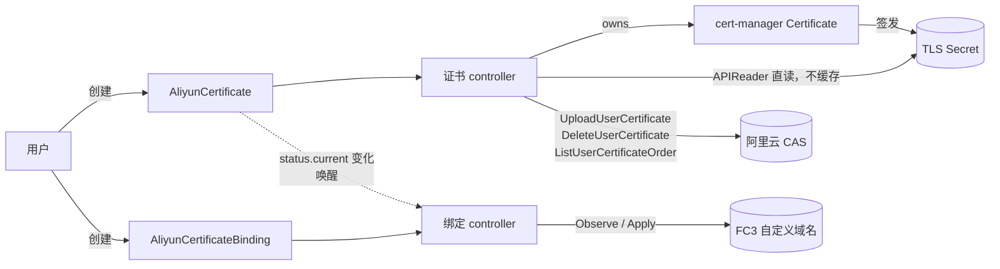

# Plan 3 — 部署、运维文档、真实云集成测试与工具链 实现计划

> **For agentic workers:** REQUIRED SUB-SKILL: Use superpowers:subagent-driven-development (recommended) or superpowers:executing-plans to implement this plan task-by-task. Steps use checkbox (`- [ ]`) syntax for tracking.

**Goal:** 把 Plan 1 交付的 operator 变成一个可以交给别人部署和运维的东西：`make lint` 与带 `-race` 的 CI 全绿、一套 Argo CD + OpenShift 的部署清单与告警规则、一份中文 README，以及一个 build tag 隔离的真实云集成测试包，把 spec §12.3 的 11 项未核实事实逐条实测并把结论回填进 spec 与代码注释。

**Architecture:** 三条互不阻塞的线。工具链线（Task 1–2）修 golangci-lint 与 CI；集成测试线（Task 3–8、14）在 `test/integration/` 建一个 `//go:build integration` 的包，凭证只从环境变量读、缺失即 skip，每项结论经 `Record` 落进 `test/integration/RESULTS.md`；部署与文档线（Task 9–13）把 `config/` 拆出一个不含 CRD 的 `config/operator` 基座，供 Argo CD 的两个 Application 拥有互不相交的资源集合，再写 PrometheusRule、OpenShift overlay 与 README。

**Tech Stack:** Go 1.26（本机工具链 go1.27.1）、golangci-lint v2.13.2、kustomize v5.6.0、controller-gen v0.18.0、Argo CD（`ServerSideApply=true`）、Prometheus Operator（`PrometheusRule` / `ServiceMonitor`）、阿里云 CAS SDK `github.com/alibabacloud-go/cas-20200407/v4`、cert-manager v1.21.1。

**Spec:** `docs/superpowers/specs/2026-09-04-le-to-alicloud-operator-design.md`

## Global Constraints

- Go module 路径：`git.dev.bestheme.ac.cn/infra/le-to-alicloud`。API group / version：`certs.bestheme.ac.cn/v1alpha1`。
- Commit message 不加 `Co-Authored-By`（用户偏好），使用 conventional commits（`feat:` / `fix:` / `test:` / `chore:` / `docs:`）。
- 代码注释与文档用中文；标识符、API 名、flag 名、指标名保持英文原样。
- 不手改生成物：`config/crd/bases/*.yaml`、`api/v1alpha1/zz_generated.deepcopy.go`、`config/rbac/role.yaml` 只能经 `make manifests generate` 产生。需要给生成物加注解一律走 kustomize patch。
- 每个 Task 结束时 `make build && make test` 必须通过。Task 1 之后每个 Task 结束时 `make lint` 也必须通过。
- **文档里出现的每一条命令都必须能直接复制执行**：路径真实存在、flag 真实注册、`make` 目标真实定义。写完一节就把该节的命令跑一遍。
- **不引入新的 Go module**。允许的例外只有两类：`Makefile` 的 `GOLANGCI_LINT_VERSION` 版本变更；`go mod tidy` 把**已经存在**的 indirect 依赖提为 direct（例如 `k8s.io/client-go/tools/clientcmd` 被集成测试直接 import 时）。Task 8 需要的 `github.com/alibabacloud-go/fc-20230330/v4` 由 Plan 2 引入，Plan 3 不负责添加。
- **仓库里绝不出现真实凭证**。集成测试只从环境变量读凭证；`test/integration/RESULTS.md` 在写入前必须经 `scrub()` 抹掉 AK/SK；`.gitignore` 收录 `*.env`。
- 私钥、AK/SK 绝不出现在日志、event、status、error message、测试报告中。
- 集成测试在缺少凭证时 **skip**，不 fail；`make test` 与 CI 的三个 workflow 都不得执行 `make test-integration`。

---

## 文件结构

| 路径 | 职责 |
|---|---|
| `.golangci.yml` | lint 配置：新增 `run.build-tags: [integration]` 与四条排除规则 |
| `Makefile` | 新增 `test-race`、`test-integration` 目标；`GOLANGCI_LINT_VERSION` 升级；`PLATFORMS` 收敛为 amd64 + arm64 |
| `.github/workflows/test.yml` | `go mod tidy -diff`；新增 `-race` job |
| `.github/workflows/test-e2e.yml` | `go mod tidy -diff` |
| `.github/workflows/lint.yml` | golangci-lint 版本与 Makefile 对齐 |
| `.gitignore` | 追加 `*.env` 与 `/bin` |
| `test/utils/utils.go` | e2e 的 cert-manager 版本对齐到 v1.21.1 |
| `test/integration/env.go` | 环境变量契约、skip 逻辑、CAS client 构造、上传与清理辅助 |
| `test/integration/report.go` | `finding` / `Record` / `RecordSkip` / `scrub` / `writeResults` / `mdCell` |
| `test/integration/main_test.go` | `TestMain`：跑完全部用例后写 `RESULTS.md`（Go 只在 `_test.go` 里识别 `TestMain`） |
| `test/integration/certs.go` | 证书链拼装辅助（拆分 / 重排 PEM 块） |
| `test/integration/cas_pem_test.go` | §12.3 #1、#5（CAS 侧）：私钥编码与证书链形状 |
| `test/integration/cas_token_test.go` | §12.3 #3、#4：ClientToken 语义、`Name` 字符集、重名错误码 |
| `test/integration/cas_scope_test.go` | §12.3 #8、#9 + M-13：配额、跨 region 可见性、`Keyword` 通配符 |
| `test/integration/cluster_test.go` | §12.3 #6、#7、#11：Secret ownerRef、revision、cert-manager 注解 |
| `test/integration/fc3_test.go` | §12.3 #1、#2、#5、#10（FC3 侧）——依赖 Plan 2 的 `FC3Client` |
| `test/integration/env.example.sh` | 环境变量样板（无真实值） |
| `test/integration/RESULTS.md` | 由 `make test-integration` 生成并提交，作为回填依据 |
| `config/operator/kustomization.yaml` | operator 自身（RBAC + Deployment + metrics Service），**不含 CRD** |
| `config/operator/metrics_service.yaml` | 从 `config/default/` 移入 |
| `config/operator/manager_metrics_patch.yaml` | 从 `config/default/` 移入 |
| `config/default/kustomization.yaml` | 改为 `../crd` + `../operator`，`make deploy` 行为不变 |
| `config/prometheus/prometheusrule.yaml` | spec §10.3 的四条告警 |
| `config/overlays/openshift/kustomization.yaml` | OpenShift 生产 overlay：`config/operator` + `config/prometheus` |
| `config/overlays/openshift/sync-waves.yaml` | Deployment 的 `argocd.argoproj.io/sync-wave: "1"` |
| `config/overlays/openshift/openshift-scc.yaml` | 显式抹掉 `runAsUser` / `runAsGroup`（restricted-v2） |
| `deploy/argocd/application-crds.yaml` | Application：CRD，wave `-2` |
| `deploy/argocd/application-operator.yaml` | Application：operator，wave `0` |
| `deploy/argocd/application-credentials.yaml.example` | Application 模板：凭证 Secret 独立所有权 |
| `docs/ram/certificate-cas-policy.json` | 证书 controller 的 RAM 策略（抄 spec §8.3）；README 只引用不再抄 JSON |
| `README.md` | 中文全量文档（Task 12 前半 + Task 13 后半） |
| `docs/superpowers/specs/2026-09-04-le-to-alicloud-operator-design.md` | §5.2、§9、§10.2、§12.3、§14 更新（Task 9）；§2.5 / §12.3 结论回填（Task 14） |

---

### Task 1: 工具链——golangci-lint 升级与 `make lint` 转绿

Plan 1 全程 `make lint` 是失效的（golangci-lint v2.1.0 不认 Go 1.27 的 export data），15 个任务没有一次跑过 lint。这个任务把它修好，并把它暴露出来的真实问题一次清掉。

**Files:**
- Modify: `Makefile`（`GOLANGCI_LINT_VERSION`）
- Modify: `.golangci.yml`（排除规则）
- Modify: `.github/workflows/lint.yml`（版本对齐）
- Modify: `internal/controller/aliyuncertificate_controller.go:136`
- Modify: `internal/controller/upload.go:158`
- Modify: `internal/controller/metrics.go`（label 切片抽常量）
- Modify: `internal/controller/suite_test.go:69`
- Modify: `pkg/pki/bundle.go`（`CERTIFICATE` 抽常量）
- Modify: `pkg/pki/bundle_test.go:107,215`
- Modify: `cmd/main.go:107`、`cmd/main_flags_test.go:31`
- Modify: `pkg/aliyun/fake/cas.go:14,105`、`pkg/aliyun/cas_sdk_test.go:63`、`pkg/aliyun/credentials_test.go:62`

**Interfaces:**
- Consumes: 无。
- Produces: `make lint` exit 0，成为后续每个 Task 的收尾门禁；`.golangci.yml` 的排除规则块，Task 3 会在同一文件的 `run:` 段追加 `build-tags`。

- [ ] **Step 1: 升级 golangci-lint 版本并确认它能跑起来**

`Makefile` 的 `GOLANGCI_LINT_VERSION ?= v2.1.0` 改为：

```make
GOLANGCI_LINT_VERSION ?= v2.13.2
```

然后：

```bash
make golangci-lint
./bin/golangci-lint version
```

Expected: 打印 `golangci-lint has version v2.13.2`（或 `(devel)`，取决于安装方式），不再出现 `export data ... unsupported version`。

- [ ] **Step 2: 跑一次基线 lint，确认它真的在工作**

```bash
make lint 2>&1 | tail -8
```

Expected: 失败，末尾是

```
48 issues:
* goconst: 34
* lll: 7
* staticcheck: 5
* unconvert: 1
* unparam: 1
```

数字不必完全一致（取决于 lint 版本的规则微调），但**必须有输出**。如果输出是 0 issues，说明版本没换上去，回到 Step 1。

- [ ] **Step 3: 加排除规则，把「不是问题的问题」压下去**

`.golangci.yml` 的 `linters.exclusions.rules` 段落末尾（`path: internal/*` 那条之后）追加四条：

```yaml
      # 测试与测试辅助包里的重复字面量是被测数据，不是待抽取的常量
      - linters:
          - goconst
        path: (_test\.go|/testutil/)
      # 脚手架生成的 SchemeBuilder：controller-runtime 已弃用，但这一行由 operator-sdk 生成
      - linters:
          - staticcheck
        path: api/v1alpha1/groupversion_info.go
        text: "SA1019"
      # 迁移到 events.EventRecorder 会改动全部 12 个事件调用点并要求补 action 参数，
      # 属于行为变更，不在 lint 清理的范围内；见 README「已知限制」
      - linters:
          - staticcheck
        text: "SA1019.*GetEventRecorderFor"
      # 集成探针的 Record(t, id, question, result, detail) 天然是长参数列表，
      # 折行只会让「哪一项在记什么」更难读；Task 3 建的 test/integration/ 整目录豁免 lll
      - linters:
          - lll
        path: test/integration/
```

第四条现在指向一个还不存在的目录（`test/integration/` 由 Task 3 创建）。golangci-lint 对
匹配不到任何文件的 path 规则不报错，先落地是为了让 Task 3 不必回头再改这一段。

验证配置合法并复跑：

```bash
make lint-config
make lint 2>&1 | tail -8
```

Expected: `lint-config` exit 0；`make lint` 剩 13 issues（goconst 2、lll 7、staticcheck 2、unconvert 1、unparam 1）。

- [ ] **Step 4: 修 `unconvert`——`internal/controller/upload.go:158`**

`r.APIReader` 的声明类型已经是 `client.Reader`（`aliyuncertificate_controller.go:58`），转换是多余的：

```go
	reader := r.APIReader
	if reader == nil {
		reader = r.Client
	}
```

`client` 包在同文件 163、202 行仍在用，import 不动。

- [ ] **Step 5: 修 `unparam`——`internal/controller/suite_test.go:69`**

没有任何调用方使用返回值，去掉它：

```go
// resetCAS 换上一个全新的 fake，用例随后用 currentCAS() 取。
func resetCAS() {
	fakeMu.Lock()
	defer fakeMu.Unlock()
	fakeCAS = fake.NewCAS()
}
```

- [ ] **Step 6: 修 `staticcheck` SA1019——`internal/controller/aliyuncertificate_controller.go:136`**

`ctrl.Result{Requeue: true}` 在 controller-runtime v0.24 已弃用。加 finalizer 的那次 `Update` 本身就会触发 watch 事件，返回空 `Result` 即可（这也是 Plan 1 最终评审的 M-4）：

```go
	if !controllerutil.ContainsFinalizer(ac, certsv1alpha1.FinalizerName) {
		controllerutil.AddFinalizer(ac, certsv1alpha1.FinalizerName)
		if err := r.Update(ctx, ac); err != nil {
			return ctrl.Result{}, err
		}
		// Update 会触发本对象的 watch 事件，不需要显式 requeue。
		return ctrl.Result{}, nil
	}
```

- [ ] **Step 7: 修 `staticcheck` SA1019——`pkg/pki/bundle_test.go:215`**

这里是**读取**私钥标量做「没有泄漏」断言，不是修改私钥，弃用告警不适用。加行内豁免：

```go
			case *ecdsa.PrivateKey:
				d = k.D //nolint:staticcheck // 只读取标量做泄漏断言，不修改私钥
```

- [ ] **Step 8: 修两处 `goconst`**

`pkg/pki/bundle.go`：在 `parseCertificates` 之前加常量，并替换 77、206、208 三处字面量。

```go
// pemTypeCertificate 是证书 PEM 块的类型标识。
const pemTypeCertificate = "CERTIFICATE"
```

```go
		if blk.Type != pemTypeCertificate {
```

```go
	buf.Write(pem.EncodeToMemory(&pem.Block{Type: pemTypeCertificate, Bytes: b.Leaf.Raw}))
```

```go
		buf.Write(pem.EncodeToMemory(&pem.Block{Type: pemTypeCertificate, Bytes: c.Raw}))
```

`internal/controller/metrics.go`：五个 GaugeVec / CounterVec 共用同一组 label，抽成变量并替换 44、47、50、53、63 五处 `[]string{"namespace", "name"}`。在 `var (` 块之前加：

```go
// crLabels 是「一个 CR 一条 series」的 label 集合。抽成变量不只是去重：它保证五个
// 指标的 label 顺序永远一致，recordCertMetrics 里 WithLabelValues(ns, n) 才是对的。
var crLabels = []string{"namespace", "name"}
```

**只替换现有的这 5 处**。Plan 2 的 Task 7 会往同一个 `var (` 块里加两个 binding gauge
（`aliyuncert_binding_ready` / `aliyuncert_binding_conflict`），它们由 Plan 2 自己用
`crLabels` 写（Plan 2 ledger P2-R13），Plan 3 不管，也不要在合并后回头去改它们。

- [ ] **Step 9: 修 7 处 `lll`（超过 120 字符）**

逐个折行，不改语义：

- `cmd/main.go:107`（122 字符）——`validate()` 里的策略判断：

```go
	if o.CleanupFailurePolicy != controller.CleanupPolicyAbandon &&
		o.CleanupFailurePolicy != controller.CleanupPolicyBlock {
```

- `pkg/aliyun/fake/cas.go:14`（148 字符）——`ErrDuplicateName` 拆成多行字面量：

```go
var ErrDuplicateName = &aliyun.Error{
	Class: aliyun.ClassPermanent,
	Op:    "Upload",
	Code:  "CertNameDuplicated",
	Err:   errors.New("name already exists"),
}
```

- `pkg/aliyun/fake/cas.go:105`（135 字符）——`f.certs[id] = Cert{...}` 拆成多行字段。
- `cmd/main_flags_test.go:31`（127 字符）——把多条件 `if` 拆成多行 `||` 续行。
- `pkg/aliyun/cas_sdk_test.go:63`（131 字符）——表驱动用例的一行，把 `Classify(...)` 提到表外的局部变量。
- `pkg/aliyun/credentials_test.go:62`（149 字符）——map 字面量每个键值一行。
- `pkg/pki/bundle_test.go:107`（158 字符）——`dirty := append(...)` 拆成两条语句。

- [ ] **Step 10: 确认 lint 全绿且测试没被改坏**

```bash
make lint
make build test
```

Expected: `make lint` 无输出、exit 0；`make test` 全部包 ok。

- [ ] **Step 11: CI 的 lint 版本与 Makefile 对齐**

`.github/workflows/lint.yml` 的 `version: v2.1.0` 改为 `version: v2.13.2`。两处版本必须一致，否则本地绿 CI 红。

```bash
grep -n "v2.13.2" Makefile .github/workflows/lint.yml
```

Expected: 两个文件各命中一次。

- [ ] **Step 12: 提交**

```bash
git add Makefile .golangci.yml .github/workflows/lint.yml \
  cmd internal pkg
git commit -m "chore(lint): upgrade golangci-lint to v2.13.2 and fix all findings"
```

---

### Task 2: CI 加固与仓库卫生

**Files:**
- Modify: `Makefile`（新增 `test-race` 目标）
- Modify: `.github/workflows/test.yml`
- Modify: `.github/workflows/test-e2e.yml`
- Modify: `test/utils/utils.go:35`
- Modify: `.gitignore`

**Interfaces:**
- Consumes: Task 1 的 `make lint`。
- Produces: `make test-race` 目标（Task 3–14 收尾时可选跑）；`.gitignore` 的 `*.env` 规则，Task 3 的 `env.example.sh` 依赖它保证真实凭证文件不会被误提交。

- [ ] **Step 1: 复现 CI 会剪掉钉版这件事**

```bash
go mod tidy -diff; echo "exit=$?"
```

Expected: exit 0，无 diff 输出。这说明当前 `go.mod` 已经 tidy，可以安全地把 CI 从「跑 tidy」改成「校验 tidy」。

- [ ] **Step 2: CI 改为校验而不是修改**

`.github/workflows/test.yml` 与 `.github/workflows/test-e2e.yml` 里的 `go mod tidy` 都改成：

```yaml
          go mod tidy -diff
```

理由写进 commit：裸跑 `tidy` 会在 CI 里静默改写 `go.mod`，把还没被 import 的钉版依赖剪掉，本地与 CI 于是构建自不同的依赖图；`-diff` 只做校验，不一致就退出非零。

- [ ] **Step 3: 新增 `make test-race`**

`Makefile` 的 `test` 目标之后插入：

```make
.PHONY: test-race
test-race: manifests generate fmt vet setup-envtest ## Run tests with the race detector.
	KUBEBUILDER_ASSETS="$(shell $(ENVTEST) use $(ENVTEST_K8S_VERSION) --bin-dir $(LOCALBIN) -p path)" go test -race $$(go list ./... | grep -v /e2e)
```

刻意不带 `-coverprofile`：`-race` 跑的是并发正确性，覆盖率由 `make test` 负责，两个目标各写各的产物才不会互相覆盖 `cover.out`。

- [ ] **Step 4: 跑一遍确认干净**

```bash
make test-race
```

Expected: 全部包 `ok`，没有 `WARNING: DATA RACE`。参考耗时：`internal/controller` 约 40s。

- [ ] **Step 5: CI 增加 race job**

`.github/workflows/test.yml` 的 `jobs:` 下追加：

```yaml
  test-race:
    name: Race detector
    runs-on: ubuntu-latest
    steps:
      - name: Clone the code
        uses: actions/checkout@v4

      - name: Setup Go
        uses: actions/setup-go@v5
        with:
          go-version-file: go.mod

      - name: Running Tests with race detector
        run: |
          go mod tidy -diff
          make test-race
```

理由：这个分支的并发面（manager goroutine + 假时钟 + 共享 fake CAS）恰恰需要 `-race`，而 `make test` 不带它。

- [ ] **Step 6: e2e 的 cert-manager 版本对齐**

`test/utils/utils.go:35` 的 `certmanagerVersion = "v1.16.3"` 改为：

```go
	certmanagerVersion = "v1.21.1"
```

与 `go.mod` 钉的 cert-manager 模块版本、`test/crds/cert-manager.crds.yaml` 的来源版本三者一致。校验：

```bash
grep -n "certmanagerVersion" test/utils/utils.go
go list -m github.com/cert-manager/cert-manager
```

Expected: 两处都是 `v1.21.1`。

- [ ] **Step 7: `.gitignore` 挡住凭证文件**

在 `# editor and IDE paraphernalia` 之前插入：

```gitignore
# 本地凭证（集成测试用），绝不提交
*.env
# 并行 worktree 里 bin 是指向主仓库 bin 的软链，不能提交
/bin
```

现有的 `bin/*` 规则只挡目录里的内容，挡不住名为 `bin` 的软链本身（`git status` 会把它
当成一个未跟踪的普通文件），`/bin` 这一行才是真正生效的那条。

- [ ] **Step 8: 确认门禁全绿并提交**

```bash
make build test lint
git add Makefile .github/workflows .gitignore test/utils/utils.go
git commit -m "chore(ci): verify go.mod with tidy -diff, add race job, align cert-manager version"
```

---

### Task 3: 集成测试骨架

建一个 `//go:build integration` 的包。**整个目录里的每个文件都带这个 tag**——这样 `go list ./...` 完全看不见它，`make build` / `make test` / `go vet ./...` 一律不受影响（已实测：混合模块里带 tag 的目录对 `./...` 不可见，exit 0，无 warning）。lint 侧则通过 `run.build-tags` 把它拉回视野。

**Files:**
- Create: `test/integration/env.go`
- Create: `test/integration/report.go`（`finding` / `Record` / `RecordSkip` / `scrub` / `writeResults` / `mdCell`）
- Create: `test/integration/main_test.go`（只放 `TestMain`；Go 只在 `_test.go` 里识别 `TestMain`）
- Create: `test/integration/certs.go`
- Create: `test/integration/env.example.sh`
- Create: `test/integration/smoke_test.go`
- Modify: `Makefile`（`test-integration` 目标）
- Modify: `.golangci.yml`（`run.build-tags`）

**Interfaces:**
- Consumes: `aliyun.Credentials{AccessKeyID, AccessKeySecret, SecurityToken}`、`(*Credentials).Build() (credential.Credential, error)`、`(*Credentials).LimiterKey() string`、`aliyun.NewCASClient(cred credential.Credential, cfg aliyun.CASClientConfig) (aliyun.CASClient, error)`、`aliyun.CASClientConfig{Region, Endpoint, ResourceGroupID, Timeout, Limiters, LimiterKey, OnCall}`、`aliyun.NewLimiters()`、`aliyun.CASClient{Upload(ctx, name string, certPEM, keyPEM []byte, clientToken string) (int64, error); Delete(ctx, certID int64, clientToken string) error; FindUploaded(ctx, domainHint string) ([]aliyun.CertSummary, error)}`、`aliyun.CertSummary{CertID, Name, SANs, EndDate}`、`pkg/pki/testutil` 的 `NewCA(TB) *CA`、`IssueLeaf(TB, *CA, ...string) (certPEM, keyPEM []byte)`、`IssueLeafRSA`、`SelfSigned`、`ToPKCS8(TB, []byte) []byte`、`Encrypted(TB) []byte`。
- Produces: 供 Task 4–8 使用的
  - `requireCAS(t *testing.T, id, question string) (*aliyun.Credentials, string)`
  - `newCAS(t *testing.T, cred *aliyun.Credentials, region string) aliyun.CASClient`
  - `uploadForTest(t *testing.T, c aliyun.CASClient, name string, certPEM, keyPEM []byte, token string) (int64, error)`
  - `deleteForTest(t *testing.T, c aliyun.CASClient, certID int64) error`
  - `itName(t *testing.T, suffix string) string`
  - `randToken(t *testing.T) string`、`randHex(t *testing.T, n int) string`
  - `testDomain() string`、`env(k string) string`、`itoa(v int64) string`
  - `asAliyunError(err error, target **aliyun.Error) bool`
  - `outcome(certID int64, err error) (result, detail string)`
  - `Record(t *testing.T, id, question, result, detail string)`
  - `RecordSkip(t *testing.T, id, question, why string)`
  - `TestMain(m *testing.M)`（在 `main_test.go` 里，不在 `report.go`：Go 只从 `_test.go` 中识别 `TestMain`，写在普通文件里它永远不会被执行、`RESULTS.md` 也就永远不会生成）
  - `splitPEM(t *testing.T, b []byte) [][]byte`、`joinPEM(blocks ...[]byte) []byte`
  - 环境变量常量 `EnvAccessKeyID` / `EnvAccessKeySecret` / `EnvSecurityToken` / `EnvRegion` / `EnvCASRegionAlt` / `EnvResourceGroupID` / `EnvFC3TestDomain` / `EnvKubeconfig` / `EnvKeepUploaded`

- [ ] **Step 1: 写环境契约 `test/integration/env.go`**

```go
//go:build integration

// Package integration 是 spec §12.3 的真实云必测清单。
//
// 这些测试对真实的阿里云账号发起调用并留下真实资源，所以：
//   - 凭证只从环境变量读，仓库里不放任何凭证；
//   - 缺少凭证时 skip 而不是失败，`make test` 与 CI 完全不受影响；
//   - 每一项的结论经 Record 落进 RESULTS.md，供最后一个任务回填 spec 与代码注释。
//
// 整个目录的每个文件都带 integration build tag，因此 `go list ./...` 看不见这个包。
package integration

import (
	"context"
	"crypto/rand"
	"encoding/hex"
	"errors"
	"os"
	"strconv"
	"strings"
	"testing"
	"time"

	"git.dev.bestheme.ac.cn/infra/le-to-alicloud/pkg/aliyun"
)

// 环境变量契约。样板见 test/integration/env.example.sh。
const (
	EnvAccessKeyID     = "ALIYUN_ACCESS_KEY_ID"
	EnvAccessKeySecret = "ALIYUN_ACCESS_KEY_SECRET"
	EnvSecurityToken   = "ALIYUN_SECURITY_TOKEN"
	EnvRegion          = "ALIYUN_REGION"
	EnvCASRegionAlt    = "ALIYUN_CAS_REGION_ALT"
	EnvResourceGroupID = "ALIYUN_RESOURCE_GROUP_ID"
	EnvFC3TestDomain   = "FC3_TEST_DOMAIN"
	EnvKubeconfig      = "INTEGRATION_KUBECONFIG"
	EnvKeepUploaded    = "INTEGRATION_KEEP_UPLOADED"
)

// callTimeout 与 --cloud-call-timeout 的默认值一致，让集成测试看到的超时行为
// 与生产一致。
const callTimeout = 30 * time.Second

func env(k string) string { return strings.TrimSpace(os.Getenv(k)) }

// testDomain 是测试证书的 SAN。CAS 只做格式校验、不验证域名归属，所以没设
// FC3_TEST_DOMAIN 时用一个保留域名，避免误碰真实域名的证书。
func testDomain() string {
	if d := env(EnvFC3TestDomain); d != "" {
		return d
	}
	return "it.integration.invalid"
}

// requireCAS 取 CAS 凭证。缺任何一项就把这一项记成「未实测」并 skip——测试不该
// 因为没凭证而变红，但清单上少了哪一项必须留下痕迹。
func requireCAS(t *testing.T, id, question string) (*aliyun.Credentials, string) {
	t.Helper()
	id0, secret, region := env(EnvAccessKeyID), env(EnvAccessKeySecret), env(EnvRegion)
	if id0 == "" || secret == "" || region == "" {
		RecordSkip(t, id, question,
			"缺少 "+EnvAccessKeyID+" / "+EnvAccessKeySecret+" / "+EnvRegion)
	}
	return &aliyun.Credentials{
		AccessKeyID:     id0,
		AccessKeySecret: secret,
		SecurityToken:   env(EnvSecurityToken),
	}, region
}

// newCAS 构造指向 region 的真实 CAS client。限流器每次新建：集成测试是串行的，
// 共享限流器只会让相邻用例互相拖慢。
func newCAS(t *testing.T, cred *aliyun.Credentials, region string) aliyun.CASClient {
	t.Helper()
	built, err := cred.Build()
	if err != nil {
		t.Fatalf("构造凭证失败: %v", err)
	}
	c, err := aliyun.NewCASClient(built, aliyun.CASClientConfig{
		Region:          region,
		ResourceGroupID: env(EnvResourceGroupID),
		Timeout:         callTimeout,
		Limiters:        aliyun.NewLimiters(),
		LimiterKey:      cred.LimiterKey(),
	})
	if err != nil {
		t.Fatalf("构造 CAS client 失败: %v", err)
	}
	return c
}

// uploadForTest 上传并登记清理：成功上传的每一张证书都会经 registerCleanup 注册一个
// t.Cleanup(func(){ deleteForTest(...) })，用例结束时从真实账号里删掉。刻意返回原始
// error 而不 Fatal：多数用例要断言的恰恰是错误的形状（错误码、是否可重试），不是「成功」。
func uploadForTest(
	t *testing.T, c aliyun.CASClient, name string, certPEM, keyPEM []byte, token string,
) (int64, error) {
	t.Helper()
	ctx, cancel := context.WithTimeout(context.Background(), callTimeout)
	defer cancel()
	certID, err := c.Upload(ctx, name, certPEM, keyPEM, token)
	if err == nil && certID != 0 {
		registerCleanup(t, c, certID)
	}
	return certID, err
}

// deleteForTest 立刻删除一张证书。它是删除的唯一入口：registerCleanup 的 t.Cleanup
// 调它，用例也可以显式调它（「先删首张再验证同名可复用」这类路径）。统一走这一个
// 函数还顺带消掉了 unused——它不会再是一个定义了没人调的死函数。
func deleteForTest(t *testing.T, c aliyun.CASClient, certID int64) error {
	t.Helper()
	ctx, cancel := context.WithTimeout(context.Background(), callTimeout)
	defer cancel()
	return c.Delete(ctx, certID, randToken(t))
}

// registerCleanup 保证测试结束后云上不留垃圾：每张探针上传的证书都在用例结束时从
// 真实账号删除。删不掉时只记日志不 Fail——测试的结论已经拿到了，清理失败该由人接手，
// 不该把结论一起抹掉。
func registerCleanup(t *testing.T, c aliyun.CASClient, certID int64) {
	t.Helper()
	if env(EnvKeepUploaded) == "1" {
		t.Logf("INTEGRATION_KEEP_UPLOADED=1，保留 certId=%d 供人工检查", certID)
		return
	}
	t.Cleanup(func() {
		if err := deleteForTest(t, c, certID); err != nil {
			t.Logf("清理 certId=%d 失败，需人工删除: %v", certID, err)
		}
	})
}

// itName 生成本次运行专用的 CAS 证书名：itest_<12 位随机>_<suffix>。
// 字符集与长度都遵守 naming.CASName 的约束（[A-Za-z0-9_]、≤ 63），只有专门探测
// 字符集的那个用例会故意越界。
func itName(t *testing.T, suffix string) string {
	t.Helper()
	return "itest_" + randHex(t, 6) + "_" + suffix
}

// randToken 生成 32 字符的纯字母数字 ClientToken。
func randToken(t *testing.T) string {
	t.Helper()
	return randHex(t, 16)
}

func randHex(t *testing.T, n int) string {
	t.Helper()
	b := make([]byte, n)
	if _, err := rand.Read(b); err != nil {
		t.Fatalf("生成随机数失败: %v", err)
	}
	return hex.EncodeToString(b)
}

// itoa 让报告里的 certId 有个统一写法。
func itoa(v int64) string { return strconv.FormatInt(v, 10) }

// asAliyunError 是 errors.As 的一层包装，让各个用例文件不必各自 import errors。
func asAliyunError(err error, target **aliyun.Error) bool {
	return errors.As(err, target)
}

// outcome 把一次上传折叠成一句可写进报告的话。探针类用例关心的是「接受还是拒绝、
// 拒绝时的错误码是什么」，这三行在六七个用例里一模一样，抽出来免得各写一遍。
func outcome(certID int64, err error) (result, detail string) {
	if err == nil {
		return "接受", "上传成功，certId=" + itoa(certID)
	}
	var ae *aliyun.Error
	if asAliyunError(err, &ae) {
		return "拒绝", "code=" + ae.Code + " class=" + aliyun.ClassOf(err).String()
	}
	return "拒绝", "非 SDK 错误: " + err.Error()
}
```

- [ ] **Step 2: 写报告器 `test/integration/report.go` 与入口 `test/integration/main_test.go`**

报告器拆成两个文件：`report.go` 放 `finding` / `Record` / `RecordSkip` / `scrub` /
`writeResults` / `mdCell`，`TestMain` 单独放 `main_test.go`。**这不是风格问题**：Go 只在
`_test.go` 文件里识别 `TestMain`，写在普通文件里它不会被 `go test` 调用，`RESULTS.md`
于是永远不会生成，Task 4–8 的每一条 `Record` 与 Task 14 的整条回填链都会跟着落空。

`test/integration/report.go`：

```go
//go:build integration

package integration

import (
	"fmt"
	"os"
	"sort"
	"strings"
	"sync"
	"testing"
	"time"
)

// finding 是清单里的一行结论。
type finding struct {
	ID       string // spec §12.3 的编号，例如 "#3"
	Question string
	Result   string // 一句话结论
	Detail   string // 证据：错误码、certId、返回字段
	Skipped  bool
}

var (
	findingsMu sync.Mutex
	findings   []finding
)

// Record 登记一条结论。result 与 detail 都要经 scrub——RESULTS.md 是要提交进
// 仓库的，绝不能夹带 AK/SK。
func Record(t *testing.T, id, question, result, detail string) {
	t.Helper()
	t.Logf("[%s] %s => %s (%s)", id, question, result, detail)
	findingsMu.Lock()
	defer findingsMu.Unlock()
	findings = append(findings, finding{
		ID: id, Question: question, Result: scrub(result), Detail: scrub(detail),
	})
}

// RecordSkip 登记一条「未实测」并 skip 当前用例。它不返回。
func RecordSkip(t *testing.T, id, question, why string) {
	t.Helper()
	findingsMu.Lock()
	findings = append(findings, finding{
		ID: id, Question: question, Result: "未实测", Detail: why, Skipped: true,
	})
	findingsMu.Unlock()
	t.Skip(why)
}

// scrub 把凭证明文从报告里抹掉。云 SDK 的错误文本偶尔会回显请求参数，这一层是
// 「报告绝不含凭证」这条约束唯一的执行点。
func scrub(s string) string {
	for _, k := range []string{EnvAccessKeySecret, EnvAccessKeyID, EnvSecurityToken} {
		if v := env(k); v != "" {
			s = strings.ReplaceAll(s, v, "***")
		}
	}
	return s
}

// resultsFile 相对 cwd；go test 的 cwd 就是包目录。
const resultsFile = "RESULTS.md"

func writeResults() error {
	findingsMu.Lock()
	defer findingsMu.Unlock()
	if len(findings) == 0 {
		return nil
	}
	// 一次没有凭证的运行不该把已有的真实结论覆盖成一片「未实测」。
	allSkipped := true
	for _, f := range findings {
		if !f.Skipped {
			allSkipped = false
			break
		}
	}
	if allSkipped {
		if _, err := os.Stat(resultsFile); err == nil {
			fmt.Fprintln(os.Stderr, "全部用例被 skip，保留已有的 RESULTS.md")
			return nil
		}
	}
	sort.SliceStable(findings, func(i, j int) bool { return findings[i].ID < findings[j].ID })

	var b strings.Builder
	b.WriteString("# 真实云集成测试结论（spec §12.3）\n\n")
	fmt.Fprintf(&b, "- 生成时间：%s\n", time.Now().UTC().Format(time.RFC3339))
	fmt.Fprintf(&b, "- region：`%s`；备用 CAS region：`%s`\n", env(EnvRegion), env(EnvCASRegionAlt))
	b.WriteString("- 本文件由 `make test-integration` 生成，不要手改。\n\n")
	b.WriteString("| # | 待核实 | 结论 | 证据 |\n|---|---|---|---|\n")
	for _, f := range findings {
		fmt.Fprintf(&b, "| %s | %s | %s | %s |\n",
			f.ID, mdCell(f.Question), mdCell(f.Result), mdCell(f.Detail))
	}
	return os.WriteFile(resultsFile, []byte(b.String()), 0o644)
}

// mdCell 转义竖线与换行，保证一段多行的云错误文本不会把表格撑破。
func mdCell(s string) string {
	s = strings.ReplaceAll(s, "|", `\|`)
	return strings.ReplaceAll(s, "\n", "<br>")
}
```

`test/integration/main_test.go`（**文件名必须以 `_test.go` 结尾**，否则 `TestMain` 不生效）：

```go
//go:build integration

package integration

import (
	"fmt"
	"os"
	"testing"
)

// TestMain 是 RESULTS.md 的唯一写入点：跑完包内全部用例后把攒下的 findings 落盘。
// 它必须待在 _test.go 里——Go 的测试主函数只从测试文件中识别，放进 report.go 之类的
// 普通文件里既不会报错也不会被调用，报告会静默地永远不生成。
func TestMain(m *testing.M) {
	code := m.Run()
	if err := writeResults(); err != nil {
		fmt.Fprintf(os.Stderr, "写 RESULTS.md 失败: %v\n", err)
	}
	os.Exit(code)
}
```

- [ ] **Step 3: 写 PEM 辅助 `test/integration/certs.go`**

```go
//go:build integration

package integration

import (
	"bytes"
	"encoding/pem"
	"testing"
)

// splitPEM 把一段可能含多个块的 PEM 拆成逐块编码的切片，顺序保持不变。
// 用于构造「只有 leaf」「leaf 与 intermediate 顺序颠倒」这类形状。
func splitPEM(t *testing.T, b []byte) [][]byte {
	t.Helper()
	var out [][]byte
	rest := b
	for {
		blk, next := pem.Decode(rest)
		if blk == nil {
			break
		}
		out = append(out, pem.EncodeToMemory(blk))
		rest = next
	}
	if len(out) == 0 {
		t.Fatal("PEM 里一个块也没有")
	}
	return out
}

// joinPEM 按给定顺序拼接 PEM 块，块之间不留空行——这正是阿里云要求的形状
// （spec §2.2：证书之间不能有空行）。
func joinPEM(blocks ...[]byte) []byte {
	return bytes.Join(blocks, nil)
}
```

- [ ] **Step 4: 写环境样板 `test/integration/env.example.sh`**

```bash
#!/usr/bin/env bash
# 集成测试环境样板。复制成一个 .env 文件（已被 .gitignore 挡住）后填真实值：
#   cp test/integration/env.example.sh local.env && $EDITOR local.env
#   set -a && source local.env && set +a && make test-integration
#
# 强烈建议用一个只给了 README「RAM 权限」一节那两条策略的独立子账号，
# 且不要用生产账号：yundun-cert:* 无法资源级收窄，AK 泄漏可删账号下任意上传证书。

export ALIYUN_ACCESS_KEY_ID=REPLACE_ME
export ALIYUN_ACCESS_KEY_SECRET=REPLACE_ME
# 可选：STS 临时凭证
export ALIYUN_SECURITY_TOKEN=

# CAS 与 FC3 的主 region
export ALIYUN_REGION=cn-hangzhou
# 可选：用于验证 CAS 跨 region 可见性（§12.3 #9）。留空则跳过该项。
# 选一个有独立 endpoint 的 region：ap-southeast-1 / ap-northeast-1 / eu-central-1 …
export ALIYUN_CAS_REGION_ALT=ap-southeast-1
# 可选：资源组
export ALIYUN_RESOURCE_GROUP_ID=

# 可选：FC3 自定义域名（§12.3 #2 / #10 会真的改它的 certConfig，别用生产域名）
export FC3_TEST_DOMAIN=

# 可选：跑集群侧用例（§12.3 #6 / #7 / #11）所需的 kubeconfig。留空则跳过。
export INTEGRATION_KUBECONFIG=

# 可选：设为 1 时保留上传的测试证书，便于人工在控制台核对
export INTEGRATION_KEEP_UPLOADED=
```

- [ ] **Step 5: 写骨架自检用例 `test/integration/smoke_test.go`**

这是唯一一个不需要凭证的用例：它验证骨架自身（报告器、PEM 辅助）能工作。

```go
//go:build integration

package integration

import (
	"strings"
	"testing"

	"git.dev.bestheme.ac.cn/infra/le-to-alicloud/pkg/pki/testutil"
)

// TestHarnessSplitJoinRoundTrip 验证 splitPEM / joinPEM 是可逆的——后面所有
// 「改变链形状」的用例都建立在这个前提上。
func TestHarnessSplitJoinRoundTrip(t *testing.T) {
	ca := testutil.NewCA(t)
	certPEM, _ := testutil.IssueLeaf(t, ca, testDomain())

	blocks := splitPEM(t, certPEM)
	if len(blocks) != 2 {
		t.Fatalf("期望 leaf + CA 两个块，得到 %d", len(blocks))
	}
	if got := joinPEM(blocks...); string(got) != string(certPEM) {
		t.Fatal("split 后再 join 与原文不一致")
	}
	if strings.Contains(string(joinPEM(blocks...)), "\n\n") {
		t.Fatal("拼接结果里出现了空行，阿里云会拒绝")
	}
}

// TestHarnessScrubRemovesSecrets 验证报告器不会把凭证写进 RESULTS.md。
func TestHarnessScrubRemovesSecrets(t *testing.T) {
	secret := env(EnvAccessKeySecret)
	if secret == "" {
		t.Skip("未设置 " + EnvAccessKeySecret + "，无可抹内容")
	}
	got := scrub("错误文本里混进了 " + secret + " 这一段")
	if strings.Contains(got, secret) {
		t.Fatal("scrub 没有抹掉 accessKeySecret")
	}
}
```

- [ ] **Step 6: 加 `make test-integration` 目标**

`Makefile` 的 `test-race` 之后插入：

```make
.PHONY: test-integration
test-integration: ## Run the real-cloud integration probes (spec §12.3). Skips without credentials.
	go test -tags=integration ./test/integration/... -v -count=1 -timeout 30m
```

`-count=1` 关掉结果缓存（云侧行为不可缓存）；30 分钟超时给「上传 → 列出 → 删除」这类串行链路留够余量；刻意不带 `-race`（真实网络调用的 race 检测只会拖慢，不增加信息）。

- [ ] **Step 7: 让 lint 看得见这个包**

`.golangci.yml` 的 `run:` 段落追加（`allow-parallel-runners: true` 之后）：

```yaml
  build-tags:
    - integration
```

不加这一行，`test/integration/` 就永远不会被 lint 检查。

同时在 `linters.exclusions.rules` 里追加一条 dupl 规则——探针类用例天然长得几乎一样
（换个私钥编码、换个链形状），`dupl` 会把它们全报出来，而把它们合并成表驱动反而会让
「哪一项失败了」在输出里看不清：

```yaml
      - linters:
          - dupl
        path: _test\.go
```

- [ ] **Step 8: 验证四条路径**

```bash
make lint-config
go vet ./...
go build ./...
make test-integration 2>&1 | tail -20
make lint
```

Expected：
- `lint-config` exit 0。
- `go vet ./...` 与 `go build ./...` exit 0，输出里**没有** `test/integration`（tag 隔离生效）。
- `make test-integration` exit 0，两个 harness 用例的结果是：`TestHarnessSplitJoinRoundTrip` **PASS**（它不需要凭证），`TestHarnessScrubRemovesSecrets` **SKIP**（无凭证）。`RESULTS.md` **不生成**——此时整个包里还没有任何 `Record` / `RecordSkip` 调用，`writeResults` 在 `len(findings)==0` 处直接早退。第一份 `RESULTS.md` 由 Task 4 产生。
- `make lint` exit 0，且它这次确实分析了 integration 包（临时把 `env.go` 里加一行 `var unusedProbe int` 再跑，应报 `unused`；确认后删掉）。

- [ ] **Step 9: 确认 `make test` 未受影响并提交**

```bash
make build test
git add test/integration Makefile .golangci.yml
git commit -m "test: add integration test harness behind the integration build tag"
```

注意：这次提交里**没有** `RESULTS.md`——本任务只建骨架，还没有任何 `Record` 调用，
报告器不会写文件。`RESULTS.md` 的首次生成与提交发生在 Task 4。

---

### Task 4: CAS 探针 A——私钥编码与证书链形状（§12.3 #1、#5）

**Files:**
- Create: `test/integration/cas_pem_test.go`

**Interfaces:**
- Consumes: Task 3 的 `requireCAS` / `newCAS` / `uploadForTest` / `outcome` / `itName` / `randToken` / `testDomain` / `splitPEM` / `joinPEM` / `Record`；`pkg/pki/testutil` 的 `NewCA` / `IssueLeaf` / `IssueLeafRSA` / `ToPKCS8` / `Encrypted`。
- Produces: RESULTS.md 中 `#1`、`#5` 两行结论，Task 14 据此回填 spec §2.2 与 `pkg/pki/bundle.go` 的 `KeyPEM` 注释。

- [ ] **Step 1: 写用例文件**

```go
//go:build integration

package integration

import (
	"testing"

	"git.dev.bestheme.ac.cn/infra/le-to-alicloud/pkg/aliyun"
	"git.dev.bestheme.ac.cn/infra/le-to-alicloud/pkg/pki/testutil"
)

const (
	q1 = "CAS 对 PKCS#1 / PKCS#8 / SEC1 私钥的接受情况"
	q5 = "CAS 是否接受 leaf+intermediate（无 root）以及链顺序是否敏感"
)

// TestCASAcceptsPKCS1RSAKey：cert-manager 默认签 RSA，私钥默认编码就是 PKCS#1，
// 这是生产上最常走的一条路，必须先确认它是通的。
func TestCASAcceptsPKCS1RSAKey(t *testing.T) {
	cred, region := requireCAS(t, "#1", q1)
	c := newCAS(t, cred, region)
	ca := testutil.NewCA(t)
	certPEM, keyPEM := testutil.IssueLeafRSA(t, ca, testDomain())

	certID, err := uploadForTest(t, c, itName(t, "pkcs1"), certPEM, keyPEM, randToken(t))
	result, detail := outcome(certID, err)
	Record(t, "#1", q1+"（PKCS#1 RSA）", result, detail)
	if err != nil {
		t.Fatalf("PKCS#1 RSA 私钥被拒绝，这是 operator 的默认输出格式: %v", err)
	}
}

// TestCASAcceptsSEC1ECKey：EC 私钥走 SEC1（"EC PRIVATE KEY"）。spec §2.2 说 CAS
// 的私钥头列表里有它，这里确认。
func TestCASAcceptsSEC1ECKey(t *testing.T) {
	cred, region := requireCAS(t, "#1", q1)
	c := newCAS(t, cred, region)
	ca := testutil.NewCA(t)
	certPEM, keyPEM := testutil.IssueLeaf(t, ca, testDomain())

	certID, err := uploadForTest(t, c, itName(t, "sec1"), certPEM, keyPEM, randToken(t))
	result, detail := outcome(certID, err)
	Record(t, "#1", q1+"（SEC1 EC）", result, detail)
	if err != nil {
		t.Fatalf("SEC1 EC 私钥被拒绝，spec §5.4 允许 EC 证书: %v", err)
	}
}

// TestCASPKCS8KeyOutcome：这一项是纯探针，两种结果都合法——它决定 CRD 层要不要
// 直接拒绝 privateKey.encoding: PKCS8。所以断言的是「行为可分类」而不是方向：
// 要么成功，要么给出一个被 Classify 认出来的错误码，绝不能是超时或无码错误。
func TestCASPKCS8KeyOutcome(t *testing.T) {
	cred, region := requireCAS(t, "#1", q1)
	c := newCAS(t, cred, region)
	ca := testutil.NewCA(t)
	certPEM, keyPEM := testutil.IssueLeafRSA(t, ca, testDomain())
	pkcs8 := testutil.ToPKCS8(t, keyPEM)

	certID, err := uploadForTest(t, c, itName(t, "pkcs8"), certPEM, pkcs8, randToken(t))
	result, detail := outcome(certID, err)
	Record(t, "#1", q1+"（PKCS#8）", result, detail)
	if err != nil && aliyun.ClassOf(err) == aliyun.ClassRetryable {
		t.Fatalf("PKCS#8 被判成可重试错误，错误分类需要修正: %v", err)
	}
}

// TestCASRejectsEncryptedKey：加密私钥必须被拒。operator 侧 pki.ParseBundle 已经
// 拦在前面，这一项确认云侧也是同样立场（万一有人绕过 operator 手工上传）。
func TestCASRejectsEncryptedKey(t *testing.T) {
	cred, region := requireCAS(t, "#1", q1)
	c := newCAS(t, cred, region)
	ca := testutil.NewCA(t)
	certPEM, _ := testutil.IssueLeafRSA(t, ca, testDomain())

	certID, err := uploadForTest(t, c, itName(t, "enc"), certPEM, testutil.Encrypted(t), randToken(t))
	result, detail := outcome(certID, err)
	Record(t, "#1", q1+"（加密私钥）", result, detail)
	if err == nil {
		t.Fatalf("CAS 接受了加密私钥（certId=%d），与 spec §2.2 的记载不符", certID)
	}
}

// TestCASAcceptsLeafPlusIntermediate：LE 的链就是 leaf + intermediate、不含 root，
// 这是生产上唯一会出现的形状。testutil 的 CA 在这里扮演 intermediate。
func TestCASAcceptsLeafPlusIntermediate(t *testing.T) {
	cred, region := requireCAS(t, "#5", q5)
	c := newCAS(t, cred, region)
	ca := testutil.NewCA(t)
	certPEM, keyPEM := testutil.IssueLeafRSA(t, ca, testDomain())
	if n := len(splitPEM(t, certPEM)); n != 2 {
		t.Fatalf("期望两个证书块，得到 %d", n)
	}

	certID, err := uploadForTest(t, c, itName(t, "chain"), certPEM, keyPEM, randToken(t))
	result, detail := outcome(certID, err)
	Record(t, "#5", q5+"（leaf+intermediate，无 root）", result, detail)
	if err != nil {
		t.Fatalf("CAS 拒绝了 leaf+intermediate，这是 LE 的标准形状: %v", err)
	}
}

// TestCASChainOrderSensitivity：把 intermediate 放到 leaf 前面。pki 的规范化输出
// 永远是 leaf 在前，所以这一项只是确认「顺序确实要紧」——如果 CAS 也接受颠倒的
// 顺序，说明 §5.4 第 7 条的排序是防御性的而非必需的。
func TestCASChainOrderSensitivity(t *testing.T) {
	cred, region := requireCAS(t, "#5", q5)
	c := newCAS(t, cred, region)
	ca := testutil.NewCA(t)
	certPEM, keyPEM := testutil.IssueLeafRSA(t, ca, testDomain())
	blocks := splitPEM(t, certPEM)
	reversed := joinPEM(blocks[1], blocks[0])

	certID, err := uploadForTest(t, c, itName(t, "revchain"), reversed, keyPEM, randToken(t))
	result, detail := outcome(certID, err)
	Record(t, "#5", q5+"（intermediate 在前）", result, detail)
	if err != nil && aliyun.ClassOf(err) == aliyun.ClassRetryable {
		t.Fatalf("颠倒顺序被判成可重试错误，错误分类需要修正: %v", err)
	}
}

// TestCASLeafOnly：只交 leaf、不带 intermediate。决定 operator 在 Secret 里只有
// 一张证书时该不该拒绝上传。
func TestCASLeafOnly(t *testing.T) {
	cred, region := requireCAS(t, "#5", q5)
	c := newCAS(t, cred, region)
	ca := testutil.NewCA(t)
	certPEM, keyPEM := testutil.IssueLeafRSA(t, ca, testDomain())
	leafOnly := splitPEM(t, certPEM)[0]

	certID, err := uploadForTest(t, c, itName(t, "leafonly"), leafOnly, keyPEM, randToken(t))
	result, detail := outcome(certID, err)
	Record(t, "#5", q5+"（仅 leaf）", result, detail)
	if err != nil && aliyun.ClassOf(err) == aliyun.ClassRetryable {
		t.Fatalf("仅 leaf 被判成可重试错误，错误分类需要修正: %v", err)
	}
}
```

- [ ] **Step 2: 编译并在无凭证下确认全部 skip**

```bash
go vet -tags=integration ./test/integration/...
make test-integration 2>&1 | grep -c -- "--- SKIP"
```

Expected: `go vet` exit 0；SKIP 计数 ≥ 7。

**`test/integration/RESULTS.md` 在这一步首次生成**：本 Task 的用例是整个包里第一批调用
`Record` / `RecordSkip` 的，`writeResults` 于是不再走 `len(findings)==0` 的早退分支。无凭证
时它的内容是一片「未实测」，那也是有效的基线——它记录了清单上哪几项还欠着。

- [ ] **Step 3: 有凭证时真跑一遍（可选，取决于执行环境）**

```bash
set -a && source local.env && set +a
make test-integration 2>&1 | tee /tmp/it-task4.log | tail -40
grep -c "^| #1 " test/integration/RESULTS.md
grep -c "^| #5 " test/integration/RESULTS.md
```

Expected: `#1` 4 行、`#5` 3 行；`RESULTS.md` 里不含 `ALIYUN_ACCESS_KEY_SECRET` 的值（用 `grep -F "$ALIYUN_ACCESS_KEY_SECRET" test/integration/RESULTS.md` 确认无命中）。

- [ ] **Step 4: 门禁与提交**

```bash
make build test lint
git add test/integration
git commit -m "test(integration): probe CAS private key encodings and chain shapes"
```

这次提交**包含首次生成的 `test/integration/RESULTS.md`**，它是后续每次运行的基线。

---

### Task 5: CAS 探针 B——ClientToken 语义、`Name` 字符集与重名错误码（§12.3 #3、#4）

这是整份清单里对代码影响最直接的一项：`upload.go:224` 的 `isDuplicateName` 现在猜了三个错误码（`CertNameDuplicated` / `DuplicateCertificateName` / `CertNameExisted`），write-ahead 的幂等兜底完全建立在猜对上。

**Files:**
- Create: `test/integration/cas_token_test.go`
- Modify（条件修改，仅当 Step 3 测出的重名错误码不在现有候选里）: `internal/controller/upload.go`（`isDuplicateName` 的候选码）
- Modify（条件修改，同上）: `internal/controller/upload_test.go`（补一个断言该码的用例）

**Interfaces:**
- Consumes: Task 3 的全套辅助。
- Produces: RESULTS.md 中 `#3`、`#4` 与 `#13` 三组结论；Task 14 据此收窄 `isDuplicateName` 的候选码并回填 `pkg/naming/naming.go` 的 `sanitize` 注释。编号 `#13` 与 Task 9 Step 5 给 spec §12.3 新增的第 13 行一致——Task 14 是「按编号逐行回填」，两套编号会让回填无从下手。

- [ ] **Step 1: 写用例文件**

```go
//go:build integration

package integration

import (
	"testing"

	"git.dev.bestheme.ac.cn/infra/le-to-alicloud/pkg/aliyun"
	"git.dev.bestheme.ac.cn/infra/le-to-alicloud/pkg/pki/testutil"
)

const (
	q3 = "CAS ClientToken 语义：同 token 重复上传返回同 certId 还是报错"
	q4 = "CAS 证书 Name 是否接受 - 与 ."
)

// TestCASClientTokenSameContent：write-ahead 幂等的核心假设——进程在「云侧已成功、
// 响应还没回来」时崩溃，重启后用同一个 token 重试，应该拿回同一个 certId。
func TestCASClientTokenSameContent(t *testing.T) {
	cred, region := requireCAS(t, "#3", q3)
	c := newCAS(t, cred, region)
	ca := testutil.NewCA(t)
	certPEM, keyPEM := testutil.IssueLeafRSA(t, ca, testDomain())
	name, token := itName(t, "tok"), randToken(t)

	first, err := uploadForTest(t, c, name, certPEM, keyPEM, token)
	if err != nil {
		t.Fatalf("首次上传失败: %v", err)
	}
	second, err2 := uploadForTest(t, c, name, certPEM, keyPEM, token)

	switch {
	case err2 == nil && second == first:
		Record(t, "#3", q3, "幂等：同 token 同内容返回同一 certId",
			"certId="+itoa(first))
	case err2 == nil && second != first:
		Record(t, "#3", q3, "不幂等：同 token 产生了第二张证书",
			"first="+itoa(first)+" second="+itoa(second))
		t.Errorf("同 token 上传出了两张证书，write-ahead 的幂等兜底不成立")
	default:
		var ae *aliyun.Error
		code := "无码"
		if asAliyunError(err2, &ae) {
			code = ae.Code
		}
		Record(t, "#3", q3, "同 token 重复上传报错", "code="+code)
	}
}

// TestCASDuplicateNameError：不同 token、同名字、同内容。这条路径决定
// isDuplicateName 该认哪个错误码——认错了，重传就会一直失败而不是认领既有证书。
func TestCASDuplicateNameError(t *testing.T) {
	cred, region := requireCAS(t, "#13", "CAS 同名不同 token 上传返回的错误码")
	c := newCAS(t, cred, region)
	ca := testutil.NewCA(t)
	certPEM, keyPEM := testutil.IssueLeafRSA(t, ca, testDomain())
	name := itName(t, "dup")

	if _, err := uploadForTest(t, c, name, certPEM, keyPEM, randToken(t)); err != nil {
		t.Fatalf("首次上传失败: %v", err)
	}
	_, err := uploadForTest(t, c, name, certPEM, keyPEM, randToken(t))
	if err == nil {
		Record(t, "#13", "CAS 同名不同 token 上传返回的错误码",
			"未报错：同名可以共存", "Name 唯一性约束不成立")
		t.Error("CAS 允许了同名证书，spec §2.2 的「同账号内 Name 唯一」需要修正")
		return
	}
	var ae *aliyun.Error
	code := "无码"
	if asAliyunError(err, &ae) {
		code = ae.Code
	}
	known := code == "CertNameDuplicated" || code == "DuplicateCertificateName" || code == "CertNameExisted"
	result := "错误码=" + code
	if !known {
		result += "（不在 isDuplicateName 的候选里，必须补进去）"
	}
	Record(t, "#13", "CAS 同名不同 token 上传返回的错误码", result,
		"class="+aliyun.ClassOf(err).String())
	if !known {
		t.Errorf("upload.go 的 isDuplicateName 认不出 %q，DuplicateName→findByName 的认领路径会失效", code)
	}
}

// TestCASNameCharset：naming.sanitize 现在把 [^A-Za-z0-9_] 全换成下划线。如果 CAS
// 其实接受 - 和 .，规则可以放宽，CAS 名与 CR 名的对应关系会更好认。
func TestCASNameCharset(t *testing.T) {
	cred, region := requireCAS(t, "#4", q4)
	c := newCAS(t, cred, region)
	ca := testutil.NewCA(t)
	certPEM, keyPEM := testutil.IssueLeafRSA(t, ca, testDomain())

	for _, tc := range []struct {
		label string
		name  string
	}{
		{"连字符", "itest-" + randHex(t, 6) + "-hyphen"},
		{"点号", "itest." + randHex(t, 6) + ".dot"},
	} {
		t.Run(tc.label, func(t *testing.T) {
			certID, err := uploadForTest(t, c, tc.name, certPEM, keyPEM, randToken(t))
			result, detail := outcome(certID, err)
			Record(t, "#4", q4+"（"+tc.label+"）", result, detail)
			if err != nil && aliyun.ClassOf(err) == aliyun.ClassRetryable {
				t.Fatalf("%s 被判成可重试错误，错误分类需要修正: %v", tc.label, err)
			}
		})
	}
}
```

- [ ] **Step 2: 编译并确认 skip 路径**

```bash
go vet -tags=integration ./test/integration/...
make test-integration 2>&1 | grep -E "^(---|===) (SKIP|RUN)" | head
```

Expected: `go vet` exit 0；无凭证时新增的用例全部 SKIP。

- [ ] **Step 3: 有凭证时跑，重点看重名错误码**

```bash
set -a && source local.env && set +a
make test-integration 2>&1 | grep -A2 "TestCASDuplicateNameError"
grep -E "^\| #(3|13) " test/integration/RESULTS.md
```

Expected: `#13` 那一行给出一个具体错误码。**如果它不在三个候选里，这个 Task 不算完成**——把真实码补进 `internal/controller/upload.go` 的 `isDuplicateName`，并在 `internal/controller/upload_test.go` 加一个断言该码的用例，再跑 `make test`。

清理由 `uploadForTest` 的 `t.Cleanup` 统一负责（每张探针证书都会被 `deleteForTest` 删掉）。
若想在本用例里额外验证「删掉首张之后同名可以复用」，就把首次上传的 certId 接住并显式调用
`deleteForTest(t, c, first)` 再重传一次——`deleteForTest` 就是为这类路径留的显式入口。

- [ ] **Step 4: 门禁与提交**

```bash
make build test lint
git add test/integration internal/controller
git commit -m "test(integration): probe CAS ClientToken semantics, name charset and duplicate-name code"
```

---

### Task 6: CAS 探针 C——配额、跨 region 可见性与 `Keyword` 通配符（§12.3 #8、#9，以及 Plan 1 评审的 M-13）

**Files:**
- Create: `test/integration/cas_scope_test.go`

**Interfaces:**
- Consumes: Task 3 的全套辅助；`aliyun.CertSummary{CertID, Name, SANs, EndDate}`。
- Produces: RESULTS.md 中 `#8`、`#9`、`#12`（新增行：`Keyword` 对通配符域名的匹配行为）三条结论；Task 9 会把 `#12` 加进 spec §12.3 的表。

- [ ] **Step 1: 写用例文件**

```go
//go:build integration

package integration

import (
	"context"
	"strings"
	"testing"

	"git.dev.bestheme.ac.cn/infra/le-to-alicloud/pkg/pki/testutil"
)

const (
	q8  = "CAS 单账号已上传证书数量与配额余量"
	q9  = "同账号在不同 CAS endpoint 上传的证书是否互相可见"
	q12 = "CAS Keyword 对通配符域名（*.example.com）的匹配行为"
)

// TestCASUploadedInventory：把账号里已上传证书的数量记下来。Abandon 清理策略会留
// 孤儿证书，配额一旦打满，续期就会直接上传失败——这条数据是「cleanup_abandoned
// 必须配告警」这个结论的依据。
func TestCASUploadedInventory(t *testing.T) {
	cred, region := requireCAS(t, "#8", q8)
	c := newCAS(t, cred, region)
	ctx, cancel := context.WithTimeout(context.Background(), callTimeout)
	defer cancel()

	list, err := c.FindUploaded(ctx, testDomain())
	if err != nil {
		t.Fatalf("列出已上传证书失败: %v", err)
	}
	orphans := 0
	for _, s := range list {
		if strings.HasPrefix(s.Name, "itest_") {
			orphans++
		}
	}
	Record(t, "#8", q8,
		"按 Keyword="+testDomain()+" 可见 "+itoa(int64(len(list)))+" 张",
		"其中 itest_ 前缀的残留 "+itoa(int64(orphans))+" 张；账号总配额需在控制台"+
			"「数字证书管理服务 → 证书管理 → 上传证书」页核对并写进 README")
	if orphans > 20 {
		t.Errorf("残留了 %d 张 itest_ 证书，registerCleanup 没有生效，先清理再继续", orphans)
	}
}

// TestCASCrossRegionVisibility：spec §12.3 #9 已核实 endpoint 是部分 region 化的，
// 剩下的问题是「同一账号在两个 endpoint 看到的是不是同一批证书」。答案决定
// casRegion 写错时的后果是「查不到 → 重复上传」还是「无所谓」。
func TestCASCrossRegionVisibility(t *testing.T) {
	alt := env(EnvCASRegionAlt)
	if alt == "" {
		RecordSkip(t, "#9", q9, "未设置 "+EnvCASRegionAlt)
	}
	cred, region := requireCAS(t, "#9", q9)
	if alt == region {
		RecordSkip(t, "#9", q9, EnvCASRegionAlt+" 与 "+EnvRegion+" 相同，无法比较")
	}

	primary := newCAS(t, cred, region)
	ca := testutil.NewCA(t)
	certPEM, keyPEM := testutil.IssueLeafRSA(t, ca, testDomain())
	certID, err := uploadForTest(t, primary, itName(t, "xregion"), certPEM, keyPEM, randToken(t))
	if err != nil {
		t.Fatalf("在 %s 上传失败: %v", region, err)
	}

	secondary := newCAS(t, cred, alt)
	ctx, cancel := context.WithTimeout(context.Background(), callTimeout)
	defer cancel()
	list, err := secondary.FindUploaded(ctx, testDomain())
	if err != nil {
		Record(t, "#9", q9, "无法判定：备用 endpoint 列举失败", err.Error())
		t.Fatalf("在 %s 列举失败: %v", alt, err)
	}
	visible := false
	for _, s := range list {
		if s.CertID == certID {
			visible = true
			break
		}
	}
	result := "不可见：两个 endpoint 的证书集合互相隔离"
	if visible {
		result = "可见：两个 endpoint 共享同一份证书集合"
	}
	Record(t, "#9", q9, result, "上传于 "+region+"，在 "+alt+" 列举，certId="+itoa(certID))
}

// TestCASKeywordWildcard：通配符证书的首个 SAN 是 "*.example.com"，probe.go 会把
// 它原样当 Keyword 传给 ListUserCertificateOrder。如果 CAS 不认这种 Keyword，
// 存在性探测就会一直判「证书丢了」并反复重传。
func TestCASKeywordWildcard(t *testing.T) {
	cred, region := requireCAS(t, "#12", q12)
	c := newCAS(t, cred, region)
	base := testDomain()
	if strings.HasPrefix(base, "*.") {
		base = strings.TrimPrefix(base, "*.")
	}
	wildcard := "*." + base

	ca := testutil.NewCA(t)
	certPEM, keyPEM := testutil.IssueLeafRSA(t, ca, wildcard)
	certID, err := uploadForTest(t, c, itName(t, "wild"), certPEM, keyPEM, randToken(t))
	if err != nil {
		t.Fatalf("上传通配符证书失败: %v", err)
	}

	for _, tc := range []struct {
		label   string
		keyword string
	}{
		{"通配符原样", wildcard},
		{"裸域名", base},
		{"具体子域", "probe." + base},
	} {
		t.Run(tc.label, func(t *testing.T) {
			ctx, cancel := context.WithTimeout(context.Background(), callTimeout)
			defer cancel()
			list, err := c.FindUploaded(ctx, tc.keyword)
			if err != nil {
				Record(t, "#12", q12+"（"+tc.label+"）", "列举失败", err.Error())
				t.Fatalf("Keyword=%q 列举失败: %v", tc.keyword, err)
			}
			found := false
			for _, s := range list {
				if s.CertID == certID {
					found = true
					break
				}
			}
			result := "匹配不到"
			if found {
				result = "能匹配到"
			}
			Record(t, "#12", q12+"（Keyword="+tc.keyword+"）", result,
				"返回 "+itoa(int64(len(list)))+" 条")
		})
	}
}
```

- [ ] **Step 2: 编译并确认 skip 路径**

```bash
go vet -tags=integration ./test/integration/...
make test-integration 2>&1 | grep "TestCASKeywordWildcard" -A1
```

Expected: `go vet` exit 0；无凭证时 SKIP。

- [ ] **Step 3: 有凭证时跑，并处理「通配符匹配不到」的后果**

```bash
set -a && source local.env && set +a
make test-integration 2>&1 | tail -30
grep "^| #12" test/integration/RESULTS.md
```

如果「通配符原样」这一行是「匹配不到」，说明 `probe.go` 的 `casFindHint` 对通配符证书会持续误判。此时把结论写进报告即可（修法属于 Plan 2/后续），并在 Task 13 的 README「已知限制」里记一条。

- [ ] **Step 4: 门禁与提交**

```bash
make build test lint
git add test/integration
git commit -m "test(integration): probe CAS inventory, cross-region visibility and wildcard keyword"
```

---

### Task 7: 集群探针——Secret ownerRef、revision 与 cert-manager 注解（§12.3 #6、#7、#11）

这三项都只依赖 cert-manager 的行为，不依赖 ACME。用 `SelfSigned` Issuer 就够，且**不消耗任何 Let's Encrypt 配额**——这是这个任务的关键设计选择。

**Files:**
- Create: `test/integration/cluster_test.go`
- Modify: `go.mod` / `go.sum`（仅当 `go mod tidy` 把 `k8s.io/client-go` 的子包提为 direct）

**Interfaces:**
- Consumes: Task 3 的 `env` / `Record` / `RecordSkip` / `randHex` / `itoa`；`k8s.io/client-go/tools/clientcmd`、`sigs.k8s.io/controller-runtime/pkg/client`、`cmapi "github.com/cert-manager/cert-manager/pkg/apis/certmanager/v1"`、`cmmeta`、`certsv1alpha1`（`AliyunCertificateSpec` / `CertificateTemplate` / `AliyunSpec` / `LocalSecretReference` / `GroupVersion`，均已在 `api/v1alpha1/aliyuncertificate_types.go` 中定义）。
- Produces: RESULTS.md 中 `#6`、`#7`、`#11` 三条结论；`#6` 的结论决定 README「已知限制」要不要保留「operator 需要 `secrets: delete`」这一条。

- [ ] **Step 1: 写用例文件**

```go
//go:build integration

package integration

import (
	"context"
	"testing"
	"time"

	cmapi "github.com/cert-manager/cert-manager/pkg/apis/certmanager/v1"
	cmmeta "github.com/cert-manager/cert-manager/pkg/apis/meta/v1"
	corev1 "k8s.io/api/core/v1"
	apierrors "k8s.io/apimachinery/pkg/api/errors"
	metav1 "k8s.io/apimachinery/pkg/apis/meta/v1"
	"k8s.io/apimachinery/pkg/runtime"
	clientgoscheme "k8s.io/client-go/kubernetes/scheme"
	"k8s.io/client-go/tools/clientcmd"
	"sigs.k8s.io/controller-runtime/pkg/client"

	certsv1alpha1 "git.dev.bestheme.ac.cn/infra/le-to-alicloud/api/v1alpha1"
)

const (
	q6  = "给 TLS Secret 追加 ownerRef 后 cert-manager 的 SSA 是否保留它"
	q7  = "Secret 被替换为另一张合法证书时 cert-manager 是否重签并 bump revision"
	q11 = "cert-manager 打在 Secret 上的注解是否稳定存在"
)

// clusterClient 从 INTEGRATION_KUBECONFIG 建一个直读 client。缺 kubeconfig 就 skip。
func clusterClient(t *testing.T, id, question string) client.Client {
	t.Helper()
	kubeconfig := env(EnvKubeconfig)
	if kubeconfig == "" {
		RecordSkip(t, id, question, "未设置 "+EnvKubeconfig)
	}
	cfg, err := clientcmd.BuildConfigFromFlags("", kubeconfig)
	if err != nil {
		t.Fatalf("读取 kubeconfig 失败: %v", err)
	}
	sch := runtime.NewScheme()
	if err := clientgoscheme.AddToScheme(sch); err != nil {
		t.Fatalf("注册 core scheme 失败: %v", err)
	}
	if err := cmapi.AddToScheme(sch); err != nil {
		t.Fatalf("注册 cert-manager scheme 失败: %v", err)
	}
	if err := certsv1alpha1.AddToScheme(sch); err != nil {
		t.Fatalf("注册本项目 scheme 失败: %v", err)
	}
	c, err := client.New(cfg, client.Options{Scheme: sch})
	if err != nil {
		t.Fatalf("构造 client 失败: %v", err)
	}
	return c
}

// setupIssuedCertificate 在一个新建的 namespace 里用 SelfSigned Issuer 签一张证书，
// 返回 namespace、Certificate 名与 Secret 名。用 SelfSigned 而不是 LE：这三项探针
// 只关心 cert-manager 自身的行为，走 ACME 只会消耗配额并引入 DNS 依赖。
func setupIssuedCertificate(t *testing.T, c client.Client, dnsName string) (ns, certName, secretName string) {
	t.Helper()
	ctx := context.Background()
	ns = "it-certmgr-" + randHex(t, 4)
	if err := c.Create(ctx, &corev1.Namespace{ObjectMeta: metav1.ObjectMeta{Name: ns}}); err != nil {
		t.Fatalf("创建 namespace 失败: %v", err)
	}
	t.Cleanup(func() {
		_ = c.Delete(context.Background(), &corev1.Namespace{ObjectMeta: metav1.ObjectMeta{Name: ns}})
	})

	issuer := &cmapi.Issuer{
		ObjectMeta: metav1.ObjectMeta{Name: "selfsigned", Namespace: ns},
		Spec: cmapi.IssuerSpec{IssuerConfig: cmapi.IssuerConfig{
			SelfSigned: &cmapi.SelfSignedIssuer{},
		}},
	}
	if err := c.Create(ctx, issuer); err != nil {
		t.Fatalf("创建 SelfSigned Issuer 失败: %v", err)
	}

	certName, secretName = "probe", "probe-tls"
	cert := &cmapi.Certificate{
		ObjectMeta: metav1.ObjectMeta{Name: certName, Namespace: ns},
		Spec: cmapi.CertificateSpec{
			SecretName: secretName,
			DNSNames:   []string{dnsName},
			IssuerRef:  cmmeta.IssuerReference{Name: "selfsigned", Kind: "Issuer", Group: "cert-manager.io"},
		},
	}
	if err := c.Create(ctx, cert); err != nil {
		t.Fatalf("创建 Certificate 失败: %v", err)
	}
	waitSecret(t, c, ns, secretName)
	return ns, certName, secretName
}

// waitSecret 等 Secret 出现且含 tls.crt。SelfSigned 通常几秒内完成。
func waitSecret(t *testing.T, c client.Client, ns, name string) *corev1.Secret {
	t.Helper()
	deadline := time.Now().Add(2 * time.Minute)
	for {
		s := &corev1.Secret{}
		err := c.Get(context.Background(), client.ObjectKey{Namespace: ns, Name: name}, s)
		if err == nil && len(s.Data["tls.crt"]) > 0 {
			return s
		}
		if err != nil && !apierrors.IsNotFound(err) {
			t.Fatalf("读 Secret 失败: %v", err)
		}
		if time.Now().After(deadline) {
			t.Fatalf("等待 Secret %s/%s 超时", ns, name)
		}
		time.Sleep(2 * time.Second)
	}
}

// TestSecretOwnerRefSurvivesReissue（§12.3 #6）：如果 ownerRef 被保留，operator 就
// 可以靠 GC 级联删除 Secret，从而去掉 RBAC 上的 secrets: delete 和 finalizer 里
// 「Certificate 必须先于 Secret 死」那道顺序约束。
func TestSecretOwnerRefSurvivesReissue(t *testing.T) {
	c := clusterClient(t, "#6", q6)
	ctx := context.Background()
	ns, certName, secretName := setupIssuedCertificate(t, c, "probe6.integration.invalid")

	// 造一个真实的 AliyunCertificate 当 owner——ownerRef 必须指向存在的对象，
	// 否则 GC 会立刻把 Secret 删掉，测出来的就不是 cert-manager 的行为。
	owner := &certsv1alpha1.AliyunCertificate{
		ObjectMeta: metav1.ObjectMeta{Name: "probe-owner", Namespace: ns},
		Spec: certsv1alpha1.AliyunCertificateSpec{
			CertificateTemplate: certsv1alpha1.CertificateTemplate{DNSNames: []string{"probe6.integration.invalid"}},
			Aliyun: certsv1alpha1.AliyunSpec{
				CredentialsRef: certsv1alpha1.LocalSecretReference{Name: "unused"},
				Region:         "cn-hangzhou",
			},
		},
	}
	if err := c.Create(ctx, owner); err != nil {
		t.Fatalf("创建 owner AliyunCertificate 失败: %v", err)
	}

	s := waitSecret(t, c, ns, secretName)
	s.OwnerReferences = append(s.OwnerReferences, metav1.OwnerReference{
		APIVersion: certsv1alpha1.GroupVersion.String(),
		Kind:       "AliyunCertificate",
		Name:       owner.Name,
		UID:        owner.UID,
	})
	if err := c.Update(ctx, s); err != nil {
		t.Fatalf("给 Secret 加 ownerRef 失败: %v", err)
	}

	// 改 dnsNames 触发重签（spec §2.3：改 dnsNames 会重签）。
	cert := &cmapi.Certificate{}
	if err := c.Get(ctx, client.ObjectKey{Namespace: ns, Name: certName}, cert); err != nil {
		t.Fatalf("读 Certificate 失败: %v", err)
	}
	cert.Spec.DNSNames = []string{"probe6.integration.invalid", "probe6b.integration.invalid"}
	if err := c.Update(ctx, cert); err != nil {
		t.Fatalf("改 Certificate 失败: %v", err)
	}

	deadline := time.Now().Add(3 * time.Minute)
	kept := false
	for time.Now().Before(deadline) {
		time.Sleep(3 * time.Second)
		cur := &corev1.Secret{}
		if err := c.Get(ctx, client.ObjectKey{Namespace: ns, Name: secretName}, cur); err != nil {
			continue
		}
		if !hasSAN(t, cur.Data["tls.crt"], "probe6b.integration.invalid") {
			continue // 还没重签完
		}
		for _, or := range cur.OwnerReferences {
			if or.Kind == "AliyunCertificate" && or.Name == owner.Name {
				kept = true
			}
		}
		break
	}
	result := "不保留：重签后 ownerRef 被 SSA 抹掉"
	if kept {
		result = "保留：重签后 ownerRef 仍在"
	}
	Record(t, "#6", q6, result, "cert-manager v1.21.1，SelfSigned Issuer，改 dnsNames 触发重签")
}

// TestSecretReplacementBumpsRevision（§12.3 #7）：operator 不缓存 Secret，靠 1h
// resync 兜底。如果 cert-manager 会因为 Secret 被换掉而重签并 bump revision，
// 盲区就小得多——watch Certificate 就能第一时间知道。
func TestSecretReplacementBumpsRevision(t *testing.T) {
	c := clusterClient(t, "#7", q7)
	ctx := context.Background()
	ns, certName, secretName := setupIssuedCertificate(t, c, "probe7.integration.invalid")

	before := &cmapi.Certificate{}
	if err := c.Get(ctx, client.ObjectKey{Namespace: ns, Name: certName}, before); err != nil {
		t.Fatalf("读 Certificate 失败: %v", err)
	}
	beforeRev := revisionOf(before)

	// 换成另一张「同样合法、SAN 也满足 spec」的证书，但不是 cert-manager 签的那张。
	other := selfSignedFor(t, "probe7.integration.invalid")
	s := waitSecret(t, c, ns, secretName)
	s.Data["tls.crt"] = other.certPEM
	s.Data["tls.key"] = other.keyPEM
	if err := c.Update(ctx, s); err != nil {
		t.Fatalf("替换 Secret 内容失败: %v", err)
	}

	deadline := time.Now().Add(3 * time.Minute)
	bumped := false
	for time.Now().Before(deadline) {
		time.Sleep(5 * time.Second)
		cur := &cmapi.Certificate{}
		if err := c.Get(ctx, client.ObjectKey{Namespace: ns, Name: certName}, cur); err != nil {
			continue
		}
		if revisionOf(cur) > beforeRev {
			bumped = true
			break
		}
	}
	result := "不重签：3 分钟内 revision 未变，盲区只能靠 resync 兜住"
	if bumped {
		result = "重签并 bump revision：watch Certificate 即可发现"
	}
	Record(t, "#7", q7, result, "替换前 revision="+itoa(int64(beforeRev)))
}

// TestCertManagerSecretAnnotations（§12.3 #11）：SecretNameConflict 的判定要靠这些
// 注解认出「这个 Secret 是不是我们那张 Certificate 的产物」。
func TestCertManagerSecretAnnotations(t *testing.T) {
	c := clusterClient(t, "#11", q11)
	ns, _, secretName := setupIssuedCertificate(t, c, "probe11.integration.invalid")
	s := waitSecret(t, c, ns, secretName)

	want := []string{
		"cert-manager.io/certificate-name",
		"cert-manager.io/issuer-name",
		"cert-manager.io/issuer-kind",
		"cert-manager.io/issuer-group",
	}
	var missing []string
	for _, k := range want {
		if s.Annotations[k] == "" {
			missing = append(missing, k)
		}
	}
	result := "四个注解全部存在，可作为 SecretNameConflict 的判定依据"
	detail := "certificate-name=" + s.Annotations["cert-manager.io/certificate-name"]
	if len(missing) > 0 {
		result = "缺失：" + joinComma(missing)
		t.Errorf("cert-manager 没打这些注解: %v", missing)
	}
	Record(t, "#11", q11, result, detail)
}
```

- [ ] **Step 2: 补三个用例辅助**

同文件末尾追加。`hasSAN` 与 `revisionOf` 只在集群用例里用，`selfSignedFor` 复用 `pkg/pki/testutil`：

```go
type pemPair struct{ certPEM, keyPEM []byte }

// selfSignedFor 生成一张覆盖 dnsName 的自签证书，用来替换 Secret 内容。
func selfSignedFor(t *testing.T, dnsName string) pemPair {
	t.Helper()
	certPEM, keyPEM := testutil.SelfSigned(t, dnsName)
	return pemPair{certPEM: certPEM, keyPEM: keyPEM}
}

// hasSAN 判断 PEM 里的第一张证书是否覆盖 name。
func hasSAN(t *testing.T, certPEM []byte, name string) bool {
	t.Helper()
	blk, _ := pem.Decode(certPEM)
	if blk == nil {
		return false
	}
	c, err := x509.ParseCertificate(blk.Bytes)
	if err != nil {
		return false
	}
	for _, n := range c.DNSNames {
		if n == name {
			return true
		}
	}
	return false
}

// revisionOf 读 status.revision；未签发时为 0。
func revisionOf(c *cmapi.Certificate) int {
	if c.Status.Revision == nil {
		return 0
	}
	return *c.Status.Revision
}

func joinComma(v []string) string { return strings.Join(v, ", ") }
```

import 相应追加 `"crypto/x509"`、`"encoding/pem"`、`"strings"`，以及 `"git.dev.bestheme.ac.cn/infra/le-to-alicloud/pkg/pki/testutil"`。

- [ ] **Step 3: 编译，确认没有引入新 module**

```bash
go vet -tags=integration ./test/integration/...
go mod tidy
git diff --stat go.mod go.sum
```

Expected: `go vet` exit 0；`go.mod` 的变化只可能是把已有的 `k8s.io/client-go` 相关条目在 direct / indirect 之间挪位，**require 列表里不得出现新的 module 路径**。如果出现了，回退并改用已有依赖实现。

- [ ] **Step 4: 无 kubeconfig 时确认 skip；有集群时跑**

```bash
make test-integration 2>&1 | grep -E "Test(SecretOwnerRef|SecretReplacement|CertManagerSecret)" -A1
```

Expected: 无 `INTEGRATION_KUBECONFIG` 时三个用例 SKIP 且 RESULTS.md 里 `#6`/`#7`/`#11` 记为「未实测」。

有集群时（集群里必须已装 cert-manager v1.21.x）：

```bash
export INTEGRATION_KUBECONFIG=$HOME/.kube/config
kubectl get crd certificates.cert-manager.io -o jsonpath='{.metadata.labels.app\.kubernetes\.io/version}{"\n"}'
kubectl apply -k config/crd    # 本项目 CRD 必须在，#6 要创建 AliyunCertificate
make test-integration 2>&1 | tail -40
```

Expected: 三条结论进 RESULTS.md；测试用的 namespace 在结束时被删掉（`kubectl get ns | grep it-certmgr` 无输出）。

- [ ] **Step 5: 门禁与提交**

```bash
make build test lint
git add test/integration go.mod go.sum
git commit -m "test(integration): probe cert-manager secret ownerRef, revision and annotations"
```

---

### Task 8: FC3 探针（§12.3 #1、#2、#5 的 FC3 侧与 #10）——**依赖 Plan 2**

**这个 Task 在 Plan 2 交付 `pkg/aliyun` 的 FC3 client 之前无法编译。** 执行顺序上它必须排在 Plan 2 的 FC3Client 任务之后。如果 Plan 2 还没合并，跳过本 Task，在 ledger 里记一条 blocked，继续 Task 9。

**Files:**
- Create: `test/integration/fc3_test.go`
- Modify（条件修改，仅当 Step 2 测出 `GetCustomDomain` 对不存在域名的错误没被判成 `ClassNotFound`）: `pkg/aliyun/errors.go`（`classifyCode` 补该错误码）

**本 Task 必须探测并 `Record` 的三条 FC3 未实测事实**（Task 9 Step 7 把它们补进 spec §12.3，本 Task 负责给出结论；表里已有等价行时复用其编号）：

1. `GetCustomDomain` 对**不存在的域名**返回的错误码与 HTTP 状态。**若 `aliyun.ClassOf(err) != aliyun.ClassNotFound`，本 Task 当场修 `pkg/aliyun/errors.go` 的 `classifyCode` 把该码归到 NotFound**——绑定 controller 的 Observe 靠 NotFound 区分「目标不存在」与「调用失败」，分错会让它把一个不存在的域名当成可重试故障无限重试。
2. FC3 的限流码**是否以 `Throttling` 开头**（`TestFC3ThrottlingThreshold` 覆盖）。
3. FC3 `CertConfig` 对 **PKCS#1 / EC 私钥**与 **Let's Encrypt 链形状**（leaf+intermediate、仅 leaf）的接受情况（`TestFC3CertConfigEncodings` 覆盖）。

**Interfaces:**
- Consumes: Plan 2 的 FC3 client。spec §12.2 把接口定为
  ```go
  type FC3Client interface {
      GetCustomDomain(ctx context.Context, domain string) (*CustomDomain, error)
      UpdateCustomDomain(ctx context.Context, domain string, in *UpdateCustomDomainInput) error
  }
  ```
  以及一个与 `aliyun.NewCASClient` 同构的构造函数。**Step 1 必须先核实真实签名**。
- Produces: RESULTS.md 中 `#2`、`#10` 与 `#1`/`#5` 的 FC3 侧结论。

- [ ] **Step 1: 核实 Plan 2 的真实接口，不要照抄本 Task 的假设**

```bash
grep -rn "FC3Client\|NewFC3Client\|UpdateCustomDomainInput" pkg/aliyun/ | grep -v _test
go doc ./pkg/aliyun FC3Client
```

Expected: 打印出接口与构造函数签名。把下面各步的调用按真实签名改写；名字对不上就以代码为准，不要改 Plan 2 的代码去迁就本 Task。

- [ ] **Step 2: 写 `test/integration/fc3_test.go`**

```go
//go:build integration

package integration

import (
	"context"
	"strings"
	"testing"

	"git.dev.bestheme.ac.cn/infra/le-to-alicloud/pkg/pki/testutil"
)

const (
	q2fc3  = "UpdateCustomDomain 是全量替换还是部分合并"
	q10fc3 = "FC3 账号级频控阈值与 Throttling 错误码"
	q1fc3  = "FC3 对 PKCS#1 / PKCS#8 私钥的接受情况"
	q5fc3  = "FC3 是否接受 leaf+intermediate（无 root）"
)

// requireFC3 取 FC3 测试域名与凭证。域名会被真的改掉 certConfig，绝不能填生产域名。
func requireFC3(t *testing.T, id, question string) (domain string) {
	t.Helper()
	domain = env(EnvFC3TestDomain)
	if domain == "" {
		RecordSkip(t, id, question, "未设置 "+EnvFC3TestDomain)
	}
	return domain
}

// TestFC3UpdateSemantics（#2）：先确认目标域名上有 routeConfig，然后只提交
// certConfig，看 routeConfig 是否还在。这决定 §6.3 的 read-modify-write 是「必须」
// 还是「保险」，也决定 last-write-wins 的风险有多大。
func TestFC3UpdateSemantics(t *testing.T) {
	domain := requireFC3(t, "#2", q2fc3)
	cred, region := requireCAS(t, "#2", q2fc3)
	fc := newFC3(t, cred, region)
	ctx := context.Background()

	before, err := fc.GetCustomDomain(ctx, domain)
	if err != nil {
		t.Fatalf("读 %s 失败: %v", domain, err)
	}
	if !hasRouteConfig(before) {
		RecordSkip(t, "#2", q2fc3, domain+" 上没有 routeConfig，无法判定合并语义；"+
			"先在控制台给它配一条 path → function 路由再跑")
	}

	ca := testutil.NewCA(t)
	certPEM, keyPEM := testutil.IssueLeafRSA(t, ca, domain)
	// 刻意只提交 certConfig，其它字段一律不带。
	if err := fc.UpdateCustomDomain(ctx, domain, certOnlyInput(t, domain, certPEM, keyPEM)); err != nil {
		t.Fatalf("只提交 certConfig 的 Update 失败: %v", err)
	}

	after, err := fc.GetCustomDomain(ctx, domain)
	if err != nil {
		t.Fatalf("回读 %s 失败: %v", domain, err)
	}
	result := "全量替换：只提交 certConfig 会清掉 routeConfig，read-modify-write 是必需的"
	if hasRouteConfig(after) {
		result = "部分合并：未提交的字段被保留，read-modify-write 是保险而非必需"
	}
	Record(t, "#2", q2fc3, result, "域名="+domain)
	restoreCustomDomain(t, fc, domain, before)
}

// TestFC3CertConfigEncodings（#1、#5 的 FC3 侧）：CAS 与 FC3 是两套独立的校验，
// 结论可能不同——operator 输出的 PEM 必须同时满足两边。
func TestFC3CertConfigEncodings(t *testing.T) {
	domain := requireFC3(t, "#1", q1fc3)
	cred, region := requireCAS(t, "#1", q1fc3)
	fc := newFC3(t, cred, region)
	ctx := context.Background()
	before, err := fc.GetCustomDomain(ctx, domain)
	if err != nil {
		t.Fatalf("读 %s 失败: %v", domain, err)
	}
	t.Cleanup(func() { restoreCustomDomain(t, fc, domain, before) })

	ca := testutil.NewCA(t)
	certPEM, keyPEM := testutil.IssueLeafRSA(t, ca, domain)
	// EC 走 SEC1（"EC PRIVATE KEY"）。CAS 与 FC3 是两套独立校验，EC 必须在两边各测一次。
	ecCertPEM, ecKeyPEM := testutil.IssueLeaf(t, ca, domain)

	for _, tc := range []struct {
		id, question, label string
		cert, key           []byte
	}{
		{"#1", q1fc3, "PKCS#1", certPEM, keyPEM},
		{"#1", q1fc3, "PKCS#8", certPEM, testutil.ToPKCS8(t, keyPEM)},
		{"#1", q1fc3, "SEC1 EC", ecCertPEM, ecKeyPEM},
		{"#5", q5fc3, "leaf+intermediate", certPEM, keyPEM},
		{"#5", q5fc3, "仅 leaf", splitPEM(t, certPEM)[0], keyPEM},
	} {
		t.Run(tc.label, func(t *testing.T) {
			err := fc.UpdateCustomDomain(ctx, domain, mergedInput(t, before, tc.cert, tc.key))
			result, detail := "接受", "Update 成功"
			if err != nil {
				result, detail = "拒绝", err.Error()
			}
			Record(t, tc.id, tc.question+"（"+tc.label+"）", result, detail)
		})
	}
}

// TestFC3ThrottlingThreshold（#10）：连打 GetCustomDomain，直到出现 Throttling 或
// 打满上限。结论决定 drift-check-interval=1h 在数百个 Binding 下安不安全。
func TestFC3ThrottlingThreshold(t *testing.T) {
	domain := requireFC3(t, "#10", q10fc3)
	cred, region := requireCAS(t, "#10", q10fc3)
	fc := newFC3(t, cred, region)
	ctx := context.Background()

	const maxCalls = 200
	code := ""
	n := 0
	for ; n < maxCalls; n++ {
		if _, err := fc.GetCustomDomain(ctx, domain); err != nil {
			code = errCode(err)
			break
		}
	}
	if code == "" {
		Record(t, "#10", q10fc3, "未触发：连续 "+itoa(int64(maxCalls))+" 次 Get 未被限流",
			"drift-check-interval=1h 在数百 Binding 下安全")
		return
	}
	Record(t, "#10", q10fc3, "第 "+itoa(int64(n+1))+" 次调用被拒，错误码="+code,
		"若该码不以 Throttling 开头，aliyun.Classify 需要补一条规则")
	if !strings.HasPrefix(code, "Throttling") {
		t.Errorf("FC3 的限流码 %q 不以 Throttling 开头，错误分类会把它判成不可重试", code)
	}
}

// TestFC3GetCustomDomainNotFound：绑定 controller 的 Observe 靠 ClassNotFound 区分
// 「目标域名不存在」与「调用失败」。分错的后果是把一个永远不会出现的域名当成可重试
// 故障无限重试。这一项探的是不存在域名的真实错误码 / HTTP 状态，以及 classifyCode
// 认不认它。
func TestFC3GetCustomDomainNotFound(t *testing.T) {
	const qnf = "FC3 GetCustomDomain 对不存在域名的错误码与 HTTP 状态"
	cred, region := requireCAS(t, "#10", qnf)
	fc := newFC3(t, cred, region)
	ctx := context.Background()

	absent := "it-absent-" + randHex(t, 6) + ".integration.invalid"
	_, err := fc.GetCustomDomain(ctx, absent)
	if err == nil {
		Record(t, "#10", qnf, "无错误：不存在的域名也返回了对象", "域名="+absent)
		t.Fatalf("GetCustomDomain 对不存在的域名 %q 没有报错", absent)
	}
	class := aliyun.ClassOf(err)
	Record(t, "#10", qnf, "错误码="+errCode(err)+" class="+class.String(),
		"域名="+absent+"；原始错误="+err.Error())
	if class != aliyun.ClassNotFound {
		t.Errorf("不存在的域名被判成 %s 而不是 NotFound，"+
			"必须把该码补进 pkg/aliyun/errors.go 的 classifyCode 再重跑", class)
	}
}
```

`aliyun` 包需要在 import 里加上（`aliyun.ClassOf` / `aliyun.ClassNotFound`）。

- [ ] **Step 3: 按 Plan 2 的真实类型补六个辅助**

`newFC3`、`hasRouteConfig`、`certOnlyInput`、`mergedInput`、`restoreCustomDomain`、`errCode` 六个辅助的实现完全取决于 Plan 2 的 `CustomDomain` / `UpdateCustomDomainInput` 结构体形状。写在 `fc3_test.go` 末尾，规则是：

- `newFC3` 与 `newCAS` 同构：`cred.Build()` → Plan 2 的构造函数 → 传 `Region` / `Timeout: callTimeout` / `Limiters` / `LimiterKey`。
- `certOnlyInput` 只填 `CertConfig`，其它字段一律零值。
- `mergedInput` 把 `before` 的 `authConfig` / `corsConfig` / `routeConfig` / `tlsConfig` / `wafConfig` / `protocol` 原样回填，只替换 `CertConfig`——这就是 spec §6.3 的 read-modify-write。
- `restoreCustomDomain` 用 `before` 的完整内容回写，保证测试不留下改动。
- `errCode` 复用 `asAliyunError`；Plan 2 若定义了自己的错误类型，改用它的取码方式。

- [ ] **Step 4: 编译与运行**

```bash
go vet -tags=integration ./test/integration/...
make test-integration 2>&1 | grep -E "TestFC3" -A2
```

Expected: `go vet` exit 0；无 `FC3_TEST_DOMAIN` 时全部 SKIP。

- [ ] **Step 5: 门禁与提交**

```bash
make build test lint
git add test/integration pkg/aliyun   # errors.go 仅在 classifyCode 被改时有内容
git commit -m "test(integration): probe FC3 update semantics, cert encodings and throttling"
```

---

### Task 9: spec 文档对齐——事件全表、停滞措辞、清单补行

这个任务不依赖任何凭证，纯粹是把 spec 与已经合并的代码对齐。它必须排在 README 之前：README 的「故障排查」一节要直接引用这张事件表。

**Files:**
- Modify: `docs/superpowers/specs/2026-09-04-le-to-alicloud-operator-design.md`（§5.2、§7、§9、§10.2、§12.3、§14）

**Interfaces:**
- Consumes: `internal/controller/*.go` 里全部 12 处 `Recorder.Event` 调用；Plan 2 的 `pkg/provider/provider.go`（Step 7 的 §7 签名以它为准）。
- Produces: spec §10.2 的完整事件表，Task 13 的 README「故障排查」直接照抄。

- [ ] **Step 1: 核对事件全表**

```bash
grep -rn "Recorder.Event" internal/controller/*.go | grep -v _test.go
```

Expected: 12 行。逐条对应关系如下（`me.Reason` 与 `reason` 两个变量处已在代码中收敛）：

| 类型 | Reason | 发出点 | 触发条件 |
|---|---|---|---|
| Warning | `CertificateRecreated` | `aliyuncertificate_controller.go:194` | 已建过的 cert-manager Certificate 又被创建了一次（LE 配额护栏，应恒为 0） |
| Warning | `IssuanceStalled` | `aliyuncertificate_controller.go:209` | `Issuing=True` 超过 `--issuance-stall-threshold` |
| Warning | `SelfSignedDuringIssuance` | `aliyuncertificate_controller.go:241` | Secret 里是自签临时证书且 `Issuing=True`；`loadMaterial` 的其它 reason 只置 condition 不发事件 |
| Warning | `IssuerDefaultDiverged` | `aliyuncertificate_controller.go:303` | 固化的 issuer 与当前 `--default-issuer-*` 不一致 |
| Warning | `UploadFailed` | `aliyuncertificate_controller.go:366` | `handleCloudError` 的 default 分支（不可重试的云错误）；Retryable 与 Auth 分支只置 condition，不发事件 |
| Warning | `ReclaimFailed` | `retention.go` → `aliyuncertificate_controller.go:387` | 保留策略回收失败；不改 `Uploaded` / `Ready` |
| Warning | `ProbeFailed` | `probe.go:96` | CAS 存在性探测失败；不改 condition、不中断本轮 |
| Warning | `CASCertificateMissing` | `probe.go:65` | 探测发现 `current.certId` 已不在 CAS，将重新上传 |
| Warning | `DeletionBlockedByBindings` | `deletion.go:78` | 删除被存活的 Binding 阻塞 |
| Warning | `CleanupAbandoned` | `deletion.go:113` | 有界清理超时且策略为 `Abandon`，CAS 侧留下孤儿证书 |
| Normal | `Reclaimed` | `retention.go:116` | 一代旧证书被回收 |
| Normal | `Uploaded` | `upload.go:121` | 新代次上传成功 |

- [ ] **Step 2: 用这张表替换 spec §10.2**

把 §10.2 现有的那一行罗列（`Normal Uploaded · Warning UploadFailed · …`）整段换成上面的表格，并在表前保留原有的那句约束，改写为：

```markdown
只在**状态跃迁**时发，Message 为固定文案、不含变量（避免 event 洪水，K8s 只聚合
Reason+Message 完全相同的事件）。下表是证书 controller 实际发出的全部事件，与
`internal/controller/*.go` 的 `Recorder.Event` 调用一一对应。
```

表后追加两段说明：

```markdown
**与早期草案的差异（以代码为准）**：`DeletionBlocked` 的实际 reason 是
`DeletionBlockedByBindings`（`api/v1alpha1/conditions.go` 的 `ReasonDeletionBlocked`
常量值）；`CertificateRecreated`、`CASCertificateMissing`、`ProbeFailed`、
`ReclaimFailed`、`IssuanceStalled` 五个是实现期新增的。

**绑定 controller 的事件（`Normal Applied` / `Warning ApplyFailed` /
`Warning DriftCorrected` / `Warning ObserveFailed`）由 Plan 2 交付，reason 常量已在
`api/v1alpha1/conditions.go` 中定义。`ObserveFailed` 在 Observe 失败且 reason 相对上
一轮发生变化时发出——同一个失败原因反复出现不重复发事件。**
```

- [ ] **Step 3: 修 §5.2 步骤 4 的措辞**

现文本让「Certificate 未 Ready → return」与停滞判定挤在一起，Plan 1 据此实现成了停滞即早退，最终评审（I-3）把它改回旁路。spec 要跟上。把 §5.2 代码块里的第 4 步改为：

```
 4. 镜像 Certificate.status 到 status.issuance
    - Issuing=True 持续超过 --issuance-stall-threshold（默认 6h）
      → Issued=False/IssuanceStalled + Warning event + metric，**但不结束本轮**：
        status.current 指向的仍是一张有效、正在服役的证书，探测 / 回收 / 复读 Secret
        都必须照常进行（与 §5.2 步骤 9 旁路化、§5.7 回收失败不降级同一条原则）
    - Certificate 未 Ready → Issued=False/CertificateNotReady，return（靠 watch）；
      停滞时不覆写这个 reason，否则「已经卡了几小时」这条信息会被抹平
```

- [ ] **Step 4: 修 §9 的 `--leader-elect` 默认值**

代码里 `flag.BoolVar(&enableLeaderElection, "leader-elect", false, ...)` 默认是 `false`，`config/manager/manager.yaml` 的 args 显式传了 `--leader-elect`。把 §9 表里那一行改为：

```markdown
| `--leader-elect` | `false`（部署清单显式传 `--leader-elect` 开启） | `LeaderElectionReleaseOnCancel: true` |
```

- [ ] **Step 5: §12.3 补两行**

在表末追加：

```markdown
| 12 | CAS `Keyword` 对通配符域名（`*.example.com`）的匹配行为 | 通配符证书的首个 SAN 会被原样当 Keyword 传给 `ListUserCertificateOrder`；匹配不到就会让存在性探测持续误判「证书丢了」并反复重传 |
| 13 | CAS 同名不同 ClientToken 上传返回的真实错误码 | `internal/controller/upload.go` 的 `isDuplicateName` 现在猜了三个候选码；认错则 `DuplicateName → findByName` 的认领路径失效 |
```

同时把 #3 那一行的「影响」补上一句：`write-ahead 幂等能否落地；结论见 test/integration/RESULTS.md`。

再修 §10.1 与 §10.3 中 `aliyuncert_binding_applied_age_seconds` 的语义（Plan 2 撰写期裁决：字面「目标上生效证书的年龄」会让 §10.3 的 `> 86400` 告警对每张健康证书在一天后误报）。§10.1 该指标的注释改为：

```
  # 滞后时长：证书 CR 的 status.current 推进后，Binding 尚未把该代应用到目标的持续秒数；
  # 已同步时为 0。独有失败模式：续期成功但没推到线上。必须告警。
```

§10.3 第二条告警保持式子不变（`aliyuncert_binding_applied_age_seconds > 86400 and on(namespace,name) aliyuncert_certificate_ready == 1`），但在其后加一句说明：「按滞后语义，该式子表示『证书已推进超过一天而线上仍是旧代』」。

- [ ] **Step 6: §14 追加两条已知限制**

```markdown
7. CAS 证书名不含 namespace（`sanitize(CR名)[:50] + "_" + fingerprint[:12]`）。撞名的前提是两个不同 namespace 的同名 CR 持有完全相同的 leaf DER，cert-manager 正常签发不会产生这种形状；兜底是 `DuplicateName → findByName` 认领既有 certId，以及 12h 的存在性探测。**引入 `ReferencesCertByID: true` 的 provider（CDN / CLB / ALB）之前必须重新评估**——那时 certId 悬空的代价会大得多。
8. `record.EventRecorder`（旧 events API）在 controller-runtime v0.24 已弃用。迁移到 `events.EventRecorder` 要改动全部 12 个事件调用点并为每条事件补一个 `action` 参数，属于行为变更，暂以 `.golangci.yml` 的一条排除规则挂起。
```

- [ ] **Step 7: 三处从 Plan 2 移交过来的 spec 修改**

Plan 2 的 pre-flight 把这三条判给了 Plan 3（spec 归 Plan 3 改，见 cross-plan 分工）。三条都只改 spec，不动代码。

**(a) §7 Provider 接口的第三形参改类型。** `Observe` / `Apply` / `Cleanup` 三个方法的第三个参数由 `c Credentials` 改成 `c Client`：

```markdown
| `Observe(ctx context.Context, b *AliyunCertificateBinding, c Client) (*ObservedState, error)` |
| `Apply(ctx context.Context, b *AliyunCertificateBinding, c Client, desired *DesiredCert) error` |
| `Cleanup(ctx context.Context, b *AliyunCertificateBinding, c Client) error` |
```

理由（抄 Plan 2 `pkg/provider/provider.go` 的原话）：Provider 注册表是异构的——不同 provider 需要的是不同的云 client（FC3 要 `FC3Client`，将来的 CDN / CLB 要各自的），而注册表把它们放在同一个 map 里，**不能给 Provider 加类型参数**。所以接口收的是一个已经构造好的 `Client`（由 provider 自己断言成它要的具体类型），而不是原始 `Credentials`。

**(b) §10.2 事件表的 Binding 侧新增一行：**

```markdown
| Warning | `ObserveFailed` | 绑定 controller | Observe 失败，且失败 reason 相对上一轮发生了变化 |
```

「reason 变化时才发」与表头那句「只在状态跃迁时发」是同一条规则：一个持续失败的目标不该每个 `--drift-check-interval` 就刷一条事件。

**(c) §12.3 在 #13 之后追加 FC3 的三条未实测事实：**

```markdown
| 14 | FC3 `GetCustomDomain` 对不存在域名返回的错误码与 HTTP 状态 | 绑定 controller 的 Observe 靠 `ClassNotFound` 区分「目标不存在」与「调用失败」；分错会把不存在的域名当成可重试故障无限重试。认不出时需补 `pkg/aliyun/errors.go` 的 `classifyCode` |
| 15 | FC3 的限流错误码是否以 `Throttling` 开头 | 不以它开头则 `aliyun.Classify` 会把限流判成不可重试，退避逻辑失效 |
| 16 | FC3 `CertConfig` 对 PKCS#1 / EC 私钥与 Let's Encrypt 链形状（leaf+intermediate、仅 leaf）的接受情况 | CAS 与 FC3 是两套独立校验，operator 输出的 PEM 必须同时满足两边 |
```

**编号以追加时表的真实长度为准**：如果表里已经有等价的行（比如 #10 已经覆盖了限流码），就复用那一行的编号并把措辞补全，不要新开一行造出两个编号指向同一件事。这三项由 Task 8 探测并 `Record`。

- [ ] **Step 8: 校验引用一致性**

```bash
grep -n "DeletionBlockedByBindings" docs/superpowers/specs/2026-09-04-le-to-alicloud-operator-design.md api/v1alpha1/conditions.go
grep -c "^| " docs/superpowers/specs/2026-09-04-le-to-alicloud-operator-design.md
```

Expected: 第一条命令在两个文件里都命中；spec 里出现的每一个 reason 字符串都能在 `api/v1alpha1/conditions.go` 或 `internal/controller/*.go` 里找到（逐个 `grep` 确认 `CertificateRecreated`、`CASCertificateMissing`、`ProbeFailed`、`ReclaimFailed`、`Reclaimed`、`Uploaded` 六个裸字符串）。

- [ ] **Step 9: 提交**

```bash
make build test lint
git add docs/superpowers/specs
git commit -m "docs(spec): align event table, stall wording and the §12.3 checklist with the code"
```

---

### Task 10: `config/operator` 拆分、OpenShift overlay 与 PrometheusRule

Argo CD 下 CRD 与 operator 分属两个 Application，两个 Application 的资源集合必须**不相交**，否则 Argo 会报 shared resource。现在 `config/default` 里 CRD 与 operator 混在一起，先把它拆开。

拆法已实测：把 `metrics_service.yaml` 与 `manager_metrics_patch.yaml` 从 `config/default/` 移进新建的 `config/operator/`，`config/default` 改为 `../crd` + `../operator`，`kustomize build config/default` 的输出与拆分前**逐字节相同**。

**Files:**
- Create: `config/operator/kustomization.yaml`
- Move: `config/default/metrics_service.yaml` → `config/operator/metrics_service.yaml`
- Move: `config/default/manager_metrics_patch.yaml` → `config/operator/manager_metrics_patch.yaml`
- Modify: `config/default/kustomization.yaml`
- Create: `config/prometheus/prometheusrule.yaml`
- Modify: `config/prometheus/kustomization.yaml`
- Create: `config/overlays/openshift/kustomization.yaml`
- Create: `config/overlays/openshift/sync-waves.yaml`
- Create: `config/overlays/openshift/openshift-scc.yaml`
- Modify: `Makefile`（`PLATFORMS`）

**Interfaces:**
- Consumes: `internal/controller/metrics.go` 的指标名（告警表达式要与它们逐字一致）。
- Produces: 两个可 `kustomize build` 的入口 `config/crd` 与 `config/overlays/openshift`，Task 11 的两个 Argo CD Application 分别指向它们。

- [ ] **Step 1: 先记下拆分前的基线**

```bash
make kustomize
./bin/kustomize build config/default > /tmp/before.yaml
grep -cE "^kind:" /tmp/before.yaml
```

Expected: 输出 19 个 `kind:` 行（9 ClusterRole、2 ClusterRoleBinding、2 CRD、1 Deployment、1 Namespace、1 Role、1 RoleBinding、1 Service、1 ServiceAccount）。

这个数字只是记账用的基线，**判据是 Step 4 的 `diff` 为空，不是数字相等**：Plan 2 若往
`config/rbac` 里加了新的 Role，19 就会变，而 `diff` 为空这条断言不受影响。

- [ ] **Step 2: 建 `config/operator`**

```bash
mkdir -p config/operator
git mv config/default/metrics_service.yaml config/operator/metrics_service.yaml
git mv config/default/manager_metrics_patch.yaml config/operator/manager_metrics_patch.yaml
```

`config/operator/kustomization.yaml`：

```yaml
apiVersion: kustomize.config.k8s.io/v1beta1
kind: Kustomization

# operator 自身：RBAC + Deployment + metrics Service。刻意不含 CRD——Argo CD 下
# CRD 由独立的 Application 拥有，两个 Application 的资源集合必须不相交，否则
# Argo 会把它们报成 shared resource 并在两边反复 sync。
#
# 这个目录是**有意从脚手架布局里拆出来的**，不是 operator-sdk 生成的。将来重新
# 生成 config/default（升级 operator-sdk、重跑 init 之类）时不要用生成结果覆盖
# config/operator，也不要把 metrics_service.yaml 与 manager_metrics_patch.yaml
# 挪回 config/default——那会让两个 Argo Application 重新拥有同一批资源。
# 布局的完整说明在 README 的「开发」一节。
resources:
- ../rbac
- ../manager
- metrics_service.yaml

patches:
- path: manager_metrics_patch.yaml
  target:
    kind: Deployment
```

- [ ] **Step 3: `config/default` 改为引用它**

`config/default/kustomization.yaml` 做三处最小修改，其余注释一律保留：

- `resources:` 下的 `- ../rbac` 与 `- ../manager` 两行合并成一行 `- ../operator`（`- ../crd` 保持在最前）。
- 删掉 `# [METRICS] Expose the controller manager metrics service.` 与 `- metrics_service.yaml` 两行。
- 删掉 `patches:` 段里 `- path: manager_metrics_patch.yaml` 及其 `target: {kind: Deployment}` 三行和上方的两行 `# [METRICS]` 注释。**`patches:` 键此时已无条目，必须连键一起删掉**——理由不是语法：kustomize 其实**接受**一个空的 `patches:` 键（拿本仓库的 `./bin/kustomize` 在一个最小 kustomization 上实测过：只留 `patches:` 键、不给任何条目，`build` 照常 exit 0，输出与整个删掉该键时逐字节相同，不报错）。真正的理由是**归属**：拆分之后 `config/operator` 是 operator 部署件的唯一入口，把一个空键连同下面那些「uncomment 就能用」的指引留在 `config/default`，会把读者引向错误的目录去改 patch。

`patches:` 键下方还留着 `[METRICS-WITH-CERTS]` / `[WEBHOOK]` / `[CERTMANAGER]` 三段被注释掉的 patch 条目，以及「Uncomment the patches line ... 就能用」的指引。删掉键会让这些指引落在一个不存在的键下面。**把这三段注释连同它们的 Uncomment 指引原样搬进 `config/operator/kustomization.yaml` 的 `patches:` 段末尾**（那里的 `patches:` 键是有条目的，指引继续成立）——它们描述的都是给 Deployment 打的 patch，本来就属于 operator 基座，不属于「CRD + operator」的聚合层。搬完之后 `config/default/kustomization.yaml` 里不应再有任何 `patch` 字样。

- [ ] **Step 4: 验证输出逐字节不变（这一步是本 Task 的核心断言）**

```bash
./bin/kustomize build config/default > /tmp/after.yaml
diff /tmp/before.yaml /tmp/after.yaml && echo IDENTICAL
```

Expected: 打印 `IDENTICAL`。有差异就说明拆错了，回到 Step 2。

- [ ] **Step 5: 写 PrometheusRule**

`config/prometheus/prometheusrule.yaml`：

```yaml
apiVersion: monitoring.coreos.com/v1
kind: PrometheusRule
metadata:
  labels:
    control-plane: controller-manager
    app.kubernetes.io/name: le-to-alicloud
    app.kubernetes.io/managed-by: kustomize
  name: controller-manager-alerts
  namespace: system
spec:
  groups:
    - name: le-to-alicloud
      rules:
        # 到期。最直接的一条，但它单独不够：证书续期成功而线上没跟上，它是沉默的。
        - alert: AliyunCertificateExpiringSoon
          expr: aliyuncert_certificate_not_after_timestamp_seconds - time() < 7 * 86400
          for: 1h
          labels:
            severity: critical
          annotations:
            summary: "AliyunCertificate {{ $labels.namespace }}/{{ $labels.name }} 将在 7 天内过期"
        # 新鲜度。独有的失败模式：证书续期成功，但没被推到线上。必须与上一条并存。
        - alert: AliyunCertificateBindingStale
          expr: |
            aliyuncert_binding_applied_age_seconds > 86400
              and on (namespace, name) aliyuncert_certificate_ready == 1
          for: 1h
          labels:
            severity: critical
          annotations:
            summary: "Binding {{ $labels.namespace }}/{{ $labels.name }} 上生效的证书已超过 24 小时未更新"
        # 应恒为 0：重建 cert-manager Certificate 会消耗 Let's Encrypt 配额。
        - alert: AliyunCertificateManagerCertRecreated
          expr: increase(aliyuncert_certmanager_certificate_recreated_total[1d]) > 0
          labels:
            severity: warning
          annotations:
            summary: "{{ $labels.namespace }}/{{ $labels.name }} 的 cert-manager Certificate 被重建，会消耗 ACME 配额"
        # Abandon 策略会在 CAS 留下孤儿证书，需要人工清理，且会吃掉账号配额。
        - alert: AliyunCertificateCleanupAbandoned
          expr: increase(aliyuncert_cleanup_abandoned_total[1d]) > 0
          labels:
            severity: warning
          annotations:
            summary: "region {{ $labels.region }} 放弃了 CAS 清理，存在需人工删除的孤儿证书"
```

`config/prometheus/kustomization.yaml` 的 `resources:` 追加一行 `- prometheusrule.yaml`（保留下方全部注释）。

- [ ] **Step 6: 写 OpenShift overlay**

`config/overlays/openshift/kustomization.yaml`：

```yaml
apiVersion: kustomize.config.k8s.io/v1beta1
kind: Kustomization

# Argo CD 的 operator Application 指向这里。CRD 不在其中：见 config/operator 的注释。
namespace: le-to-alicloud-system
namePrefix: le-to-alicloud-

resources:
- ../../operator
- ../../prometheus

patches:
- path: sync-waves.yaml
  target:
    kind: Deployment
- path: openshift-scc.yaml
  target:
    kind: Deployment
```

`config/overlays/openshift/sync-waves.yaml`：

```yaml
# Deployment 排在最后一波：ServiceAccount / ClusterRole / ClusterRoleBinding 留在
# 默认的 wave 0，Argo CD 会等它们健康之后才进 wave 1。CRD 由另一个 Application
# 负责，它的 wave 标在 Application 对象上（deploy/argocd/application-crds.yaml）。
apiVersion: apps/v1
kind: Deployment
metadata:
  name: controller-manager
  annotations:
    argocd.argoproj.io/sync-wave: "1"
```

`config/overlays/openshift/openshift-scc.yaml`：

```yaml
# restricted-v2 会为 namespace 注入自己的 UID 区间，任何写死的 runAsUser /
# runAsGroup（kubebuilder 脚手架默认的 65532）都会被 SCC 拒绝。base 里现在没有
# 这两个字段，这份 patch 是护栏：将来有人重新生成脚手架把它们带回来时，overlay
# 会把它们抹掉，而不是等到上线才发现 Pod 起不来。
apiVersion: apps/v1
kind: Deployment
metadata:
  name: controller-manager
spec:
  template:
    spec:
      securityContext:
        runAsUser: null
        runAsGroup: null
      containers:
      - name: manager
        securityContext:
          runAsUser: null
          runAsGroup: null
```

- [ ] **Step 7: 验证 overlay**

```bash
./bin/kustomize build config/overlays/openshift > /tmp/ocp.yaml
grep -cE "^kind:" /tmp/ocp.yaml
grep -c "kind: CustomResourceDefinition" /tmp/ocp.yaml || true
grep -c "runAsUser" /tmp/ocp.yaml || true
grep -n "sync-wave" /tmp/ocp.yaml
grep -c "alert:" /tmp/ocp.yaml
grep -c "runAsNonRoot: true" /tmp/ocp.yaml
grep -c "readOnlyRootFilesystem: true" /tmp/ocp.yaml
grep -c "RuntimeDefault" /tmp/ocp.yaml
```

Expected：`kustomize build` exit 0；`kind:` 共 19 行（17 个 operator 资源 + ServiceMonitor + PrometheusRule）；CRD 计数 0；`runAsUser` 计数 0；`sync-wave: "1"` 出现 1 次；`alert:` 4 条；`runAsNonRoot` / `readOnlyRootFilesystem` / `RuntimeDefault` 各 1。

- [ ] **Step 8: 核对告警表达式里的指标名真实存在**

```bash
for m in aliyuncert_certificate_not_after_timestamp_seconds \
         aliyuncert_binding_applied_age_seconds \
         aliyuncert_certificate_ready \
         aliyuncert_certmanager_certificate_recreated_total \
         aliyuncert_cleanup_abandoned_total; do
  grep -q "$m" internal/controller/metrics.go && echo "OK   $m" || echo "MISS $m"
done
```

Expected: 五行里四行 `OK`；`aliyuncert_binding_applied_age_seconds` 是 `MISS`——本 Task 执行时 Plan 2 尚未合并，该指标由绑定 controller 注册。**这一步的 Expected 就保持 `MISS`**，不要为了让输出好看去改脚本或删指标。

`prometheusrule.yaml` 顶部加一句中性说明即可（**不要写「Plan 2 合并之前永不触发」这类带时序假设的注释**——它会在合并当天变成假话，而 YAML 注释没人会回头改）：

```yaml
# aliyuncert_binding_applied_age_seconds 由绑定 controller 注册；
# 该指标尚未出现时，AliyunCertificateBindingStale 对空 series 求值为空，不会误报。
```

**移交给 Task 14**：Plan 2 合并进本分支之后重跑本 Step 的脚本，五行应当**全部 `OK`**，并把这个结果 `Record` 进 ledger。

- [ ] **Step 9: 可选——用 promtool 校验 PromQL**

```bash
command -v promtool >/dev/null && \
  ./bin/kustomize build config/overlays/openshift \
  | awk '/^kind: PrometheusRule$/,/^---$/' > /tmp/rule-obj.yaml && \
  echo "promtool 可用，把 /tmp/rule-obj.yaml 的 spec 段落抽出来跑 promtool check rules" \
  || echo "未安装 promtool（macOS: brew install prometheus），跳过；kustomize build 已保证 YAML 合法"
```

这一步不是门禁：`kustomize build` 成功已经证明 YAML 结构合法，PromQL 的语法错误会在 Prometheus 加载时暴露。

- [ ] **Step 10: 镜像架构收敛为 amd64 + arm64**

`Makefile` 的 `PLATFORMS ?= linux/arm64,linux/amd64,linux/s390x,linux/ppc64le` 改为：

```make
# spec §11：只承诺 amd64 与 arm64。多出来的架构会让 buildx 慢一倍，且没有目标集群。
PLATFORMS ?= linux/amd64,linux/arm64
```

- [ ] **Step 11: 确认 `make deploy` 路径没坏并提交**

```bash
make manifests generate
git status --porcelain config/crd/bases   # 必须为空：生成物没被手改
make build test lint
git add config Makefile
git commit -m "feat(deploy): split config/operator from CRDs, add PrometheusRule and the OpenShift overlay"
```

---

### Task 11: Argo CD 清单

**Files:**
- Create: `deploy/argocd/application-crds.yaml`
- Create: `deploy/argocd/application-operator.yaml`
- Create: `deploy/argocd/application-credentials.yaml.example`

**Interfaces:**
- Consumes: Task 10 的 `config/crd` 与 `config/overlays/openshift` 两个 kustomize 入口。
- Produces: Task 12 的 README「安装（Argo CD）」一节直接引用这三个文件路径。

- [ ] **Step 1: CRD Application**

`deploy/argocd/application-crds.yaml`：

```yaml
# CRD 单独一个 Application。理由有三：
#   1. CRD 与 CR 的生命周期不同——prune 掉 CRD 会连带删掉所有 CR 与云上的证书；
#   2. wave -2 让它整体先于 operator 落地，operator 起来时 CRD 一定已存在；
#   3. 与 operator Application 的资源集合不相交，Argo 不会报 shared resource。
apiVersion: argoproj.io/v1alpha1
kind: Application
metadata:
  name: le-to-alicloud-crds
  namespace: argocd
  annotations:
    argocd.argoproj.io/sync-wave: "-2"
  finalizers:
    # 刻意不加 resources-finalizer：删掉这个 Application 不应该连锁删除 CRD。
    []
spec:
  project: default
  source:
    repoURL: https://git.dev.bestheme.ac.cn/infra/le-to-alicloud.git
    targetRevision: main
    path: config/crd
  destination:
    server: https://kubernetes.default.svc
    namespace: le-to-alicloud-system
  syncPolicy:
    automated:
      selfHeal: true
      # 刻意不开 prune：CRD 被 prune 会级联删除所有 AliyunCertificate，
      # finalizer 随即去删云上的证书。要删 CRD 请人工执行。
      prune: false
    syncOptions:
      # SSA 让 Argo 与 apiserver 共享字段所有权，避免 last-applied-configuration 与
      # CRD 默认值互相打架；CRD 将来增长也不会撞上 262144 字节的注解上限。
      - ServerSideApply=true
      - CreateNamespace=true
  ignoreDifferences:
    # CRD 的 status 由 apiserver 维护（acceptedNames / conditions / storedVersions），
    # 不忽略的话 Argo 会永远看到 drift 并无限 sync。
    - group: apiextensions.k8s.io
      kind: CustomResourceDefinition
      jsonPointers:
        - /status
```

**绝不给 CRD 加 `Replace=true`**：Replace 是 delete + create，会连带删掉全部 CR。

- [ ] **Step 2: operator Application**

`deploy/argocd/application-operator.yaml`：

```yaml
apiVersion: argoproj.io/v1alpha1
kind: Application
metadata:
  name: le-to-alicloud-operator
  namespace: argocd
  annotations:
    argocd.argoproj.io/sync-wave: "0"
spec:
  project: default
  source:
    repoURL: https://git.dev.bestheme.ac.cn/infra/le-to-alicloud.git
    targetRevision: main
    path: config/overlays/openshift
    kustomize:
      images:
        # 部署前替换成真实镜像；tag 请用不可变 tag 或 digest。
        - controller=registry.dev.bestheme.ac.cn/infra/le-to-alicloud:v0.1.0
  destination:
    server: https://kubernetes.default.svc
    namespace: le-to-alicloud-system
  syncPolicy:
    automated:
      prune: true
      selfHeal: true
    syncOptions:
      - ServerSideApply=true
      - CreateNamespace=true
  ignoreDifferences:
    # 两个 CR 的 status 由 operator 写，Argo 不该把它当 drift。
    - group: certs.bestheme.ac.cn
      kind: AliyunCertificate
      jsonPointers:
        - /status
    - group: certs.bestheme.ac.cn
      kind: AliyunCertificateBinding
      jsonPointers:
        - /status
```

- [ ] **Step 3: 凭证 Application 模板**

`deploy/argocd/application-credentials.yaml.example`：

```yaml
# 凭证 Secret 必须放在与 CR 不同的 Application（spec §5.6）。
#
# 为什么：如果凭证与 CR 同属一个 Application，一次 prune 会把两者一起删掉，而
# 顺序是不确定的。凭证先消失时，CR 的 finalizer 就再也拿不到凭证去删 CAS 上的
# 证书，只能等 --cleanup-grace-period 耗尽后按 Abandon 放弃，在云上留下孤儿。
#
# 这个文件是模板：把它复制成 application-credentials.yaml，指向你自己存放
# SealedSecret / ExternalSecret 的仓库路径。**不要把明文 Secret 提交进任何仓库。**
apiVersion: argoproj.io/v1alpha1
kind: Application
metadata:
  name: le-to-alicloud-credentials
  namespace: argocd
  annotations:
    # 排在 operator（wave 0）之前：operator 起来时凭证应该已经在了。
    argocd.argoproj.io/sync-wave: "-1"
spec:
  project: default
  source:
    repoURL: https://git.dev.bestheme.ac.cn/infra/REPLACE_ME-secrets.git
    targetRevision: main
    path: le-to-alicloud
  destination:
    server: https://kubernetes.default.svc
    # 凭证 Secret 必须与引用它的 AliyunCertificate 同 namespace：CRD 里没有
    # namespace 字段，跨 namespace 引用被类型系统禁止（spec §4.3）。
    namespace: REPLACE_ME
  syncPolicy:
    automated:
      # 刻意不开 prune：凭证被误 prune 会让所有 CR 的清理路径同时失效。
      prune: false
      selfHeal: true
    syncOptions:
      - ServerSideApply=true
```

Secret 本身的形状（放进你的密钥仓库，不是这个仓库）：

```yaml
apiVersion: v1
kind: Secret
metadata:
  name: aliyun-cas-credentials
  namespace: REPLACE_ME
type: certs.bestheme.ac.cn/aliyun-credentials
stringData:
  accessKeyId: REPLACE_ME
  accessKeySecret: REPLACE_ME
```

- [ ] **Step 4: 校验三个文件是合法 YAML 且路径真实存在**

```bash
for f in deploy/argocd/*.yaml deploy/argocd/*.example; do
  python3 -c "import sys,yaml; list(yaml.safe_load_all(open(sys.argv[1]))); print('OK', sys.argv[1])" "$f"
done
for p in $(grep -h "    path: config" deploy/argocd/*.yaml | awk '{print $2}'); do
  test -d "$p" && echo "OK   $p" || echo "MISS $p"
done
```

Expected: 三个文件 `OK`；两个 `path:` 都指向真实目录。

- [ ] **Step 5: 确认没有凭证混进仓库**

```bash
grep -rniE "LTAI[0-9A-Za-z]{8,}|BEGIN [A-Z ]*PRIVATE KEY" deploy/ config/ test/integration/ || echo "无凭证残留"
```

Expected: 打印 `无凭证残留`。

- [ ] **Step 6: 提交**

```bash
make build test lint
git add deploy
git commit -m "feat(deploy): add Argo CD applications for CRDs, operator and credentials"
```

---

### Task 12: README 上半——概述、架构、前置条件、安装、CRD 参考

README 用中文，整份替换脚手架生成的英文占位内容。这个任务写前五节，Task 13 写后五节。

**Files:**
- Modify: `README.md`

**Interfaces:**
- Consumes: Task 10 / 11 的清单路径；`api/v1alpha1/aliyuncertificate_types.go` 与 `aliyuncertificatebinding_types.go` 的 json 字段名；`config/samples/*.yaml`。
- Produces: README 的 `## 安装`、`## CRD 参考` 两节锚点，Task 13 的「故障排查」会引用它们。

- [ ] **Step 1: 清掉脚手架内容，写文档骨架**

`README.md` 整份替换。先落十个二级标题（Task 13 会填后五个）：

```markdown
# le-to-alicloud

## 概述
## 架构
## 前置条件
## 安装
## CRD 参考
## Flags
## 指标与告警
## RAM 权限
## 威胁模型
## 已知限制
## 故障排查
## 开发
```

- [ ] **Step 2: 写「概述」与「架构」**

概述要说清三件事，各一段：这个 operator 把「阿里云上的一张 TLS 证书」变成集群里的声明式资源；证书由 cert-manager 签发（operator 只依赖 `Issuer` 抽象，不管 ACME 账号和 DNS-01 solver）；第一版的部署目标只有 FC3 自定义域名，provider 层为 CDN / CLB / ALB 预留。同时点明当前状态：**证书 controller 与绑定 controller（`AliyunCertificateBinding`）都已交付可用**。

**README 的口径前提：本 Task 执行时 Plan 2 已经合并进本分支**（执行顺序见 ledger 的 P3-R14）。README 里不要出现「由 Plan 2 交付」「尚未交付」「没有消费方」这类措辞——对读 README 的人来说不存在 Plan 2 这个东西，只有「装上就能用的功能」。若执行到这里发现 `internal/controller/aliyuncertificatebinding_controller.go` 还不在树上，**停下来先合并 Plan 2**，不要退回去写「未交付」版本的 README。

架构一节放一张 mermaid 图：

````markdown

````

图后补三句设计要点（照 spec §3 的核心原则，各一行）：SHA-256(DER) 指纹是全系统的幂等基准；上传 CAS 与绑定 FC3 是并行副作用而非串行依赖；宁可停在旧证书，也不把坏证书推到线上。

- [ ] **Step 3: 写「前置条件」**

必须逐条写到，每条都给出可执行的检查命令：

```markdown
| 依赖 | 要求 | 检查 |
|---|---|---|
| Kubernetes | ≥ 1.25（CRD 用了 CEL `x-kubernetes-validations`）；OpenShift ≥ 4.12 | `kubectl version -o json \| jq -r .serverVersion.minor` |
| cert-manager | 已安装并可用。编译期钉在 v1.21.1，运行期建议同版本；更低版本未验证 | `kubectl get pods -n cert-manager` |
| Issuer / ClusterIssuer | 由你自己创建，operator 不管它 | `kubectl get clusterissuer` |
| Prometheus Operator | **使用 openshift overlay 时必需**：该 overlay 含 `ServiceMonitor` 与 `PrometheusRule`。OpenShift 自带 `monitoring.coreos.com` CRD，所以 apply 不会失败，但需要启用 user workload monitoring 才会真的被抓取；其他集群必须先安装 Prometheus Operator，否则 Argo sync 会因为缺 CRD 而失败 | `kubectl get crd prometheusrules.monitoring.coreos.com servicemonitors.monitoring.coreos.com` |
```

然后两段必须写的警告：

**external-dns 会删掉 ACME 的挑战记录。** external-dns 把 cert-manager 创建的 `_acme-challenge.*` TXT 当成无主记录清理掉，DNS-01 挑战于是永远超时。三种修法任选：给 external-dns 加 `--policy=upsert-only`；用 `--exclude-domains` 排除 `_acme-challenge`；或把挑战记录放进独立 zone。

**先用 Let's Encrypt staging 验证。** 生产 LE 的速率限制是每个注册域每周 50 张证书、每周 5 张重复证书。配错一次 `dnsNames` 就可能把一周的配额烧掉。用 staging issuer 跑通全流程再切生产。

- [ ] **Step 4: 写「安装」——Argo CD 与 kubectl 两条路**

Argo CD 路径：

````markdown
### Argo CD（推荐）

三个 Application，资源集合互不相交：

| 文件 | 同步内容 | wave | prune |
|---|---|---|---|
| `deploy/argocd/application-crds.yaml` | `config/crd` | -2 | 关（prune CRD 会级联删除所有 CR） |
| `deploy/argocd/application-credentials.yaml.example` | 你自己的密钥仓库 | -1 | 关 |
| `deploy/argocd/application-operator.yaml` | `config/overlays/openshift` | 0 | 开 |

```bash
# 1. 改镜像地址
$EDITOR deploy/argocd/application-operator.yaml   # kustomize.images

# 2. 凭证 Application：复制模板并指向你的密钥仓库，别提交明文 Secret
cp deploy/argocd/application-credentials.yaml.example /tmp/application-credentials.yaml
$EDITOR /tmp/application-credentials.yaml

# 3. 创建
kubectl apply -f deploy/argocd/application-crds.yaml
kubectl apply -f /tmp/application-credentials.yaml
kubectl apply -f deploy/argocd/application-operator.yaml
```

三条硬约束，写在这里是因为踩中任何一条都会丢证书：

- **`ServerSideApply=true` 必开**。SSA 让 Argo 与 apiserver 共享字段所有权，避免 `last-applied-configuration` 与 CRD 默认值互相打架；CRD 将来增长也不会撞上 262144 字节的注解上限。（本仓库两个 CRD 目前合计约 32 KB，离上限还很远——开 SSA 是为了避免所有权打架，不是因为现在就会失败。）
- **绝不给 CRD 用 `Replace=true`**。Replace 是 delete + create，会连带删除全部 `AliyunCertificate`，finalizer 随即去删云上的证书。
- **凭证 Secret 必须与 CR 分属不同 Application**。同一个 Application 里 prune 的顺序不确定；凭证先消失时 finalizer 拿不到凭证，云上会留下孤儿证书。
````

kubectl 路径：

````markdown
### kubectl（开发与验证）

```bash
make docker-build docker-push IMG=registry.example.com/le-to-alicloud:v0.1.0
make install                                   # 只装 CRD
make deploy IMG=registry.example.com/le-to-alicloud:v0.1.0
kubectl -n le-to-alicloud-system get deploy
```

卸载（**会删掉全部 CR，从而触发云侧清理**）：

```bash
make undeploy
make uninstall
```
````

- [ ] **Step 5: 写「CRD 参考」**

两个 CRD 各一张字段表 + 一个可直接 `kubectl apply` 的完整示例。字段名逐一对照
`api/v1alpha1/aliyuncertificate_types.go` 的 json tag，不要凭记忆写。

`AliyunCertificate.spec`：

| 字段 | 类型 | 必填 | 默认 | 说明 |
|---|---|---|---|---|
| `secretName` | string | 否 | `<metadata.name>-tls` | 存放证书的 Secret 名 |
| `certificateTemplate.issuerRef` | object | 否 | 回退到 `--default-issuer-*` | 一旦解析成功就固化进 `status.effectiveIssuerRef`，之后改 flag 不会触发重签 |
| `certificateTemplate.dnsNames` | []string | 与 `commonName` 至少一个 | — | 证书的 SAN |
| `certificateTemplate.commonName` | string | 同上 | — | |
| `certificateTemplate.ipAddresses` | []string | 否 | — | |
| `certificateTemplate.duration` | duration | 否 | cert-manager 默认 | |
| `certificateTemplate.renewBefore` | duration | 否 | cert-manager 默认 | |
| `certificateTemplate.subject` | object | 否 | — | |
| `certificateTemplate.usages` | []string | 否 | cert-manager 默认 | |
| `certificateTemplate.privateKey` | object | 否 | `encoding: PKCS1` | operator 会补上 PKCS#1；这是 CAS 与 FC3 的原生期望格式 |
| `certificateTemplate.secretTemplate` | object | 否 | — | operator 会注入 label `certs.bestheme.ac.cn/managed=true` |
| `aliyun.credentialsRef.name` | string | **是** | — | 同 namespace 的凭证 Secret；**没有 namespace 字段，跨 namespace 引用被禁止** |
| `aliyun.region` | string | **是** | — | |
| `aliyun.casRegion` | string | 否 | 同 `region` | CAS 部分 region 化，见「已知限制」 |
| `aliyun.endpointOverride` | string | 否 | — | VPC 内网 / 专有云 |
| `aliyun.resourceGroupId` | string | 否 | — | |
| `aliyun.uploadToCAS` | bool | 否 | `true` | 设为 `false` 时完全不碰 CAS，也就不需要 `yundun-cert:*` 权限 |
| `retention.keepLast` | int32 | 否 | `2` | current + history 的总代数，最小 1 |
| `retention.minAge` | duration | 否 | `24h` | 代次年龄不足不回收 |

`AliyunCertificate.status` 的关键字段：`current`（当前代次的 `fingerprint` / `certId` / `casName` / `notAfter`）、`history`（≤ `keepLast-1` 代）、`pendingUpload`（write-ahead 记录，上传成功即清空）、`issuance`（镜像 cert-manager 的 `revision` / `renewalTime` / `failedIssuanceAttempts`）、`casProbedAt`、`conditions`。

`AliyunCertificateBinding.spec`（**字段以合并后的 `api/v1alpha1` 为准**——Plan 2 给 binding 加过字段，写表前逐个 `grep json:"` 核对，不要照抄本计划）：

| 字段 | 类型 | 必填 | 默认 | 说明 |
|---|---|---|---|---|
| `certificateRef.name` | string | **是** | — | 同 namespace 的 `AliyunCertificate` |
| `target.type` | string | **是** | — | 目前只有 `FC3CustomDomain`；**整个 `target` 不可变** |
| `target.fc3CustomDomain.region` | string | **是** | — | |
| `target.fc3CustomDomain.domainName` | string | **是** | — | |
| `target.fc3CustomDomain.ensureHTTPSProtocol` | bool | 否 | `false` | 只有为 true 且当前 protocol 不含 HTTPS 时才改 protocol |
| `credentialsRef.name` | string | 否 | 继承证书的 | |
| `deletionPolicy` | enum | 否 | `Orphan` | `Orphan`：删 Binding 不动云侧；`Unbind`：清掉自己那张证书 |

`AliyunCertificateBinding.status` 的关键字段：`appliedFingerprint` / `appliedAt`（目标上当前生效的那一代）、`observedTarget`、`cleanupStartedAt`（`Unbind` 清理的起点，用于有界清理的超时判定）、`conditions`。**这张表同样以合并后的 `api/v1alpha1/aliyuncertificatebinding_types.go` 为准**：Plan 2 往 status 里加过字段（`cleanupStartedAt` 是其中之一），逐个核对 json tag 再写，Step 6 的校验脚本会把漏掉的字段抓出来。

示例直接引用仓库里的样本，保证「文档里的命令可执行」：

```bash
kubectl apply -f config/samples/aliyun-credentials-secret.yaml   # 先改 REPLACE_ME
kubectl apply -f config/samples/certs_v1alpha1_aliyuncertificate.yaml
kubectl get aliyuncertificate -o wide
```

- [ ] **Step 6: 逐条验证 README 上半的每个命令与字段名**

```bash
# 字段名对照：表里每个 json tag 都要能在类型文件里找到
for f in secretName certificateTemplate issuerRef dnsNames commonName ipAddresses \
         duration renewBefore subject usages privateKey secretTemplate \
         credentialsRef region casRegion endpointOverride resourceGroupId \
         uploadToCAS keepLast minAge; do
  grep -q "json:\"$f" api/v1alpha1/aliyuncertificate_types.go && echo "OK   $f" || echo "MISS $f"
done
for f in certificateRef target type fc3CustomDomain domainName ensureHTTPSProtocol deletionPolicy \
         appliedFingerprint appliedAt cleanupStartedAt; do
  grep -q "json:\"$f" api/v1alpha1/aliyuncertificatebinding_types.go && echo "OK   $f" || echo "MISS $f"
done
# 反向核对：类型文件里有、README 表里没有的字段，一个都不许漏
grep -oE 'json:"[a-zA-Z]+' api/v1alpha1/aliyuncertificatebinding_types.go | sort -u
# 命令里引用的文件都存在
ls config/samples/aliyun-credentials-secret.yaml \
   config/samples/certs_v1alpha1_aliyuncertificate.yaml \
   deploy/argocd/application-crds.yaml \
   deploy/argocd/application-operator.yaml \
   deploy/argocd/application-credentials.yaml.example
# make 目标真实存在
for t in install deploy undeploy uninstall docker-build docker-push; do
  grep -q "^$t:" Makefile && echo "OK   make $t" || echo "MISS make $t"
done
```

Expected: 全部 `OK`，`ls` 无报错。任何一个 `MISS` 都要么改 README 要么补代码，不许留着。

- [ ] **Step 7: 提交**

```bash
make build test lint
git add README.md
git commit -m "docs(readme): overview, architecture, prerequisites, install and CRD reference"
```

---

### Task 13: README 下半——Flags、指标与告警、RAM、威胁模型、已知限制、故障排查、开发

**与 Task 12 同一个口径前提：本 Task 执行时 Plan 2 已经合并进本分支。** 绑定 controller、FC3 provider 与 5 个 binding 指标都写成**已交付**，README 里不出现「Plan 2」「尚未交付」「没有消费方」。

**Files:**
- Modify: `README.md`
- Create: `docs/ram/certificate-cas-policy.json`（证书 controller 的 RAM 策略，内容抄 spec §8.3）

**Interfaces:**
- Consumes: `cmd/main.go` 的 `registerOperatorFlags` 与脚手架 flag 注册；`internal/controller/metrics.go` 的 12 个指标；`api/v1alpha1/conditions.go` 的 condition 与 reason 常量；Task 9 更新后的 spec §10.2 事件表；spec §8.3 的两份 RAM 策略；spec §13、§14；`docs/ram/binding-fc3-policy.json`（Plan 2 Task 6 新建）。
- Produces: 完整的 README；Task 14 的验收会逐条跑它里面的命令。

- [ ] **Step 1: 写「Flags」**

两张表。operator 自有 flag（对照 `cmd/main.go:82-102`）：

| flag | 默认 | 说明 |
|---|---|---|
| `--default-issuer-name` | 空 | CR 未指定且无已固化值时使用 |
| `--default-issuer-kind` | `Issuer` | |
| `--default-issuer-group` | `cert-manager.io` | |
| `--certificate-resync-interval` | `1h` | 证书 controller 的周期 resync。**Secret 不进 cache，这是漂移检测的承重通道** |
| `--drift-check-interval` | `1h` | 绑定 controller 的周期 Observe：每隔这么久回读一次目标上的实际证书，发现漂移就纠正 |
| `--cas-probe-interval` | `12h` | CAS 存在性探测的节流间隔 |
| `--issuance-stall-threshold` | `6h` | `Issuing=True` 持续超过即判 `IssuanceStalled` |
| `--cloud-call-timeout` | `30s` | 每次阿里云调用的 context 超时 |
| `--cleanup-grace-period` | `15m` | finalizer 内云侧清理的有界时长 |
| `--cleanup-failure-policy` | `Abandon` | `Abandon`：超时后放弃并计数告警；`Block`：保持 finalizer 持续重试 |
| `--watch-namespaces` | 空（全集群） | 逗号分隔。配合 namespace 级 Role 才能真正收窄 `secrets: get` |

脚手架 flag（对照 `cmd/main.go:144-164`，含末尾的 `zapOpts.BindFlags`）：`--metrics-bind-address`（默认 `0`，即关闭；`config/operator/manager_metrics_patch.yaml` 会改成 `:8443`）、`--health-probe-bind-address`（`:8081`）、`--leader-elect`（**代码默认 `false`**，`config/manager/manager.yaml` 显式传上开启）、`--metrics-secure`（`true`）、`--enable-http2`（`false`，防 HTTP/2 Rapid Reset）、`--webhook-cert-path` / `--webhook-cert-name` / `--webhook-cert-key`、`--metrics-cert-path` / `--metrics-cert-name` / `--metrics-cert-key`、以及 zap 的 `--zap-devel` 等（部署清单传 `--zap-devel=false`：development 模式会把日志级别降到 Debug 并换成 console 编码，采集侧解析不出结构化字段）。

- [ ] **Step 2: 写「指标与告警」**

指标表（逐条对照 `internal/controller/metrics.go`）：

| 指标 | 类型 | label | 含义 |
|---|---|---|---|
| `aliyuncert_certificate_not_after_timestamp_seconds` | gauge | namespace, name | 当前代次的到期时间 |
| `aliyuncert_certificate_ready` | gauge | namespace, name | `Ready` condition 为 True 时 1 |
| `aliyuncert_certificate_issuance_stalled` | gauge | namespace, name | 签发停滞时 1 |
| `aliyuncert_issuer_default_diverged` | gauge | namespace, name | 固化 issuer 与当前 flag 不一致时 1 |
| `aliyuncert_cas_upload_total` | counter | result | `success` / `throttled` / `error` |
| `aliyuncert_cas_delete_total` | counter | result | 同上；`NotFound` 记为 `success` |
| `aliyuncert_certmanager_certificate_recreated_total` | counter | namespace, name | **应恒为 0**：重建会消耗 ACME 配额 |
| `aliyuncert_cleanup_abandoned_total` | counter | region, reason | 放弃清理的次数。**必须配告警**：每一次都意味着 CAS 上多一张需要人工删除的孤儿证书 |
| `aliyuncert_aliyun_api_requests_total` | counter | service, action, code | 覆盖 `UploadUserCertificate` / `DeleteUserCertificate` / `ListUserCertificateOrder` 三个动作 |
| `aliyuncert_aliyun_api_duration_seconds` | histogram | service, action | 同上 |

绑定 controller 的 5 个指标同表列出，**不加任何「由 Plan 2 提供」之类的标注**：

| 指标 | 类型 | label | 含义 |
|---|---|---|---|
| `aliyuncert_binding_applied_age_seconds` | gauge | namespace, name, provider | **滞后时长**：证书 CR 的 `status.current` 推进后，Binding 尚未把该代应用到目标的持续秒数；已同步时为 0 |
| `aliyuncert_binding_ready` | gauge | namespace, name | `Ready` condition 为 True 时 1 |
| `aliyuncert_binding_conflict` | gauge | namespace, name | 同一目标被多个 Binding 争用时 1 |
| `aliyuncert_binding_apply_total` | counter | — | Apply 次数 |
| `aliyuncert_binding_drift_detected_total` | counter | — | Observe 发现漂移的次数 |

label 与类型以 `internal/controller/metrics.go` 的实际注册为准，写表前逐个核对。

告警指向 `config/prometheus/prometheusrule.yaml` 里的四条，并解释为什么前两条缺一不可：到期告警看不见「续期成功但没推到线上」，新鲜度告警看不见「根本没续上」。

- [ ] **Step 3: 写「RAM 权限」**

先新建 `docs/ram/certificate-cas-policy.json`，内容抄 spec §8.3 那份含 CAS 的策略（`yundun-cert` 的 Upload / Delete / List 三个 Action）。另一份仅 FC3 的策略是 `docs/ram/binding-fc3-policy.json`，由 Plan 2 Task 6 新建，**本 Task 不重写它**。

**README 的「RAM 权限」一节只引用这两个文件路径，不在 README 里再抄一份 JSON**：

| 文件 | 给谁 | 内容 |
|---|---|---|
| `docs/ram/certificate-cas-policy.json` | 证书 controller（`uploadToCAS: true` 时需要） | `yundun-cert` 的 Upload / Delete / List |
| `docs/ram/binding-fc3-policy.json` | 绑定 controller | `fc` 的自定义域名读写，按域名 ARN 授权 |

理由：两份同源策略一旦在 README 里各抄一份，迟早会漂移，而这类文件漂移的后果是线上权限配错。README 里只放差异说明，策略原文永远只有一个来源。

差异说明写清这四点：

- `yundun-cert:*` 的资源类型是「全部资源」，**无法资源级收窄**。持有这个 AK 就能删掉账号下任意上传证书。这是不可回避的爆炸半径。**必须用独立 RAM 子账号 + 独立 AK**，不要复用任何现有账号。
- `fc` 支持逐域名 ARN 授权（`acs:fc:{regionId}:{accountId}:custom-domains/{domainName}`），必须用上，别偷懒写 `*`。
- **不授 `yundun-cert:GetUserCertificateDetail`**：它会返回私钥，operator 完全不需要它。
- 只用 FC3、不需要控制台里看到证书的用户，设 `spec.aliyun.uploadToCAS: false` 并只用 `docs/ram/binding-fc3-policy.json`——`yundun-cert:*` 一个都不给。

- [ ] **Step 4: 写「威胁模型」（spec §13）**

四段：

- **私钥流经 operator 内存**，并写进 FC3 的 API 请求体；`GetCustomDomain` 的响应也含明文私钥。能读 operator 日志、内存或 `oc exec` 进容器的主体，等于持有全部被管证书的私钥。缓解：operator 独立 namespace、收紧该 namespace 的 `exec` / `debug` 权限、日志采集不收 debug 级（部署清单已传 `--zap-devel=false`）。
- **CAS 权限无法收窄**：见上一节。
- **凭证同 namespace 约束由类型系统保证**：CRD 里没有 namespace 字段，不存在跨 namespace 读别人云凭证的路径。
- **不越权改线上配置**：`ensureHTTPSProtocol` 默认 false，`deletionPolicy` 默认 `Orphan`，drift 纠正只动 `certConfig`。一次 `kubectl delete` 不会打穿生产 HTTPS。

- [ ] **Step 5: 写「已知限制」**

按 spec §14 的八条 + 集成测试暴露的结论逐条写，每条都要说清「什么情况下会咬人」和「怎么发现」。注意 **原第 9 条（Binding controller 未交付）删除**——Plan 2 已合并，创建 Binding 会正常 reconcile：

1. FC3 的 Get 与 Update 之间没有已确认的乐观锁，是 last-write-wins。缓解是窗口极短、写入频率极低（正常一年 4–6 次）。
2. `yundun-cert:*` 无法资源级收窄，用独立子账号。
3. 不缓存 Secret 的盲区：Secret 被换成一张合法但不同的证书、且 cert-manager 不 bump `revision` 时，最多延迟一个 `--certificate-resync-interval`（默认 1h）才被发现。实测结论见 `test/integration/RESULTS.md` 的 `#7`。
4. CAS 的 `Name` 字符集、`ClientToken` 语义、跨 region 可见性由 `make test-integration` 实测，结论见 `RESULTS.md`；`ClientToken` 若不支持幂等，兜底退化为 `ListUserCertificateOrder` 分页查询（QPS 仅 10）。
5. `Abandon` 清理策略会在 CAS 留下孤儿证书。有计数器（`aliyuncert_cleanup_abandoned_total`）和事件（`Warning CleanupAbandoned`），**必须配告警**，否则孤儿会静默吃满账号配额。
6. cert-manager 依赖是编译期的：module 钉在 v1.21.1，运行期建议同版本。
7. **CAS 证书名不含 namespace**：`sanitize(CR名)[:50] + "_" + fingerprint[:12]`。撞名的前提是两个不同 namespace 的同名 CR 持有完全相同的 leaf DER（即同一把私钥、同一张证书），cert-manager 正常签发不会产生这种形状；兜底是 `DuplicateName → findByName` 认领既有 certId 和 12h 的存在性探测。**引入 `ReferencesCertByID: true` 的 provider（CDN / CLB / ALB）之前必须重新评估。**
8. 事件仍用已弃用的 `record.EventRecorder`（旧 events API）。迁移要改动全部 12 个事件调用点并补 `action` 参数，属行为变更，暂以 `.golangci.yml` 的排除规则挂起。
9. **FC3 不支持 `endpointOverride`**：`spec.aliyun.endpointOverride` 只作用于 CAS，FC3 客户端按 region 走公网默认 endpoint。VPC 内网 / 专有云环境里 CAS 可以走内网而 FC3 不行，网络策略要为 FC3 单独放行出网。怎么发现：Binding 一直 `ApplyFailed` 且错误是连接超时，而同一个 CR 的 CAS 上传是成功的。
10. **CAS `Keyword` 对通配符域名的匹配行为**：通配符证书的首个 SAN 是 `*.example.com`，`probe.go` 的 `casFindHint` 把它原样当 `Keyword` 传给 `ListUserCertificateOrder`。若 CAS 不认这种 Keyword，存在性探测就会持续误判「证书丢了」并反复重传。实测结论见 `test/integration/RESULTS.md` 的 `#12`。怎么发现：通配符证书的 `aliyuncert_cas_upload_total` 每 12 小时涨一次。
11. **`--watch-namespaces` 生效时，跨 namespace 仲裁退化为跨已 watch namespace 仲裁**：「同一个目标只能有一个 Binding 生效」这条约束靠 controller 自己看到的全量 Binding 列表来判定。限定了 watch 范围之后，范围外的 Binding 看不见也就不参与仲裁，两个不同 namespace 的 Binding 可能同时认为自己是赢家并互相覆盖目标上的证书。怎么发现：`aliyuncert_binding_conflict` 恒为 0，而目标上的证书在两代之间来回翻。用 `--watch-namespaces` 时必须自己保证同一个 FC3 域名不被范围外的 Binding 引用。
12. **`aliyuncert_cleanup_abandoned_total{reason}` 的 `reason` 混用两套词表**：证书侧放弃清理时填的是 `aliyun.ErrClass`（`Retryable` / `Permanent` / `Auth` …），绑定侧填的是 `provider.Code*`。同一个 label 上出现两套取值，按 `reason` 做聚合或告警时要分别列举，不能假定它是一个封闭枚举。

「CAS 证书名不含 namespace、不同 namespace 的同名 CR 持有同一把私钥时会撞名」（Plan 1 Task 6 parked）已由上面第 7 条覆盖，不再单列一条。

- [ ] **Step 6: 写「故障排查」**

一张 condition / reason 对照表（逐条对照 `api/v1alpha1/conditions.go`），每行给出「怎么确认」和「怎么修」：

| condition | reason | 含义 | 处置 |
|---|---|---|---|
| `Issued=False` | `NoIssuer` | 既没写 `issuerRef` 也没配 `--default-issuer-name` | 补 `spec.certificateTemplate.issuerRef`。**不会自动重试**，等 spec 变更 |
| `Issued=False` | `SecretNameConflict` | 目标 Secret 已存在且不是我们 Certificate 的产物 | 改 `spec.secretName` 或删掉占用者；每个 resync 周期自动重试 |
| `Issued=False` | `CertificateNotReady` | 正在签发 | 看 `kubectl describe certificate` 与 CertificateRequest / Order / Challenge |
| `Issued=False` | `IssuanceStalled` | `Issuing=True` 超过阈值 | 多半是 DNS-01 solver 坏了或撞了 LE 速率限制。**这期间探测、回收、Secret 复读照常进行** |
| `Issued=False` | `SecretNotFound` | Secret 还没出现或被删了 | 检查 cert-manager 与 Secret 是否被误删 |
| `Issued=False` | `SecretInvalid` | 链断、公私钥不匹配、私钥加密或编码不认 | 检查 Secret 内容；operator 拒绝上传坏证书是有意为之 |
| `Issued=False` | `SelfSignedDuringIssuance` | Secret 里是自签临时证书 | 等签发完成；同时发 `Warning SelfSignedDuringIssuance` |
| `Issued=False` | `SANsMismatch` | leaf 的 SAN 没覆盖 `dnsNames` / `commonName` | 改 spec 或等重签 |
| `Uploaded=False` | `CredentialsSecretNotFound` | 凭证 Secret 不存在 | 建 Secret，5 分钟后重试 |
| `Uploaded=False` | `CredentialsInvalid` | AK 无效 / 被拒 | 换凭证；不会热重试 |
| `Uploaded=False` | `UploadFailed` | 上传失败 | 看 `Warning UploadFailed` 事件与日志 |
| `Uploaded=False` | `Throttled` | 撞限流 | 会自动退避重试，通常不用管 |
| `Uploaded=False` | `UploadDisabled` | `uploadToCAS: false` | 预期状态，不参与 `Ready` |
| — | `DeletionBlockedByBindings` | 还有存活的 Binding 引用这张证书 | 先删 Binding。正在删除中的 Binding 不计入 |
| — | `CleanupFailed` / `CleanupAbandoned` | 云侧清理失败 / 超时后放弃 | `CleanupAbandoned` 意味着 CAS 上留了孤儿，去控制台按 `casName` 手工删除 |
| `IssuerDefaultDiverged=True` | `IssuerDefaultDiverged` | 固化的 issuer 与当前 flag 不一致 | 证书本身是健康的，**不参与 `Ready`**。要切 issuer 请显式写 `spec.certificateTemplate.issuerRef` |

事件表照抄 Task 9 更新后的 spec §10.2（12 行），并给出排查命令：

```bash
kubectl get aliyuncertificate <name> -o jsonpath='{.status.conditions}' | jq
kubectl describe aliyuncertificate <name>
kubectl -n le-to-alicloud-system logs deploy/le-to-alicloud-controller-manager | grep <name>
```

- [ ] **Step 7: 写「开发」**

make 目标一览与集成测试 runbook：

````markdown
| 目标 | 作用 |
|---|---|
| `make build` | `manifests generate fmt vet` 后编译 |
| `make test` | envtest 全量单测 + 覆盖率 |
| `make test-race` | 同上，开竞态检测，不写覆盖率 |
| `make lint` | golangci-lint v2.13.2，含 `integration` build tag |
| `make test-integration` | 真实云集成测试（见下），无凭证时全部 skip |
| `make test-e2e` | Kind 集群上的 e2e，需要预装 kind |
| `make install` / `make deploy` | 装 CRD / 部署 operator |
| `make docker-buildx` | 多架构镜像（linux/amd64 + linux/arm64） |

### 清单布局

`config/` 的结构与 operator-sdk 脚手架**有一处有意的偏离**：

```
config/
├── crd/                  # 只有 CRD。Argo CD 的 crds Application 指向这里
├── operator/             # RBAC + Deployment + metrics Service，刻意不含 CRD
├── default/              # ../crd + ../operator，供 make deploy 与 make build-installer
├── prometheus/           # ServiceMonitor + PrometheusRule
└── overlays/openshift/   # ../operator + ../prometheus，Argo CD 的 operator Application 指向这里
```

`config/operator` 是从 `config/default` 里拆出来的（`metrics_service.yaml` 与
`manager_metrics_patch.yaml` 一并移了过去）。理由是 Argo CD 的两个 Application 必须
拥有互不相交的资源集合，否则 CRD 会被两边同时认领并反复 sync。`make deploy` 的输出
在拆分前后逐字节相同。

**重新生成脚手架时（升级 operator-sdk、重跑 `operator-sdk init`）不要用生成结果覆盖
`config/operator`，也不要把那两个文件挪回 `config/default`。** 校验方式：

```bash
./bin/kustomize build config/overlays/openshift | grep -c "kind: CustomResourceDefinition"
```

必须输出 `0`。

### 集成测试 runbook

这些测试会在真实阿里云账号上创建并删除证书，`FC3_TEST_DOMAIN` 上的 `certConfig`
会被真的改写。**不要用生产账号，不要用生产域名。**

1. 建一个独立 RAM 子账号，只给「RAM 权限」一节的策略，生成独立 AK。
2. 准备环境变量：

   ```bash
   cp test/integration/env.example.sh local.env   # local.env 已被 .gitignore 挡住
   $EDITOR local.env
   set -a && source local.env && set +a
   ```

3. 跑：

   ```bash
   make test-integration
   ```

4. 结论落在 `test/integration/RESULTS.md`，把它一起提交。文件由测试生成，不要手改。
5. 集群侧那三项（§12.3 #6 / #7 / #11）需要 `INTEGRATION_KUBECONFIG` 指向一个装了
   cert-manager 的集群，并且本项目的 CRD 已经装上（`kubectl apply -k config/crd`）。
   它们用 `SelfSigned` Issuer，不消耗任何 ACME 配额。
6. 全部 skip 时不会覆盖已有的 `RESULTS.md`——一次没有凭证的运行不该把真实结论抹成
   一片「未实测」。
````

- [ ] **Step 8: 逐条验证 README 下半**

```bash
# flag 表里每个 flag 都真实注册
for f in default-issuer-name default-issuer-kind default-issuer-group \
         certificate-resync-interval drift-check-interval cas-probe-interval \
         issuance-stall-threshold cloud-call-timeout cleanup-grace-period \
         cleanup-failure-policy watch-namespaces metrics-bind-address \
         health-probe-bind-address leader-elect metrics-secure enable-http2; do
  grep -q "\"$f\"" cmd/main.go && echo "OK   --$f" || echo "MISS --$f"
done
# 指标表里每个指标都真实注册（Plan 2 已合并，5 个 binding 指标同样必须是 OK）
for m in $(grep -oE "aliyuncert_[a-z_]+" README.md | sort -u); do
  grep -q "$m" internal/controller/metrics.go && echo "OK   $m" || echo "MISS $m"
done
# reason 表里每个 reason 都真实存在
for r in NoIssuer SecretNameConflict CertificateNotReady IssuanceStalled \
         SecretNotFound SecretInvalid SelfSignedDuringIssuance SANsMismatch \
         CredentialsSecretNotFound CredentialsInvalid UploadFailed Throttled \
         UploadDisabled DeletionBlockedByBindings CleanupFailed CleanupAbandoned \
         IssuerDefaultDiverged; do
  grep -rq "\"$r\"" api/v1alpha1/conditions.go && echo "OK   $r" || echo "MISS $r"
done
# make 目标存在
for t in build test test-race lint test-integration test-e2e install deploy docker-buildx; do
  grep -q "^$t:" Makefile && echo "OK   make $t" || echo "MISS make $t"
done
```

Expected: flag / reason / make 目标全部 `OK`；**指标也全部 `OK`，包括 5 个 `aliyuncert_binding_*`**——Plan 2 已合并，它们由绑定 controller 注册在同一个 `metrics.go` 里。任何一个 `MISS` 都说明 README 写了一个不存在的指标名，或者 Plan 2 还没合进来，两种情况都不许留着。

- [ ] **Step 9: 提交**

```bash
make build test lint
git add README.md docs/ram/certificate-cas-policy.json
git commit -m "docs(readme): flags, metrics, RAM policies, threat model, limits and runbooks"
```

---

### Task 14: 结论回填与全量验收

**Files:**
- Modify: `docs/superpowers/specs/2026-09-04-le-to-alicloud-operator-design.md`（§2.2、§2.5、§12.3）
- Modify: `pkg/pki/bundle.go`、`pkg/naming/naming.go`、`internal/controller/upload.go`、`internal/controller/probe.go`（注释）
- Modify: `README.md`（已知限制里的实测结论）

**Interfaces:**
- Consumes: `test/integration/RESULTS.md`。
- Produces: 一份 spec 与代码注释都与真实云行为一致的仓库状态。

- [ ] **Step 1: 确认有可回填的结论**

```bash
test -f test/integration/RESULTS.md && grep -c "未实测" test/integration/RESULTS.md
```

如果每一行都是「未实测」，说明还没在有凭证的环境跑过。此时**不要伪造结论**：把这一步记进 ledger，在 spec §12.3 的表头加一句

```markdown
> 截至本次提交，下表各项尚未在真实环境实测。执行方式见 README「集成测试 runbook」；
> 结论生成在 `test/integration/RESULTS.md` 后回填本表。
```

然后跳到 Step 5。

- [ ] **Step 2: 回填 spec §12.3**

把 `RESULTS.md` 的每一行结论写进对应编号那一行的「待核实」列末尾，格式统一：

```markdown
| 3 | CAS `ClientToken` 语义…… **实测（2026-09-05, cn-hangzhou）：<结论一句话>** | …… |
```

已经有结论的 #9 保持原样，只把跨 endpoint 可见性的实测追加上去。

- [ ] **Step 3: 回填 spec §2.2 的事实表**

`#1`（私钥编码）与 `#5`（链形状）的结论进 §2.2 的「仅支持 PEM 编码」那一行；`#4`（Name 字符集）进 `UploadUserCertificate` 那一行；`#13` 的真实重名错误码进同一行。每条都注明「实测」与日期，与文档来源列里的官方链接区分开。

- [ ] **Step 4: 回填代码注释**

四处，每处只加注释不改行为：

- `pkg/pki/bundle.go` 的 `KeyPEM()` 上方：写清 CAS 与 FC3 各自接受哪些私钥编码，以及为什么输出选 PKCS#1 / SEC1。
- `pkg/naming/naming.go` 的 `sanitize` 上方：写清 CAS 的 `Name` 实测接受哪些字符；如果实测证明 `-` 与 `.` 可用而规则仍保守，说明这是有意为之。
- `internal/controller/upload.go` 的 `isDuplicateName`：把「阿里云真实错误码待实测确认」换成实测得到的码，保留其余候选并注明来源。
- `internal/controller/probe.go` 的 `casFindHint` 上方：写清 `Keyword` 对通配符域名的实测行为。

- [ ] **Step 5: README 的已知限制同步实测结论**

「已知限制」第 3、4 两条里指向 `RESULTS.md` 的说法，改成直接写结论（并保留指向 `RESULTS.md` 的链接作为证据）。

- [ ] **Step 6: 全量验收——把文档里的命令真跑一遍**

```bash
make build
make test
make test-race
make lint
make test-integration          # 无凭证时应全部 skip 且 exit 0
./bin/kustomize build config/default   > /dev/null && echo "OK config/default"
./bin/kustomize build config/crd       > /dev/null && echo "OK config/crd"
./bin/kustomize build config/overlays/openshift > /dev/null && echo "OK overlay"
make manifests generate
git status --porcelain config/crd/bases api/v1alpha1/zz_generated.deepcopy.go config/rbac/role.yaml
go mod tidy -diff && echo "OK go.mod tidy"
```

Expected: 每一条 exit 0；`git status --porcelain` 那一行**限定在三处生成物路径上**，必须无输出（生成物幂等，没被手改）。**不要去掉这个作用域**：这一步跑在 Step 8 提交之前，工作区里必然还有 Step 2–5 的未提交改动，无作用域的 `git status --porcelain` 一定有输出，断言会恒假。作用域与 Task 10 Step 11 的写法一致。

再重跑一次 Task 10 Step 8 的指标存在性脚本（Plan 2 此时已经合并）：

```bash
for m in aliyuncert_certificate_not_after_timestamp_seconds \
         aliyuncert_binding_applied_age_seconds \
         aliyuncert_certificate_ready \
         aliyuncert_certmanager_certificate_recreated_total \
         aliyuncert_cleanup_abandoned_total; do
  grep -q "$m" internal/controller/metrics.go && echo "OK   $m" || echo "MISS $m"
done
```

Expected: **五行全部 `OK`**（Task 10 执行时 `aliyuncert_binding_applied_age_seconds` 还是 `MISS`，Plan 2 合并后它必须转绿）。把这个结果 `Record` 进 ledger；仍是 `MISS` 说明 Plan 2 没有真的合进来，停下来先查。

- [ ] **Step 7: 最后确认仓库里没有凭证**

扫描范围限定在 **`git ls-files` 里的源码与清单**，排除 `docs/`、`go.sum`、`*.md`、`.superpowers/`：

```bash
git ls-files -z \
  | grep -zvE '^(docs/|\.superpowers/)|(^|/)go\.sum$|\.md$' \
  | xargs -0 -r grep -lnE 'LTAI[0-9A-Za-z]{12,}|-----BEGIN [A-Z ]*PRIVATE KEY-----' \
  || echo "无凭证残留"
git check-ignore -v local.env 2>/dev/null || echo "注意：local.env 未被忽略，检查 .gitignore"
```

Expected: 打印 `无凭证残留`；`local.env`（若存在）被 `.gitignore` 的 `*.env` 命中。

**这一步的验收要求是双向的**：干净树上必须为绿（打印 `无凭证残留`），而真实 AK 或 PEM 私钥出现时必须为红。两个方向都要自己验一遍——把一行 `LTAI` 开头的 12 位以上假 AK 临时写进某个 `.go` 文件再跑一次，脚本必须报出那个文件，确认后删掉。**一个永远为红的扫描等于没有扫描**：执行者会习惯性忽略它，反而削弱了「仓库不许有凭证」这条约束；所以排除项写成上面这样，而不是扫全仓库。

若 `pkg/aliyun/credentials.go` 仍被命中，**先确认那一行只是注释或常量名**（例如 `LTAI` 前缀的说明文字），再针对性地排除掉那一处，并在 ledger 里记一条说明为什么排除。不要因为「反正是误报」就把整个 `pkg/` 排除掉。

- [ ] **Step 8: 提交**

```bash
git add docs/superpowers/specs README.md pkg internal test/integration
git commit -m "docs: backfill real-cloud integration findings into the spec and code comments"
```

---

## 自查记录（写计划时已做）

### Spec 覆盖对照

| Spec 条目 | Task |
|---|---|
| §8.3 两份 RAM 策略、`yundun-cert:*` 无法收窄、不授 `GetUserCertificateDetail` | 13（README「RAM 权限」）；集成测试的 runbook 也要求用独立子账号（3、13） |
| §10.2 事件表（按代码实际发出的 reason 重写） | 9（spec）、13（README 故障排查） |
| §10.3 PrometheusRule 四条告警 | 10 |
| §11 不做 OLM bundle | 保留 `make bundle` 不动，README 不提；11 的三个 Application 取而代之 |
| §11 Argo CD：`ServerSideApply`、两个 Application、`ignoreDifferences` `/status`、禁 `Replace=true`、凭证独立 Application | 11（清单）、12（README 安装一节的三条硬约束） |
| §11 sync-wave（CRD −2、凭证 −1、operator 0，Deployment 在 operator 内为 1） | 10（overlay patch）、11（Application 注解） |
| §11 CRD 声明 `subresources.status` | Plan 1 已落实；10 Step 11 的生成物幂等检查覆盖 |
| §11 replicas 1 + leader election | Plan 1 已落实；13 的 flag 表说明 `--leader-elect` 默认与清单的差异 |
| §11 OpenShift SCC（不设 `runAsUser`/`runAsGroup`，其余五项） | 10（`openshift-scc.yaml` + Step 7 的六条断言） |
| §11 镜像 distroless、amd64 + arm64 | 10 Step 10（`PLATFORMS`）；Dockerfile 已是 distroless |
| §11 README 前置条件：external-dns `_acme-challenge`、LE staging、k8s ≥ 1.25、cert-manager 版本 | 12 Step 3 |
| §12.3 #1 私钥编码 | 4（CAS 侧）、8（FC3 侧） |
| §12.3 #2 `UpdateCustomDomain` 合并语义 | 8 |
| §12.3 #3 `ClientToken` 语义 | 5 |
| §12.3 #4 `Name` 字符集 | 5 |
| §12.3 #5 链形状与顺序 | 4（CAS 侧）、8（FC3 侧） |
| §12.3 #6 Secret ownerRef 是否被 SSA 保留 | 7 |
| §12.3 #7 Secret 替换是否 bump revision | 7 |
| §12.3 #8 CAS 上传配额 | 6 |
| §12.3 #9 跨 endpoint 可见性 | 6 |
| §12.3 #10 FC3 频控与错误码 | 8 |
| §12.3 #11 cert-manager Secret 注解 | 7 |
| §12.3 新增 #12 `Keyword` 通配符、#13 重名错误码 | 6、5；表本身在 9 Step 5 补 |
| §12.3 新增 FC3 三条（`GetCustomDomain` NotFound 码、限流码是否 `Throttling` 前缀、`CertConfig` 对 PKCS#1/EC 与 LE 链形状） | 8（探测并 `Record`）；表本身在 9 Step 7 补 |
| §7 Provider 接口第三形参 `Credentials` → `Client`；§10.2 Binding 侧新增 `ObserveFailed` | 9 Step 7（从 Plan 2 移交） |
| §12.3「结论写入代码注释」 | 14 |
| §13 威胁模型 | 13 Step 4 |
| §14 已知限制 1–6 + 新增 7（CASName 无 namespace）、8（EventRecorder 弃用） | 9 Step 6（spec）、13 Step 5（README；README 侧再补 FC3 无 `endpointOverride`、Keyword 通配符、`--watch-namespaces` 仲裁退化、`cleanup_abandoned_total{reason}` 两套词表四条） |
| §15 未来演进（新 provider、RRSA、defaulting webhook、v1beta1） | 13 Step 5 的第 7 条已写「引入 `ReferencesCertByID` provider 前重新评估」；README 不单列演进章节，避免与 spec 重复 |

### Plan 1 ledger / 最终评审的延后项归属

| 延后项 | Task |
|---|---|
| `make lint` 因 golangci-lint 不支持 Go 1.27 失效 | 1 |
| CI 裸跑 `go mod tidy` | 2 |
| `make test` 无 `-race` 变体 | 2 |
| `test/utils/utils.go` 硬编码 cert-manager v1.16.3 | 2 |
| M-4 `ctrl.Result{Requeue: true}` 已弃用 | 1 Step 6 |
| M-13 CAS `Keyword` 对通配符的行为 | 6（测试）、9（清单补行）、14（回填） |
| T6 parked：CASName 不含 namespace | 9 Step 6、13 Step 5 |
| `Abandon` 留孤儿、`cleanup_abandoned_total` 必须配告警 | 10（告警）、13 Step 5（README） |
| `yundun-cert:*` 无法收窄 → 独立子账号 | 13 Step 3、3 Step 4（env 样板里也写了） |
| `--leader-elect` 脚手架默认 false 与计划文本不符 | 9 Step 4（spec）、13 Step 1（README） |
| spec §5.2 停滞措辞与 R21/R24/R25 不自洽 | 9 Step 3 |
| fake `FindUploaded` 按 CR 名前缀匹配（测试保真度） | 6 的 `#12` 用真实 CAS 核对 `Keyword` 语义；fake 的长期修法留给 Plan 2 |
| `sdkCAS` 的 `OnCall` 钩子接线无自动化覆盖 | **未覆盖**——见下面「不确定项」 |
| 缺 `CreateOrUpdate` 的 `OperationResultNone` 断言（LE 配额护栏） | **部分覆盖**：`aliyuncert_certmanager_certificate_recreated_total` 已有告警（Task 10），真集群幂等性验证未列入 |

### 依赖 Plan 2 的任务

- **Task 8 全部**：需要 Plan 2 的 FC3 client（`GetCustomDomain` / `UpdateCustomDomain`）与 `CustomDomain` / `UpdateCustomDomainInput` 类型，以及它引入的 `github.com/alibabacloud-go/fc-20230330/v4`。Plan 2 未合并时跳过本 Task 并在 ledger 记 blocked。
- **Task 10 Step 8**：`aliyuncert_binding_applied_age_seconds` 由 Plan 2 注册；Task 10 执行时 Plan 2 尚未合并，Expected 保持 `MISS`，告警规则先就位。Task 14 Step 6 在合并 Plan 2 之后重跑同一段脚本，期望五行全部 `OK` 并 `Record`。
- **Task 12 与 Task 13 的 README 口径**：这两个 Task 在 **Plan 2 已合并**的前提下执行（ledger P3-R14 的 phase 2 尾段）。绑定 controller 写成已交付；架构图无「Plan 2」标注；`--drift-check-interval` 写成由绑定 controller 消费；指标表的 5 个 binding 指标不标 `PLAN2`，Task 13 Step 8 的验证脚本对它们期望 `OK`；原「已知限制」第 9 条（Binding 未交付）删除；Binding 字段表含 `status.cleanupStartedAt` 等 Plan 2 新增字段，以合并后的 `api/v1alpha1` 为准。
- **Task 10 的 `prometheusrule.yaml`**：注释只写中性说明，**不写**「Plan 2 合并之前永不触发」这类带时序假设的话。

### 执行者现场核实清单

这些是依赖环境或依赖并行工作的细节，不是占位：

1. **Task 1 Step 2 的 48 issues 分布**可能随 golangci-lint 的规则微调而变化。判据是「有输出」，不是数字相等。若出现本计划未列出的新发现，按同样的原则处理：真实问题就改代码，测试数据类的噪音就加排除规则。
2. **Task 7 Step 3 的 `go mod tidy` 结果**：`k8s.io/client-go/tools/clientcmd` 可能已经被间接引入。只允许 direct/indirect 标记变化，不允许 require 列表出现新 module 路径。
3. **Task 8 Step 1 的 FC3 接口签名**：必须以 Plan 2 合并后的真实代码为准，不要照抄本计划的假设签名。
4. **Task 7 的集群前提**：目标集群必须装了 cert-manager v1.21.x，且已 `kubectl apply -k config/crd`（`#6` 要创建真实的 `AliyunCertificate` 当 ownerRef 的目标）。
5. **Task 10 Step 1 的 19 个 `kind:`**：如果 Plan 2 往 `config/rbac` 里加了新的 Role，这个数字会变。判据是 Step 4 的 `diff` 为空，不是数字相等。
6. **Task 6 的 `ALIYUN_CAS_REGION_ALT`**：必须选一个在 SDK 的 `EndpointMap` 里有独立 endpoint 的 region（`ap-southeast-1` / `ap-southeast-2` / `ap-northeast-1` / `eu-central-1` / `me-central-1` / `ap-south-1` / `me-east-1`）。选中国区任一 region 都会映射到同一个 `cas.aliyuncs.com`，测不出任何东西。
7. **Task 11 的 `repoURL`**：三个 Application 里写的是 `https://git.dev.bestheme.ac.cn/infra/le-to-alicloud.git`。如果实际仓库地址不同，三处一起改。
8. **Task 14 Step 1 的分支**：没有真实凭证时**不许伪造结论**，走「未实测」分支并在 ledger 记下。

### 有意不做

- **`sdkCAS` 的 `OnCall` 钩子不做 httptest 自动化覆盖。** 这是 Plan 1 最终评审留下的 parked minor（原话是「需 httptest 基建，Plan 3」），已裁决不单列任务。

  理由：给阿里云 OpenAPI 打 httptest 桩要同时复刻请求签名与响应体形状，工程量不小，而它验证的只是「钩子被调用了」这一件事——一旦 SDK 版本变了，桩本身还会成为需要维护的负债。

  替代验证方式有三层：（1）Task 4–6 的真实云调用会走完整的 `sdkCAS` 路径，钩子若没接上，`aliyuncert_aliyun_api_requests_total` 就不会涨——这是比桩更强的证据，因为它验证的是真实 client 而不是替身；（2）CI 门禁由 `make test-race` 的全量测试承担（Task 2）；（3）真实云侧的回归由 README「集成测试 runbook」（Task 13）指导人工按需执行。

  什么情况下要回头补：如果将来把 `OnCall` 扩展成会影响控制流的东西（比如据它做熔断），那它就不再是纯观测钩子，必须有确定性的自动化覆盖。

### 已裁决的点

- **`config/default` → `config/operator` 的拆分：接受**（团队裁决）。已被「`kustomize build config/default` 输出逐字节相同」验证。拆分是有意为之，不是脚手架产物：Task 10 的 `config/operator/kustomization.yaml` 顶部注释与 Task 13 的 README「清单布局」一节都写明了「重新生成脚手架时不要覆盖它」，并给出 `kustomize build config/overlays/openshift | grep -c "kind: CustomResourceDefinition"` 必须为 0 的校验方式。
